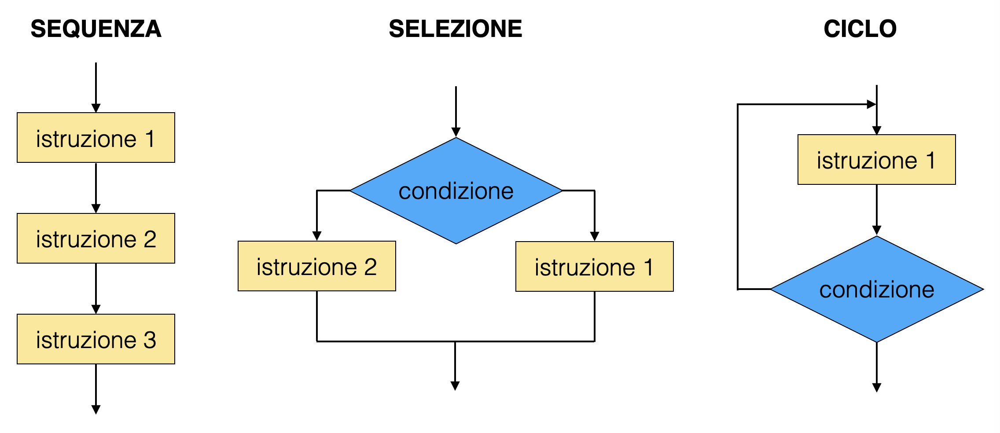
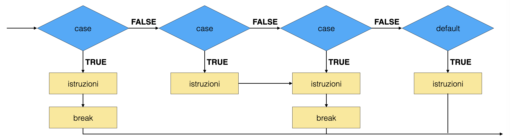
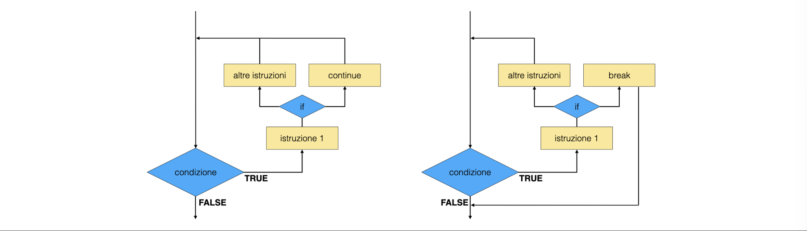

# Lezione 1: ripasso di ```C``` ed introduzione al ```C++```, parte 1

## Indice

  * [1.1 Introduzione](#11-introduzione)
    * [1.1.1 linguaggio di programmazione e linguaggio macchina](#111-linguaggio-di-programmazione-e-linguaggio-macchina)
    * [1.1.2 linguaggi intepretati o compilati](#112-linguaggi-intepretati-o-compilati)
    * [1.1.3 ```C``` e ```C++```](#113-c-e-c)
  * [1.2 Un primo programma](#12-un-primo-programma)
    * [1.2.1 il codice sorgente](#121-il-codice-sorgente)
    * [1.2.2 uno scheletro vuoto](#122-uno-scheletro-vuoto)
    * [1.2.3 la prima compilazione](#123-la-prima-compilazione)
    * [1.2.4 scrivere a schermo](#124-scrivere-a-schermo)
    * [1.2.5 il lavoro del compilatore](#125-il-lavoro-del-compilatore)
    * [1.2.6 parametri passati a linea di comando](#126-parametri-passati-a-linea-di-comando)
    * [1.2.7 parametri chiesti all'utente del programma](#127-parametri-chiesti-allutente-del-programma)
  * [1.3 Le variabili](#13-le-variabili)
    * [1.3.1 la loro inizializzazione](#131-la-loro-inizializzazione)
    * [1.3.2 l'attributo ```const```](#132-lattributo-const)
    * [1.3.3 gli array di variabili](#133-gli-array-di-variabili)
    * [1.3.4 gli indici degli array](#134-gli-indici-degli-array)
    * [1.3.5 la definizione di un array mediante il suo contenuto](#135-la-definizione-di-un-array-mediante-il-suo-contenuto)
    * [1.3.6 il casting fra diversi tipi in  ```C```](#136-il-casting-fra-diversi-tipi-in--c)
    * [1.3.7 il casting in ```C++```](#137-il-casting-in-c)
  * [1.4 Gli operatori](#14-gli-operatori)
    * [1.4.1 l'operatore di assegnazione](#141-loperatore-di-assegnazione)
    * [1.4.2 operatori aritmetici](#142-operatori-aritmetici)
    * [1.4.3 operatori aritmetici composti con assegnazione](#143-operatori-aritmetici-composti-con-assegnazione)
    * [1.4.4 operatori di incremento](#144-operatori-di-incremento)
    * [1.4.5 pre-incremento e post-incremento](#145-pre-incremento-e-post-incremento)
    * [1.4.6 operatori relazionali](#146-operatori-relazionali)
    * [1.4.7 operatori logici](#147-operatori-logici)
    * [1.4.8 le precedenze fra operatori](#148-le-precedenze-fra-operatori)
  * [1.5 Le strutture di controllo](#15-le-strutture-di-controllo)
    * [1.5.1 gli scope](#151-gli-scope)
    * [1.5.2 ```if ... else```](#152-if--else)
    * [1.5.3 ```switch ```](#153-switch-)
    * [1.5.4 il ciclo ```for```](#154-il-ciclo-for)
    * [1.5.5 il ciclo ```while```](#155-il-ciclo-while)
    * [1.5.6 il ciclo ```do ... while```](#156-il-ciclo-do--while)
    * [1.5.7 l'interruzione di un ciclo](#157-linterruzione-di-un-ciclo)
  * [1.6 Le funzioni](#16-le-funzioni)
    * [1.6.1 un primo esempio](#161-un-primo-esempio)
    * [1.6.2 funzioni senza tipo di ritorno](#162-funzioni-senza-tipo-di-ritorno)
    * [1.6.3 funzioni ed omonimia](#163-funzioni-ed-omonimia)
    * [1.6.4 il prototipo di una funzione e la sua implementazione](#164-il-prototipo-di-una-funzione-e-la-sua-implementazione)
    * [1.6.5 valori di default degli argomenti di una funzione](#165-valori-di-default-degli-argomenti-di-una-funzione)
    * [1.6.6 l'esportazione delle funzioni in librerie](#166-lesportazione-delle-funzioni-in-librerie)
    * [1.6.7 il file ```libreria.h```](#167-il-file-libreriah)
    * [1.6.8 il file ```libreria.cc```](#168-il-file-libreriacc)
    * [1.6.9 il file ```main.cpp```](#169-il-file-maincpp)
    * [1.6.10 librerie in ```C++```](#1610-librerie-in-c)
    * [1.6.11 le funzioni ```inline```](#1611-le-funzioni-inline)
    * [1.6.12 funzioni matematiche](#1612-funzioni-matematiche)
    * [1.6.13 un esempio: radice quadrata ed elevamento a potenza](#1613-un-esempio-radice-quadrata-ed-elevamento-a-potenza)
    * [1.6.14 accesso all'orologio del computer](#1614-accesso-allorologio-del-computer)
    * [1.6.15 un test di performance](#1615-un-test-di-performance)
  * [1.7 Direttive al preprocessore](#17-direttive-al-preprocessore)
    * [1.7.1 la direttiva ```#include```](#171-la-direttiva-include)
    * [1.7.2 variabili del preprocessore](#172-variabili-del-preprocessore)
    * [1.7.3 le macro del preprocessore](#173-le-macro-del-preprocessore)
  * [1.8 La scrittura del proprio programma](#18-la-scrittura-del-proprio-programma)
    * [1.8.1 la nomenclatura di variabili e funzioni](#181-la-nomenclatura-di-variabili-e-funzioni)
    * [1.8.2 la dimensione degli scope](#182-la-dimensione-degli-scope)
    * [1.8.3 l'utilizzo dei commenti nel codice sorgente](#183-lutilizzo-dei-commenti-nel-codice-sorgente)
    * [1.8.4 l'indentazione del codice sorgente](#184-lindentazione-del-codice-sorgente)
    * [1.8.5 la fattorizzazione di un programma](#185-la-fattorizzazione-di-un-programma)
    * [1.8.6 dettagli](#186-dettagli)
    * [1.8.7 unit testing](#187-unit-testing)
  * [1.9 Le opzioni di compilazione](#19-le-opzioni-di-compilazione)
    * [1.9.1 il caso di librerie non di default](#191-il-caso-di-librerie-non-di-default)
  * [1.10 Gli errori di compilazione](#110-gli-errori-di-compilazione)
  * [1.11 ESERCIZI](#111-esercizi)


## 1.1 Introduzione


### 1.1.1 linguaggio di programmazione e linguaggio macchina

  * le istruzioni che un calcolatore segue per eserguire i compiti assegnati 
    sono scritte in **linguaggio macchina**, 
    che non è umanamente intelleggibile 
  * i **linguaggi di programmazione** sono gli strumenti di scrittura umana 
    delle istruzioni per il calcolatore
  * la **traduzione** delle istruzioni scritte in linguaggi di programmazione
    in istruzioni per il calcolatore è effettuata da appositi programmi
  * l'**esecuzione** di un programma corrisponde al momento in cui il calcolatore 
    segue le istruzioni impartite


### 1.1.2 linguaggi intepretati o compilati

  * esistono **due grandi categorie** di linguaggi di programmazione:  

  | linguaggi interpretati |
  | -----------------------|

  * la traduzione del programma avviene automaticamente 
    **durante la sua esecuzione**
  * le istruzioni sono lette e tradotte riga per riga, 
    quindi spesso il programmatore può scrivere la riga successiva
    dopo aver osservato il risultato dell'istruzione precedente  
  * il programma è in generale **lento**, 
    perché la traduzione contestuale non è ottimizzata
  * ```python``` è un linguaggio di programmazione interpretato  

  | linguaggi compilati |
  | --------------------|

  * la traduzione del programma avviene prima della sua esecuzione,
    tramite l'invocazione di **istruzioni specifiche di compilazione**
  * il programma va concepito nella sua interezza prima dell'esecuzione
  * le istruzioni vengono eseguite **velocemente**  
  * ```C``` e ```C++``` sono esempi di linguaggi di programmazione compilati


### 1.1.3 ```C``` e ```C++```

  * ```C``` è un linguaggio di programmazione:
    * **imperativo**, cioè che impartisce sequenze di istruzioni al calolatore
    * **procedurale**, cioè che permette di raggruppare istruzioni in procedure
  * ```C++``` è un linguaggio di programmazione:
    * che **estende il ```C```**: 
      * un programma ```C``` compila anche in ```C++```
      * la sintassi del ```C``` è valida anche in ```C++```
      * esistono concetti nuovi nel ```C++```
      * esiste più libertà nel ```C++```
    * **object oriented**, cioè che permette di definire nuovi tipi di variabili
      all'interno dei programmi
      * vedremo che si tratta di un cambio di paradigma fondamentale
    * permette la **programmazione template**, 
      che è una forma di generalizzazione delle istruzioni impartite al calcolatore
      * vedremo che porta alla creazione di molte librerie di utilità generale
  * esistono diverse versioni del linguaggio ```C++```:
    **C++98** (che useremo noi), C++03, C++11 (che accenneremo), C++14, C++17


## 1.2 Un primo programma

### 1.2.1 il codice sorgente

  * la sequenza di istruzioni scritte nel linguaggio di programmazione
    sono salvate in un file di testo, 
    che è solitamente chiamato **codice sorgente**
  * gli **editor di testo** dedicati alla programmazione contengono strumenti
    specifici che permettono di evidenziare la sintassi del codice
    e talvolta controllarne la grammatica ed ortografia
  * oltre alle istruzioni, in un codice sorgente si possono inserire **commenti**,
    che sono frasi ignorate durante la compilazione
    * i commenti in ```C``` iniziano con ```/*``` e terminano con ```*/```:
    ```c
    /* questo è un commento
    */
    ```
  * ATTENZIONE: i simboli di apertura e chiusura di commenti **non funzionano come parentesi** scrivere ```/* /* */ */``` non è come scrivere ( ( ) )
  * in ```C++``` i commenti possono anche iniziare con ```//``` e terminano automaticamente a fine riga:
    ```cpp
    // questo è un commento
    ```


### 1.2.2 uno scheletro vuoto

  * il programma più semplice e autoconsistente è costituito dalla sequenza di istruzioni relative alla funzione ```main```
  * ogni programma deve contenere una ed una sola **funzione chiamata ```main```**, 
    che viene eseguita dal calcolatore quando il programma viene lanciato
  * esistono due versioni della funzione ```main```
    * una **senza argomenti** che corrisponde al caso in cui il programma sia eseguito da SHELL senza argomenti 
    ```cpp
    int main ()
      {
        return 0 ;
      }
    ```
    * una **con argomenti in ingresso** che corrisponde al caso in cui il programma sia eseguito da SHELL passando degli argomenti mediante una frase scritta a linea di comando
    ```cpp
    int main (int arcg, char ** argv)
      {
        return 0 ;
      }
    ```
  * entrambe le versioni illustrate della funzione   ```main```  implementano un programma funzionante che, quando viene eseguito, restituisce alla SHELL
    un numero intero, chiamato **exit status**
    * per convenzione si sceglie di restituire il numero ```0``` se tutto è andato bene, 
      mentre un numero non nullo è usato per segnalare che ci sono stati problemi durante l'esecuzione
      (esistono codici di errori codificati, 
       tuttavia il programmatore ha la libertà di aggiungerne o cambiarli)
  
  | suggerimenti |
  | -------------|
   
  * si consiglia di svolgere tutti gli esercizi presentati in ogni lezione in una cartella dedicata, quindi, dopo aver aperto una SHELL:
    ```> mkdir Lab2_Modulo1   
    > cd Lab2_Modulo1 
    > mkdir Lezione_01
    > cd Lezione_01
    > touch main_00.cpp
    ```
    * il comando ```touch``` crea un file vuoto, in questo caso con nome ```main.cpp```, aprite quindi il file con il vostro editor preferito, scrivete il codice e salvate
    * il nome del file che contiene il codice sorgente può essere scelto arbitrariamente. Noi useremo sempre il suffisso ```.cpp``` per i codici sorgenti che contengono la funzione ```main``` (vedremo che il codice sorgente di un programma può essere spezzato in più file)
  * nello scrivere un programma, ogni volta che si apre una parentesi graffa **chiuderla immediatamente**,
    per non dimenticarlo
  * non dimenticate le variabili di ritorno delle funzioni, ```main``` incluso  


### 1.2.3 la prima compilazione
    
  * create un codice sorgente ```main.cpp``` con lo scheletro vuoto descritto al paragrafo precedente
  * il sorgente va **compilato** perché possa essere eseguito dal calcolatore
  * per compilare il programma si utilizza il comando ```c++```, chiamato **compilatore**: 
    ```
    > c++ -o main_00 main_00.cpp
    ```
    * l'argomento ```-o main_00``` dice al compilatore di chiamare l'eseguibile con il nome ```main_00```
  * per eseguire il programma (nel caso di ```main```senza argomenti):
    ```
    > ./main_00
    >
    ```
    * non succede nulla, infatti non ci sono istruzioni all'interno della funzione ```main```, la SHELL restituisce il ** prompt **
    * l'istruzione ```return 0``` non dice di scrivere a schermo ```0```, 
      ma di restituire alla SHELL il valore ```0``` (questo valore può per esempio essere intercettato ed utilizzato mediante i comandi di SHELL)   

  | suggerimenti |
  | -------------|
 
  * includete sempre all'inizio del codice sorgente un commento 
    che contenga il **comando di compilazione** del programma


    
### 1.2.4 scrivere a schermo

  * oltre ai comandi fondamentali disponibili di default, il ```C++``` offre
    insiemi di istruzioni dedicate allo svolgimento di specifici compiti, questi
    sono **incapsulate in librerie** (identificate da un nome come ```iostream```, ```cmath``` ...)
  * bisogna sempre dichiarare al programma che si vuole utilizzare una o più librerie (usando il comando ```include <nome-della-libreria>```)
  * per scrivere a schermo,
    si utilizza la libreria ```iostream``` che gestisce il flusso (stream) di informazione in input (i) ed output (o) 
    durante l'esecuzione del programma: 
    ```cpp
    #include <iostream>

    int main (int arcg, char ** argv)
      {
        std::cout << "42" << std::endl ;
        return 0 ;
      }
    ```
    * la linea ```#include <iostream>``` dice al compilatore di utilizzare la libreria ```iostream```
        * il compilatore sa dove trovare le librerie standard tramite variabili di ambiente della SHELL
    * la variabile ```cout``` ([siː aʊt]  see-out) rappresenta lo strumento di output; 
      in questo caso, essendo quello standard (```std::```) si tratta dello schermo
    * la variabile ```endl``` è la fine della linea, essendo quella standard è un accapo
    * il simbolo ```<<``` rappresenta l'operatore di redirezione,
      che sposta quello che sta alla propria destra verso sinistra. 
      Quindi in questo caso prima ```endl``` viene incollato a ```42```,
      quindi l'insieme dei due viene inviato allo schermo.
  * l'esecuzione del programma visualizzerà a schermo ```42```:
    ```
    > c++ -o main_01 main_01.cpp
    > ./main_01 
    42
    ```


### 1.2.5 il lavoro del compilatore

  * la compilazione di un programma di divide in tre fasi

  | preprocessing |
  | --------------|

  * **creazione del programma** da compilare:
    * vengono eseguite le direttive date al preprocessore, sono le istruzioni che iniziano con il simbolo ```#```
    * ad esempio, l'istruzione ```#include <iostream>``` chiede al preprocessore
      di copiare al posto della linea stessa tutto il codice sorgente 
      contenuto nella libreria ```iostream```

  | compilazione |
  | -------------|

  * il compilatore vero e proprio entra in azione in questo stadio e procede a:
    * controllo sintattico del programma
      * ad esempio, ```itn``` invece di ```int``` dà errore
    * controllo grammaticale del programma
    * traduzione del codice sorgente in linguaggio macchina
  * ogni funzione, creata in linguaggio macchina, diventa un **oggetto del compilatore**

  | linking |
  | --------|

  * in questo ultimo passaggio, vengono **connessi i vari oggetti del compilatore**
    * nel nostro esempio, la parte pre-compilata delle librerie viene debitamente connessa 
    alle chiamate presenti nella funzione ```main```
  * NOTA BENE: gli oggetti del compilatore **non** hanno a che fare con la programmazione ad oggetti,
    si tratta di uno sfortunato caso di omonimia  


### 1.2.6 parametri passati a linea di comando

  * si possono passare informazioni al programma aggiungendo **parametri a linea di comando**
  * la SHELL passa alla funzione ```main``` la frase scritta dall'utente, 
    sotto forma di ```array``` di stringhe di tipo ```C```
    * ```argc``` è il numero di elementi dell'```array```
    * ```argv``` è l'array stesso
    ```cpp
    #include <iostream>

    int main (int arcg, char ** argv)
      {
        std::cout << "42" << std::endl ;
        std::cout << "ecco il nome dell'eseguibile: " << argv[0] << "\n" ;
        return 0 ;
      }
    ```


### 1.2.7 parametri chiesti all'utente del programma

  * la liberia ```<iostream>``` può essere anche utilizzata per **leggere informazioni dalla tastiera**
    ```cpp
    #include <iostream>

    int main (int arcg, char ** argv)
      {
        int numero = 0 ;
        std::cout << "inserisci un numero\n" ;
        std::cin >> numero ;
        std::cout << "hai inserito: " << numero << "\n" ;
        return 0 ;
      }
    ```
    * la tastiera è identificata da ```std::cin```
    * l'operatore ```>>``` trasferisce l'informazione dall'esterno verso il programma:
    ```
    > ./main_03 
    inserisci un numero
    4 
    hai inserito: 4
    ```


## 1.3 Le variabili 

  * le informazioni sono manipolate dal programma sotto forma di **variabili**
  * **diversi tipi di oggetti** hanno bisogno di dimensioni differenti di memoria
    e di un formato diverso di scrittura
  * per ogni differente possibilità esiste un **tipo associato in ```C++```**,
    che contiene le informazioni di lunghezza e formattazione
  * i principali tipi sono i seguenti:
  
  | tipo                            | Keyword | contenuto  |
  | ------------------------------- | ------- | ---------- |
  | Boolean                         | bool    | vero/falso |     
  | Character                       | char    | singoli caratteri |
  | Integer                         | int     | numeri interi fra -32768 fino a 32767 |
  | Floating point (virgola mobile) | float   | numeri razionali | 
  | Double floating point           | double  | numeri razionali |
  | Valueless                       | void    | nessun tipo |


### 1.3.1 la loro inizializzazione 

  * le variabili si inizializzano utilizzando le keyword indicate in tabella precedente:
    ```cpp
    // definizione di due numeri interi
    int num1 = 0 ;
    int num2 = 3 ;
    // somma di due numeri interi
    int somma = num1 + num2 ; 
    std::cout << "Somma: " << somma << std::endl ; 
    // definizione di due numeri razionali
    float razionale1 = 3.1416 ;
    double razionale2 = 1.4142 ; 
    // definizione di un carattere
    char lettera = 'à ;
    // definizione di un valore booleano
    bool condizione = true ;
    ```
    * NOTA BENE: le variabili di tipo ```char``` sono definite con valori indicati fra apici, non fra virgolette   

  | suggerimenti |
  | -------------|
  
  * non appena una variabile viene definita, **assegnarle sempre un valore**, tipicamente si opta per una delle seguenti scelte: 
    * si assegna un **valore di default**, che abbia senso nei calcoli a seguire
    * si assegna un **valore palesemte insensato**, in modo che se ci si scorda di assegnare il valore corretto alla variabile, il programma non esegua o dia risultati palesemente insensati
  * definire **una variabile per riga**, per chiarezza di lettura
  * dare **nomi esplicativi** alle variabili (e quindi anche sufficientemente lunghi)    


### 1.3.2 l'attributo ```const```

  * l'attributo ```const``` premesso ad una variabile indica che essa **non può cambiare di valore**
    durante l'esecuzione del programma.
  * se nel codice si prova a modificare una variabile dichiarata ```const```,
    il compilatore si accorge di questo errore di grammatica di programmazione
    e **non compila**, restituendo un errore:  
    ```    
    > c++ -o main_05 main_05.cpp
    main_05.cpp:10:12: error: cannot assign to variable 'numerò with const-qualified type 'const int'
        numero = numero + 1 ;
        ~~~~~~ ^
    main_05.cpp:9:15: note: variable 'numerò declared const here
        const int numero = 0 ;
        ~~~~~~~~~~^~~~~~~~~~
    1 error generated.
    ```


### 1.3.3 gli array di variabili

  * ad una variabile è associata una **zona di memoria** nella RAM,
    che è dove il calcolatore scrive la variabile durante le operazioni
  * in ```C++``` è possibile definire una zona di memoria estesa,
    chiamata **array**,
    predisposta a contenere un **elenco di variabili dello stesso tipo**
    giustapposte in celle di memoria contigue
    ```cpp
    // array di 5 numeri interi
    int num_array[5] ;
    ```
      * la dimensione dell'array, 
        indicata fra parentesi nella definizione della variabile,
        non può essere una variabile (nemmeno ```const```),
        **deve essere un numero scritto nel codice sorgente**
  * **le singole celle di memoria** sono accessibili 
    tramite l'operatore ```operator[]``` applicato al nome della variabile,
    che si scrive utilizzando le parentesi quadre
    come nell'esempio che segue:
    ```cpp
    num_array[0] = 3 ;
    num_array[1] = 6 ;
    num_array[2] = 9 ;
    num_array[3] = 11 ;
    num_array[4] = 131 ;
    ```


### 1.3.4 gli indici degli array

  * gli indici delle celle di memoria di un array lungo N **partono a 0 e finiscono ad N-1**
  * il compilatore **non sempre si accorge** che gli indici siano in questo intervallo
  * qualunque tentativo di leggere una zona di memoria all'esterno di questo intervallo
    può produrre un errore in fase di compilazione,
    oppure un comportamento inatteso del programma
    * provate, nel caso dell'array precedente, a includere queste istruzioni nel vostro programma:
    ```cpp
    int index = 4 ;
    std::cout << num_array[index + 1] << std::endl ;
    ```
  * NOTA BENE: si tratta di errori difficili da trovare, 
    bisogna prestare molta attenzione agli indici di lettura degli array


### 1.3.5 la definizione di un array mediante il suo contenuto

  * un array può essere anche definito indicandone esplicitamente la lista degli elementi
    fra parentesi graffe:
    ```cpp
    float float_array[] = {2., 3.14} ;
    std::cout << float_array[0] << std::endl ;
    std::cout << float_array[1] << std::endl ;
    ```


### 1.3.6 il casting fra diversi tipi in  ```C```

  * il casting in ```C``` è la **conversione fra diversi tipi di variabili numeriche**
  * siccome le medesime operazioni fra tipi diversi possono dare risultati differenti
    (provate a calcolare il valore della frazione 3/5
     come rapporto fra due variabili ```int``` o come rapporto fra due variabili ```float```),
    è importante sapere **come convertire variabili in maniera esplicita**,
    utilizzando la sintassi ```(type) numero``` per convertire la variabile ```numero```
    nel tipo ```type```:
    ```cpp
    int numero_intero = 4 ;
    float numero_razionale = (float) numero_intero ;
    ```


### 1.3.7 il casting in ```C++```

  * in ```C++``` l'operazione di casting ha portata più ampia
    e può essere realizzato con operatori dedicati. Quello quello con la funzionalità equivalente al type cast del```C``` è:
    ```cpp
    float secondo_razionale = static_cast<float> (numero_intero) ;
    ```
  * NOTA BENE uno dei vantaggi di usare l'espressione ```C++``` del cast è che questo è facilmente rintracciabile nel codice !


## 1.4 Gli operatori

  * Gli operatori predefiniti in ```C++``` permettono di compiere **operazioni fra variabili**
  * **Per ogni tipo di variabile**, esistono operatori corrispondenti alle operazioni 
    che si possono fare fra queste variabili
  * gli operatori si comportano **alla stregua di funzioni**, con variabili in ingresso
    e variabili di ritorno
  * tipicamente un operatore agisce su un singolo di tipo, 
    quindi l'applicazione di operatori a più di un tipo 
    implica un **casting implicito** fatto dal compilatore  


### 1.4.1 l'operatore di assegnazione

  * attribuiscono il valore iniziale ad una variabile:
    ```cpp
    int numero = 5 ;
    ```
    * in questo caso, il tipo in ingresso è un ```int``` 
      (la variabile stessa è una sorta di argomento implicito dell'operatore)
    * l'effetto dell'operatore è quello di assegnare alla variabile ```numero``` il valore 
      che sta a destra del simbolo ```=```
    * il tipo in uscita è ancora ```int``` ed è il valore assegnato alla variabile  
    ```cpp
    std::cout << (numero = 7) << std::endl ;
    ```
    * di conseguenza, le assegnazioni si possono fare in cascata:
    ```cpp
    int numero_2 = numero = 7 ;
    ```
  * anche per l'operatore di assegnazione si realizza il casting implicito:
    ```cpp
    float razionale = 5 ;
    ```
    * ```5``` è di tipo ```int```, quindi viene prima convertito in ```float``` (```5.```)
      e poi passato come argomento all'operatore di assegnazione


### 1.4.2 operatori aritmetici

  * corrispondono alle **tipiche operazioni matematiche** fra numeri interi o razionali
    ```cpp
    float R1 = 5. ;
    float R2 = 5. ;
    float R3 = R1 + R2 ;
    std::cout << R3 << std::endl ;
    R3 = R3 + 4.5 ;
    std::cout << R3 << std::endl ;
    ```


### 1.4.3 operatori aritmetici composti con assegnazione

  * gli operatori aritmetici esistono anche **composti con l'operatore di assegnazione**
    ```cpp
    R3 += 2.1 ;
    std::cout << R3 << std::endl ;
    ```
 * l'operazione precedente è equivalente a equivalente a ```cpp
    R3 += 2.1  ```


    | operatore | op. composto | operazione |
    | --- | --- | --- |
    | ```+``` | ``` += ``` | addizione |
    | ```-``` | ``` -= ``` | sottrazione |
    | ```*``` | ``` *= ``` | moltiplicazione |
    | ```/``` | ``` /= ``` | divisione |
    | ```%``` | ``` %= ``` | resto della divisione tra interi |


### 1.4.4 operatori di incremento

  * **L'incremento o decremento unitario** di una variabile si può ottenere 
    anche con operaori dedicati:

    | operatore | operazione |
    | --- |  --- |
    | ```++``` | incremento unitario |
    | ```--``` | decremento unitario |

  * l'operatore agisce direttamente sulla variabile al quale viene applicato,
    similmente agli operatori composti:
    ```cpp
    int num = 5 ;
    ++num ;
    std::cout << num << std::endl ;
    --num ;
    std::cout << num << std::endl ;
    ```


### 1.4.5 pre-incremento e post-incremento

  * ciascun operatore esiste in due versioni:
    * **pre-incremento** o **pre-decremento**: la variabile a cui viene applicato 
      viene modificata dall'operatore **prima** dell'esecuzione di eventuali altre operazioni
      che accadono in quella linea (```++num```, ```--num```), 
      quindi l'operatore restituisce la variabile stessa
    * **post-incremento** o **post-decremento**: la variabile a cui viene applicato 
      viene modificata dall'operatore **dopo** dell'esecuzione di eventuali altre operazioni
      che accadono in quella linea (```num++```, ```num--```)
    ```cpp
    int num1 = 5 ;
    std::cout << ++num1 << std::endl ;
    int num2 = 5 ;
    std::cout << num2++ << std::endl ;
    std::cout << num2 << std::endl ;
    ```
    * gli operatori di post-incremento e post-decremento **creano una copia** della variabile
      alla quale sono applicati, incrementano la variabile e restituiscono la copia
      (che non è stata incrementata)
    * di conseguenza, gli operatori di post-incremento e post-decremento **sono più lenti** 
      di quelli di pre-incremento e pre-decremento
      e richiedono che **sia possibile creare una copia** della variabile alla quale sono applicati
  * gli operatori di incremento vengono tipicamente utilizzati per aumentare o diminuire
    il valore delle variabili indice dei cicli


### 1.4.6 operatori relazionali

  * gli operatori relazionali confrontano tra loro i valori di due variabili
  * prendono in ingresso due variabili e restituiscono un valore booleano che indica se la relazione è soddisfatta o no

    | operatore | operazione |
    | --- |  --- |
    | ```==``` | uguaglianza |
    | ```!=``` | non uguaglianza |
    | ```<```  | minore di |
    | ```<=``` | minore o uguale |
    | ```>```  | maggiore di |
    | ```>=``` | maggiore o uguale |

  * NOTA BENE: l'operatore di uguaglianza ha **due segni ```=```** nel nome,
    perché l'operatore con un solo ```=``` assegna il valore di destra alla variabile di sinistra.
    La confusine tra i due operatori è una frequente sorgente di errori !


### 1.4.7 operatori logici

  * gli operatori logici codificano le relazioni fra variabili booleane:
    | operatore | operazione |
    | --- |  --- |
    | ```&&``` | and |
    | ```\|\|``` | or  |
    | ```!```  | not |
  * NOTA BENE: spesso ha luogo casting implicito fra variabili intere e booleane:
    in questo caso lo ```0``` risulta falso,
    mentre ogni altro valore intero risulta vero


### 1.4.8 le precedenze fra operatori

  * se in una singola linea di un codice sorgente vengono effettuate diverse operazioni,
    il calcolatore le esegue da destra verso sinistra, 
    rispettando l'ordine imposto da eventuali parentesi
    e una serie di regole di precedenza
  
  * ecco una tabella ridotta alle operazioni più comuni,
    gli operatori nelle righe più in alto hanno precedenza rispetto a quelli delle righe sottostanti

  | categorie di priorità |
  | -------------| 
  |  ```a++```, ```a[]```  |
  |  ```++a```, ```!```  |
  |  ```a*b```, ```a/b```, ```a%b```  |
  |  ```a+b```, ```a-b``` |
  |  ```<```, ```<=```, ```>```, ```>=``` |
  |  ```==```, ```!=``` |
  |  ```&&``` |
  |  ```||``` |
  |  ```=```, ```+=```, ```-=```, ```*=```, ```/=```, ```%=``` |
  
  * la lista completa delle precedenze si trova [qui](https://en.cppreference.com/w/cpp/language/operator_precedence)  
    


## 1.5 Le strutture di controllo

  * Le strutture di controllo sono il metodo che si utilizza nei linguaggi di programmazione procedurali
    per **gestire il flusso di istruzioni** che il calcolatore deve eseguire.
    Esistono tre tipi di strutture di controllo:
    * **sequenza**: si tratta della configurazione di default: 
      le istruzioni si susseguono una dopo l'altra
    * **selezione**: a seconda che una condizione sia o meno soddisfatta,
      il calcolatore sceglie di eseguire diverse istruzioni
    * **ciclo**: un insieme di istruzioni viene ripetuto un certo numero di volte,
      in funzione di un algoritmo che decide quando l'iterazione è terminata  

  


### 1.5.1 gli scope

  * nel codice sorgente diverse istruzioni vengono raggruppate in insiemi chiamati **scope**,
    delimitati da parentesi graffe
  * le **variabili** definite all'interno di uno scope 
    rimangono definite solamente fino alla chiusura dello scope
    e vengono automaticamente rimosse alla chiusura della parentesi graffa
  * singole istruzioni all'interno di una struttura di controllo
    possono essere sostituite da un intero scope  


### 1.5.2 ```if ... else```

  * la sequenza ```if (condizione) {scope} else {scope alternativo}``` realizza una selezione binaria,
    nella quale una istruzione o uno scope di istruzioni vengono eseguiti 
    nel caso in cui venga **soddisfatta una condizione booleana**
  * opzionalmente, uno **scope alternativo** può essere eseguito 
    nel caso in cui la condizione risulti falsa
    ```cpp
    int num1 = 5 ;
    if (num1 % 2 == 0) 
      {
        std::cout << num1 << " è pari\n" ;
      }
    else  
      {
        std::cout << num1 << " è dispari\n" ;
      }
    ```

  


### 1.5.3 ```switch ```

  * la sequenza ```switch ... case ... default``` realizza una selezione fra molte opzioni,
    basata sul valore di una variabile:
    ```cpp
    int num2 = 2 ;
    switch (num2) {
      case 1:
        // blocco di istruzioni
        std::cout << "uno\n" ;
        break;
      case 2:
        // blocco di istruzioni
        std::cout << "due\n" ;
        break;
      default:
        std::cout << "altri numeri\n" ;
        // blocco di istruzioni
    }
    ```

  

  * nella struttura di controllo ```switch (espressione)```
    vengono eseguite le istruzioni che stanno sotto la linea ```case``` 
    tale per cui **```espressione``` è uguale al valore riportato 
    dopo la parola chiave ```case```**
  * per evitare che vengano eseguite anche le istruzioni riportate dopo i ```case``` seguenti,
    solitamente si inserisce in ogni blocco di istruzioni il comando **```break```**,
    che interrompe l'esecuzione dello scope
    * la situazione in cui le istruzioni eseguite non siano soltanto quelle 
      del ```case``` corrispondente al valore di ```espressione```
      prende il nome di **fallthrough**
    * il comando ```break``` può essere utilizzato anche per **interrompere l'esecuzione di un ciclo**
    * la presenza di un ```break``` **non è obbligatoria** 
  * oltre ai vari ```case```, 
    si può aggiungere un ulteriore caso, 
    che contiene istruzioni da svolgere nell'evenienza in cui nessuno dei ```case```
    venga soddisfatto, 
    che viene etichettato con la parola chiave **```default```**
    * il caso di ```default``` **non è obbligatorio**


### 1.5.4 il ciclo ```for```

  * la struttura di controllo ```for ()``` 
    è un modo di implementare la struttura di controllo a ciclo,
    tipicamente nel caso in cui al ciclo sia **associato un conteggio**
  * nella parentesi che segue il comando ```for``` sono solitamente riportate tre istruzioni,
    separati da un punto e virgola:
    * **inizializzazione**: dove viene inizializzata (e talvolta definita) 
      una variabile che conta il numero di cicli, detta contatore
    * **controllo**: dove si verifica se il numero di cicli abbia oltrepassato una determinata soglia
    * **incremento**: dove si incrementa il contatore
    ```cpp
    int N = 10 ;
    for (int i = 0 ; i < N ; ++i)
      {
        std::cout << "il doppio di " << i << " vale: " << 2 * i << std::endl ;
      }
    ```

  

    * **le variabili** definite fra parentesi rimangono definite soltanto all'interno
      dello scope del ciclo
    * l'operazione di controllo viene compiuta **prima** di effettuare nell'iterazione corrispondente  
    * l'operazione di incremento viene compiuta **dopo** che è stata effettuata l'iterazione corrispondente
  * c'è **molta libertà** nella scrittura di un ciclo ```for```:
    i tre campi fra parentesi possono anche essere vuoti ed il programma compila 
    * utilizzare una scrittura non ortodossa del ciclo ```for```
      può portare ad errori logici nel programma,
      che possono condurre a risultati inaffidabili in fase di esecuzione


### 1.5.5 il ciclo ```while```

  * la struttura di controllo ```while ()``` 
    consente di implementare un ciclo
    fintanto che una **condizione risulta vera**
  * nella parentesi che segue l'istruzione ```while```
    è codificata un'affermazione da verificare (condizione); 
    se l'affermazione è vera )condizione soddisfatta), lo scope del ciclo viene effettuato
    ```cpp
    int N = 10 ;
    int i = 0 ;
    while (i < N)
      {
        std::cout << "il doppio di " << i << " vale: " << 2 * i << std::endl ;
        ++i ;
      }
    ```
    
    * il controllo sulla condizione viene effettuato **prima** dell'esecuzione dell'iterazione corrispondente
    * se il **campo fra parentesi è vuoto**, il ciclo avviene e continua indefinitamente (condizione sempre soddisfatta); 
      va quindi interrotto con il comando ```break```, questo permette di distribuire all'interno dello scope del ciclo più controlli,
      aumentando considerevolmente però il rischio che il ciclo non termini mai !


### 1.5.6 il ciclo ```do ... while```

  * talvolta conviene che la condizione di proseguimento del ciclo 
    venga verificata **dopo l'esecuzione dello scope**
    (ad esempio quando, prima della prima esecuzione dello scope, non ha senso effettuare il controllo)
  * per ottenere questo comportamento, 
    si utilizza la sintassi ``` do { ... } while ()```   
    ```cpp
    do
      {
        std::cout << "il doppio di " << i << " vale: " << 2 * i << std::endl ;
        ++i ;
      }
    while (i < 2 * N) ;
    ```
   

 
 
### 1.5.7 l'interruzione di un ciclo

  * oltre a terminare quando la condizione di controllo diventa falsa,
    **l'esecuzione di un ciclo può essere interrotta** con due comandi:
   * l'istruzione ```break``` che interrompe l'esecuzione dell'iterazione ed esce dal ciclo
   * l'istruzione ```continue``` che interrompe l'esecuzione dell'iterazione 
    e passa a quella successiva

   


 
## 1.6 Le funzioni

  * insiemi di istruzioni che svolgono un **compito preciso e spesso ripetuto** 
    all'interno di uno o più programmi 
    vengono solitamente raggruppate in funzioni,
    che si utilizzano come un singolo comando
  * le funzioni hanno un nome, una o più variabili in ingresso 
    e restituiscono una sola variabile,
    con il comando ```return```


 
### 1.6.1 un primo esempio

  * le funzioni vanno **definite prima di essere chiamate** e **possono** essere simultaneamente definite e implementate (come nel caso sottostante)
    ```cpp
    int raddoppia (int input_value) 
      {
        return 2 * input_value ;
      }
    
    int main (int arcg, char ** argv)
      {
      
        for (int i = 0 ; i < 5 ; ++i)
          {
            std::cout << "il doppio di " << i << " vale: " << raddoppia (i) << std::endl ;
          }
        return 0 ;
      }
    ```


 
### 1.6.2 funzioni senza tipo di ritorno

  * una funzione che non restituisce alcun valore si definisce 
    con la parola chiave ```void``` (indicatore del tipo di ritorno al posto di ```int``` , ```float```  ...)
    ed al suo interno l'istruzione ```return``` è immediatamente seguita da una virgola
    ```cpp
    int raddoppia (int input_value) 
      {
        return 2 * input_value ;
      }

    void scriviAschermo (int input_value) 
      {
        std::cout << "ecco il numero da scrivere: " << input_value << std::endl ;
        return ;
      }

    int main (int arcg, char ** argv)
      {
          for (int i = 0 ; i < 5 ; ++i)
          {
            scriviAschermo (raddoppia (i)) ;
          }

        return 0 ;
      }
    ```


 
### 1.6.3 funzioni ed omonimia

  * il nome di una funzione, insieme ai suoi tipi in ingresso,
    la **identifica univocamente**
  * nello stesso programma non possono esistere due funzioni
    diverse con lo stesso nome e gli stessi tipi in ingresso
  * funzioni con lo stesso nome, ma con tipi in ingresso diversi, possono invece coesistere:
      questa proprietà del ```C++``` si chiama **overloading**
      ```cpp
      int raddoppia (int input_value) 
        {
          return 2 * input_value ;
        }
      
      float raddoppia (float input_value) 
        {
          return 2 * input_value ;
        }
      ```


### 1.6.4 il prototipo di una funzione e la sua implementazione

  * definire una funzione prima di essere chiamata
    è necessario per **permettere il controllo grammaticale** del codice sorgente 
    da parte del compilatore
  * per effettuare il controllo grammaticale, 
    al compilatore è **sufficiente** conoscere il nome della funzione,
    la variabili in ingresso e quelle in uscita
  * è quindi lecito anticipare questa informazione sotto forma di **prototipo**,
    posticipando la scrittura dell'implementazione della funzione:
    ```cpp
    int raddoppia (int) ;
    
    int main (int arcg, char ** argv)
      {
      
        for (int i = 0 ; i < 5 ; ++i)
          {
            std::cout << "il doppio di " << i << " vale: " << raddoppia (i) << std::endl ;
          }
        return 0 ;
      }
    
    int raddoppia (int input_value) 
      {
        return 2 * input_value ;
      }
    ```
    * ciò permette di lasciare più in evidenza la funzione ```main``` rispetto alle altre
    * nella scrittura del prototipo, **non è necessario** indicare il nome delle variabili
      (ma è permesso)


### 1.6.5 valori di default degli argomenti di una funzione

  * nel prototipo, oppure nell'implementazione, si possono assegnare **valori di default** alle variabili,
    questi saranno i  valori utilizzato dalla funzione per quella variabile
    nel caso in cui il valore non venga passato al momento della chiamata della funzione
    ```cpp
    int raddoppia (int input_value = 0) 
      {
        return 2 * input_value ;
      }
    ```
    * il valore di default deve essere attribuito solamente **in uno dei due luoghi**
    * in caso di **funzioni con più variabili in ingresso**, 
      se ad una variabile viene assegnato un valore di default
      anche le variabili seguenti devono possederlo, 
      per evitare situazioni di ambiguità


### 1.6.6 l'esportazione delle funzioni in librerie

  * funzioni che vengono utilizzate in più di un programma ```main``` 
    possono essere **scritte in un file diverso**,
    in modo che non sia necessario riscriverle ogni volta
  * ogni funzione, dopo essere stata compilata, diventa un **oggetto del compilatore**
  * dopo la compilazione, il **linker** (che è il terzo passaggio della compilazione)
    connette le varie funzioni per costruire l'eseguibile finale
  * per permettere al compilatore di **controllare la grammatica** in fase di compilazione,
    è sempre necessario mettere nel codice sorgente del ```main``` il prototipo delle funzioni
  * questa struttura viene realizzata tipicamente con tre file: 
    ```libreria.h```, ```libreria.cc```, ```main.cpp```


### 1.6.7 il file ```libreria.h```

  * ```libreria.h```: è il file che contiene il codice sorgente dei prototipi delle altre funzioni
    ```cpp
    #ifndef libreria_h
    #define libreria_h
    
    int raddoppia (int) ;
    
    #endif
    ```
     * le linee che iniziano con ```#``` sono istruzioni al preprocessore,
       si tratta del controllo di una condizione:
       se non è definita una variabile (```#ifndef```) con il nome ```libreria_h```,
       si considera tutto quello che segue fino ad ```#endif```
     * questo permette di non definire due volte il prototipo di una funzione,
       che genererebbe un errore di compilazione  


### 1.6.8 il file ```libreria.cc```

  * ```libreria.cc```: è il file che contiene il codice sorgente delle altre funzioni
    ```cpp
    #include "libreria.h"      
    
    int raddoppia (int input_value) 
      {
        return 2 * input_value ;
      }
    ```
     * il codice sorgente include ```libreria.h```
       per ereditare tutte le definizioni e gli altri include
       che stanno al suo interno


### 1.6.9 il file ```main.cpp```

  * ```main.cpp```: è il file che contiene il codice sorgente della funzione ```main```
    ```cpp
    #include <iostream>
    #include "libreria.h"
       
    int main (int arcg, char ** argv)
      {
      
        for (int i = 0 ; i < 5 ; ++i)
          {
            std::cout << "il doppio di " << i << " vale: " << raddoppia (i) << std::endl ;
          }
        return 0 ;
      }
    ```
     * il codice sorgente include ```libreria.h```
       per ereditare tutte le definizioni e gli altri ```include```
       che stanno al suo interno
     * il file ```libreria.cc``` non viene mai incluso, 
       ma va indicato nel comando di compilazione:
       ```
       > c++ -o main_16 libreria.cc main_16.cpp
       ```  
 * NOTA BENE quando il processore incontra un ```include```  se il nome del file è racchiuso tra parentesi angolate <> lo va a cercare in un insieme di cartelle identificato da una specifica variabile di ambiente o PATH, se il nome del file è racchiuso tra doppi apici il file viene dapprima cercato nella cartella in cui si sta compilando e successivamente nelle cartelle specificate dal PATH.


### 1.6.10 librerie in ```C++```

  * si possono creare ed includere più di una libreria in un programma
  * le librerie di ```C++``` funzionano in questo modo,
    con i codici sorgente delle librerie spesso già compilati
    ed il file da includere indicato fra parentesi angolate, 
    come ad esempio ```#include <iostream>``` 

  | suggerimenti |
  | -------------|

  * è utile **organizzare** le proprie librerie per funzionalità, 
    sia per strutturazione logica del proprio programma
    che per decidere che cosa includere e compilare in ogni programma
  * l'utilizzo di una funzione comporta **rallentamento** nel programma,
    perché richiede al calcolatore di cercare in memoria la funzione
    di passarle gli argomenti e di recuperarne l'output,
    che sono operazioni aggiuntive


### 1.6.11 le funzioni ```inline```


  * si può utilizzare la parola chiave ```inline```, per chiedere al compilatore di **sostituire la funzione con la sua implementazione**, 
    questo si fa (è vantaggioso) solo per funzioni piccole per cui il tempo di esecuzione delle operazioni codificate è confrontabile con il tempo che richiederebbe la chiamata di una funzione non inline 
    
    ```cpp
    #ifndef libreria_h
    #define libreria_h
    
    inline int raddoppia (int input_value) 
      {
        return 2 * input_value ;
      }
    
    #endif
    ```
    * in questo caso, la funzione va definita prima del ```main```, quindi **nel file ```.h```**
    * il compilatore può decidere di ignorare la parola chiave ```inline``` quando non sono soddisfatti determinati criteri (quindi l'istruzione ```inline``` è una richiesta o proposta fatta al compilatore, non un comando)


### 1.6.12 funzioni matematiche

  * la libreria ```cmath``` offre un'utile **estensione delle operazioni matematiche**
  * per poterla utilizzare, bisogna includerne il file ```.h``` (detto header) corrispondente: 
    ```#include <cmath>```
  * la libreria contiene funzioni e variabili notevoli
    * la lista delle funzioni notevoli si trova [qui](http://www.cplusplus.com/reference/cmath/), 
      contiene funzioni trigonometriche, funzioni di potenza, iperboliche...


### 1.6.13 un esempio: radice quadrata ed elevamento a potenza

  * un esempio di utilizzo delle funzioni presenti in ```cmath```
    riguarda **l'elevamento a potenza e la radice quadrata**:
    ```cpp
    float num = 4.5 ;
    std::cout << "quadrato di " << num << ": " << pow (num, 2) << "\n" ;
    num = pow (num, 2) ;
    std::cout << "radice di " << num << ": " << sqrt (num) << "\n" ;
    std::cout << "radice di " << num << ": " << pow (num, 0.5) << "\n" ;
    ```
  * la **funzione ```pow```** ha come primo argomento la base della potenza,
    come secondo argomento il suo esponente
  * utiilzzare l'espressione ```num * num``` invece di ```pow (num, 2)```  
    è **meno dispendioso** in termini di tempo di esecuzione


### 1.6.14 accesso all'orologio del computer

  * un'altra libreria di uso frequente
    ```ctime```
  * l'istruzione ```clock ()``` restituisce il **tempo di calcolo** del processore
    consumato dal programma,
    espresso in cicli di calcolo
    * la **frequenza dei cicli di calcolo** è disponibile nella variabile ```CLOCKS_PER_SEC```
  * l'istruzione ```ctime ()``` resituisce il **tempo trascorso** a partire dal primo gennaio 1970


### 1.6.15 un test di performance

  * se volessimo **confrontare la velocità di esecuzione** della funzione ```pow (x, 2)```
    rispetto all'operazione ```x * x``` potremmo ripetere entrambe le operazioni molte (```N```) volte
    e misurare il tempo di calcolo nei due casi:
    ```cpp
    double start = (double) clock () / CLOCKS_PER_SEC ; 
    for (double i = 0; i < N; ++i) 
      {
        test += pow (i, 2) ; 
      }
    double stop = (double) clock () / CLOCKS_PER_SEC ;
    std::cout << "tempo di esecuzione per pow: " << stop - start << " secondi\n" ;

    start = (double) clock () / CLOCKS_PER_SEC ; 
    for (double i = 0; i < N; ++i) 
      {
        test += i * i ; 
      }
    stop = (double) clock () / CLOCKS_PER_SEC ;
    std::cout << "tempo di esecuzione per i*i: " << stop - start << " secondi\n" ;
    ```
  * si otterrebbe un **risultato** di questo tipo:
  ```
tempo di esecuzione per pow: 30.2506 secondi
tempo di esecuzione per i*i: 3.91943 secondi
  ```  


## 1.7 Direttive al preprocessore

  * l'insieme di istruzioni che iniziano con il simbolo ```#``` si chiamano
    **direttive al preprocessore** perché vengono lette ed interpretate
    prima della fase di compilazione
  * si tratta di istruzioni che **non riguardano la fase di compilazione** del programma,
    quindi **macro e variabili del preprocessore sono concetti diversi**
    rispetto alle funzioni e variabili di ```C++```  


### 1.7.1 la direttiva ```#include```

  * come abbiamo già visto,
    questa istruzione viene utilizzata quando si scrivono **librerie di funzioni**
    in un file separato da quello che contiene il codice sorgente del ```main``` program
  * seguendo questa direttiva, 
    il preprocessore **sostituisce alla linea l'intero file** riportato dopo ```#include```


### 1.7.2 variabili del preprocessore

  * la direttiva ```#define``` **definisce variabili** del preprocessore
  * viene estensivamente utilizzata, unitamente al controllo booleano ```#ifndef``` (se non è definita), 
    per impedire la doppia definizione del prototipo di una funzione
    e per impedire che si crei un circolo infinito di istruzioni ```#include```,
    :
    ```cpp
    #ifndef libreria_h
    #define libreria_h
    
    int raddoppia (int) ;
    
    #endif
    ```
  * è invalso nell'uso utilizzare ```#define``` anche in sostituzione di variabili del ```C++```
    ```cpp
    #define NUMERO 150
    ```
    * si tratta di una **cattiva pratica di programmazione**, 
      perché può portare a comportamenti inattesi del codice (inclusi problemi di compilazione)
      e rende difficile la fattorizzazione del codice
    * in questo caso, ```NUMERO``` **non è una variabile del ```C++```**,
      bensì il preprocessore sostituisce il testo ```NUMERO``` con il testo ```100``` nel programma
      prima della compilazione
    * quando si utilizzano questi metodi poco ortodossi,
      è buona regola utilizzare **prassi sintattiche che differenzino chiaramente**
      le effettive variabili del ```C++``` dalle sostituzioni di testo del preprocessore, 
      ad esempio scrivendone il nome interamente in caratteri maiuscoli    


### 1.7.3 le macro del preprocessore 

  * si possono anche definire **macro del preprocessore**,
    che sono espressioni che richiamano in forma il comportamento delle funzioni del ```C++```
    ```cpp
    #define quadrato(a) a*a
    ```
  * utilizzare le macro del processore come funzioni 
    **può produrre disastri**, questo programma:
    ```cpp
    int main (int argc, char ** argv)
      { 
        double numero = 3. ;
        double risposta = quadrato (numero + 1.) ;
      
        std::cout << "Il quadrato di " << numero + 1. 
                  << " vale " << risposta << "\n" ;
        return 0 ;
      }
    ```
    produce come output:
    ```
    Il quadrato di 4 vale 7
    ```
    infatti la sostituzione operata dal preprocessore genera questa istruzione
    ```cpp
   
        double risposta = numero + 1.*numero+1.;
    ```
    


## 1.8 La scrittura del proprio programma

  * perché un codice sorgente **compili**, 
    bisogna rispettare sintassi e grammatica del ```C++```
  * perché un programma **funzioni**,
    bisogna evitare errori logici nell'uso del ```C++```
    e nella funzionalità degli algoritmi
  * perché un codice sorgente **sia leggibile**,
    è buona cosa seguire regole aggiuntive di buon senso nella scrittura    


### 1.8.1 la nomenclatura di variabili e funzioni

  * scegliete nomi di funzioni e variabili **lunghi ed autoesplicativi**
  * scegliete nomi che riguardino il ruolo effettivo di variabili e funzioni:
    ad esempio, se una variabile o una funzione servono 
    nel programma per ottenere un determinato calcolo,
    ma abbiano funzionalità più ampia,
    il loro nome deve **riflettere l'effettiva funzionalità**
  * scegliete un **sistema consistente** di nomenclatura, ad esempio:
    * le funzioni iniziano con lettere minuscole, le variabili con lettere maiuscole
    * nei nomi compposti da più parole, si divide il nome con un ```_``` (e.g. ```calcola_media```),
      oppure rendendo maiuscola ogni parola all'interno (e.g. ```calcolaMedia```)


### 1.8.2 la dimensione degli scope

  * scegliete di scrivere **scope piccoli**: 
    se il numero di istruzioni in uno scope è molto alto,
    spezzatelo in sotto-gruppi tramite funzioni
  * una **numero indicativo** di istruzioni oltre il quale pensare se spezzare lo scope
    in funzioni è 7


### 1.8.3 l'utilizzo dei commenti nel codice sorgente

  * molti commenti nel codice sorgente aiutano a **capire cosa facciano** funzioni e variabili,
    descrivendo il loro contenuto o la loro funzionalità
  * i commenti possono essere utilizzati per chiarire **che cosa sta succedendo nel codice sorgente**
  * la **spiegazione di eventuali formule** utilizzate,
    oppure il **link a pagine web** di riferimento,
    possono essere inseriti nei commenti
  * nel caso di scope molto lunghi,
    per cui la chiusura di parentesi graffe non si vede insieme all'apertura,
    si possono usare commenti per ricordare al lettore
    **quale scope sia chiuso** da una graffa:
    ```cpp
    int main (int argc, char ** argv)
      { 
        for (int i1 = 0 ; i1 < 100 ; ++i1)
          {
            /* tante istruzioni che si susseguono */
          } // ciclo su i1
        return 0 ;
      }
    ```


### 1.8.4 l'indentazione del codice sorgente

  * indentare il codice coerentemente aiuta enormemente la lettura del codice sorgente
  * **tutte le istruzioni di uno stesso scope** devono inizare alla medesima colonna
  * quando si apre uno scope, 
    le istruzioni devono **inziare in posizione rientrata**
    rispetto allo scope precedente:
    **scegliete una regola** (ad es. 2 colonne) ed attenetevi rigorosamente a quella
    * imparate ad usare con cognizione di causa il tasto ```TAB```,
      oppure non utilizzatelo
  * decidete se **aprire le parentesi graffe** alla fine di una linea, 
    oppure dopo essere andati accapo
  * non chiudete parentesi graffe su una **linea in cui ci sono istruzioni**


### 1.8.5 la fattorizzazione di un programma

  * molto spesso **pezzi di codice sorgente vengono riciclati** copiandoli da programmi vecchi
    ed incollandoli in programmi nuovi
  * per facilitare questa operazione e per rendere il codice sorgente più comprensibile,
    è buona norma mantenere il più vicino possible tutte le istruzioni relative
    ad un **medesimo blocco logico** del programma
    * definire le variabili **appena prima che vengano utilizzate**
      (cioè NON tutte all'inizio del programma)
    * NON sparpagliare per il programma istruzioni che **logicamente si susseguono**


### 1.8.6 dettagli

  * il ```C++``` **distingue maiuscole da minuscole**, 
    quindi ```num``` e ```Num``` sono due variabili diverse
  * il ```C++``` **non riconosce caratteri speciali** come lettere accentate,
    quindi non usatele nei codici sorgente
  * esistono **caratteri riservati** al ```C++```, come le virgolette, gli apici, o il backslash:
    nell'output a schermo evitate di utilizzarli, oppure fateli precedere con il carattere ```\\```, 
    che dice al compilatore di non utilizzare il carattere successivo come carattere riservato


### 1.8.7 unit testing

  * quando si scrive un nuovo programma,
    è utile **compilare il codice sorgente** molto spesso
  * ad ogni passaggio importante del programma, fate uno **unit test**,
    cioè test di compilazione ed esecuzione 
    * scrivere **la funzione ```main``` vuota** è un passaggio importante 
      (una unit da testare)
    * **includere una libreria** è una unit da testare
    * aggiungere la **definizione di una variabile rilevante** per il programma è una unit da testare
    * aggiungere **una struttura di controllo vuota**, 
      cioè ancora prima di avere scritto istruzioni all'interno,
      è una unit da testare
  * procedendo in questo modo, 
    si semplifica molto l'identificazione delle cause di errori,
    perché sono tipicamente da ricercare soltanto nelle ultime aggiunte al codice sorgente    
  * in caso di programmi molto complessi,
    è buona pratica preparare tante versioni della funzione ```main```, 
    dove ciascuna fa da **test di un aspetto specifico del programma**, 
    ad esempio una funzione ```main``` per fare il test di ogni libreria creata


## 1.9 Le opzioni di compilazione

  * durante la compilazione di un codice sorgente,
    il compilatore (```c++```) prende in ingresso **diversi parametri**. 
    Alcuni sono elencati qui:
    | parametro | ruolo |
    | --------- | --------- |  
    |  ```*.cc```, ```*.cpp```  | codice dell'implementazione: deve esserci una sola funzione ```main``` |
    | ```-o eseguibile``` | nome da assegnare all'eseguibile: valore di default è ```a.out``` |
    | ```-O0``` | compilazione veloce e non ottimizzata, esecuzione lenta |
    | ```-O2``` | compilazione ottimizzata e lenta, esecuzione più veloce |
    | ```-O3``` | compilazione ottimizzata e lenta, esecuzione più veloce |
    | ```-Wall``` | accende tutti i Warning: il compilatore avvisa in caso di problemi sospetti |
    | ```-Werror``` | trasforma Warning in errori: il compilatore non compila se ci sono Warning |
    * provate a confrontare l'uso di ```pow (x, 2)``` con ```x * x``` a diversi livelli di ottimizzazione:
      che cosa cambia?
    * una **lista completa** di opzioni di compilazione si trova [qui](https://gcc.gnu.org/onlinedocs/gcc/Option-Summary.html)


### 1.9.1 il caso di librerie non di default

  * nel caso si utilizzino **librerie non di default**, 
    si può istruire il compilatore riguardo alla loro posizione nel computer:
    | parametro | ruolo |
    | --------- | --------- |  
    | ```-l[linalg]``` | nome (\*) della libreria precompilata (oggetto del compilatore) da linkare al programma |
    | ```-L[/path/to/shared-libraries]``` | la cartella dove stanno le librerie da linkare |
    | ```-I[/path/to/header-files]``` | dove stanno gli header file da includere |
    * (\*) il nome della libreria deve essere linalg.dll in Windows, liblinalg.so su Unix-like (e.g. Linux), linalg.dylib su MacOSX
  * spesso (come vedremo per ROOT) pacchetti esterni **forniscono anche un comando**
    che prepara queste opzioni per il compilatore


## 1.10 Gli errori di compilazione

  * in caso di errore di compilazione, 
    il compilatore mostra a schemo la **descrizione degli errori** che ha riscontrato
  * il messaggio di errore è solitamente utile a capire il problema:
    ```
    > c++ -o main_05 main_05.cpp
    main_05.cpp:10:12: error: cannot assign to variable 'numerò with const-qualified type 'const int'
        numero = numero + 1 ;
        ~~~~~~ ^
    main_05.cpp:9:15: note: variable 'numerò declared const here
        const int numero = 0 ;
        ~~~~~~~~~~^~~~~~~~~~
    1 error generated.
    ```
     * in questo caso, il compilatore indica **il file** con il codice sorgente problematico,
       **la linea** alla quale ha trovato un errore
       e **la ragione** per la quale ha ritenuto che ci fosse un problema
  * spesso un singolo errore genera altri errori in cascata,  
    quindi è consigliato **risolvere gli errori uno per uno**, 
    iniziando dal primo che si trova


## 1.11 ESERCIZI

  * Gli esercizi relativi alla lezione si trovano [qui](ESERCIZI.md)


