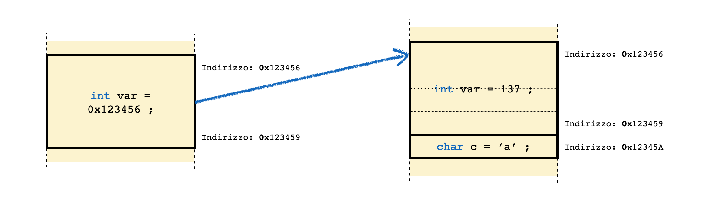
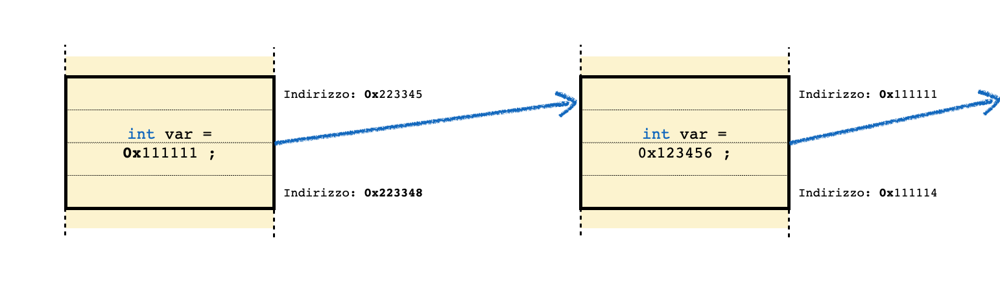
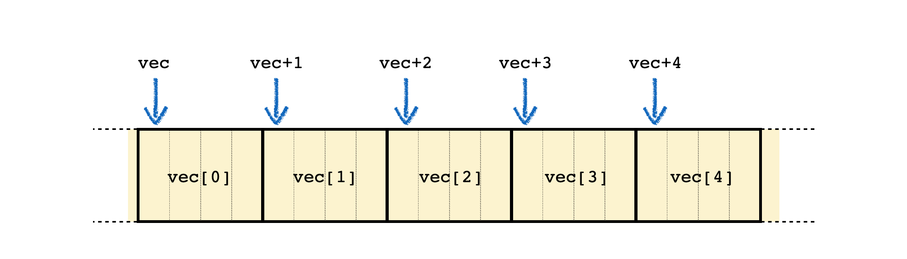

# Lezione 2: ripasso di ```C``` ed introduzione al ```C++```, parte 2

## 2.1 Variabili e puntatori


### 2.1.1 La gestione delle variabili nel calcolatore

  * In un computer tutto è rappresentato mediante **numeri**
  * I numeri sono salvati in **zone di memoria** (Random Access Memory = RAM)
  * Le celle della memoria sono individuate mediante **indirizzi**
  * Le **variabili di diversi tipi occupano una o piu' celle** di memoria (una zona),
    a seconda del tipo
    * Il calcolatore e' in grado di **interpretare correttamente il contenuto** di una zona di memoria, 
      se conosce l'indirizzo della prima cella ed il tipo salvato


### 2.1.2 Lo spazio occupato dalle variabili 

  * ogni tipo ha una **dimensione assegnata** nella RAM
  * per i tipi numerici interi, una dimensione assegnata significa che **i valori che la variabile puo' assumere
    sono limitati**
  * i tipi in virgola mobile (```float```, ```double```) non hanno limitazioni in valore, ma in precisione,
    quindi il tipo ```double```, occupando piu' celle di memoria, e' piu' preciso del tipo ```float``` 
  * per conoscere la dimensione occupata da un tipo, si puo' utilizzare la funzone ```sizeof ()```:
    ```cpp
    std::cout << "Dimensione di un char : " << sizeof (char)  
             << " byte" << std::endl ; 

    ```


### 2.1.3 Le dimensioni tipiche di alcuni tipi 

  * a seconda dell'architettura del calcolatore che si sta utilizzando, 
    le **dimensioni di un tipo possono cambiare**
  * nella tabella che segue,
    sono indicati **valori tipici** per le dimensioni dei tipi comunemente utilizzati
  * esistono **type modifier** che cambiano le caratteristiche di un tipo 
    (```signed```, ```unsigned```, ```short```, ```long```)
    che ne modificano la dimensione o l'intervallo di copertura

 | tipo | dimensione (in Byte) | intervallo |
 | --- | :---: | :---: |
 | short int              | 2      | -32,768 to 32,767               |   
 | unsigned short int     | 2      | 0 to 65,535                     |               
 | unsigned int           | 4      | 0 to 4,294,967,295              |                      
 | int                    | 4      | -2,147,483,648 to 2,147,483,647 |                 
 | long int               | 4      | -2,147,483,648 to 2,147,483,647 |                 
 | unsigned long int      | 4      | 0 to 4,294,967,295              |    
 | long long int          | 8      | -(2^63) to (2^63)-1             |     
 | unsigned long long int | 8      | 0 to 18,446,744,073,709,551,615 |                 
 | signed char            | 1      | -128 to 127                     |               
 | unsigned char          | 1      | 0 to 255                        |            
 | float                  | 4      |                                 |                      
 | double                 | 8      |                                 |                      
 | long double            | 12     |                                 |                        
 | wchar_t                | 2 or 4 | 1 wide character                |                    


### 2.1.4 L'indirizzo di memoria di una variabile

  * per ogni variabile, in ```C++``` si conosce il suo **valore** tramite il suo nome
  * si puo' anche conoscere il suo indirizzo di memoria,
    tramite l'operatore ```&```:
    ```cpp
    int numero_intero = 5 ;
    std::cout << "valore:    " << numero_intero << std::endl ;
    std::cout << "indirizzo: " << & numero_intero << std::endl ;
    ```


### 2.1.4 Salvare l'indirizzo di memoria: i puntatori

  * l'indirizzo di una cella di memoria e' un numero, 
    quindi puo' essere a sua volta **salvato in una variabile**
  * variabili che contengono indirizzi alla prima cella di memoria di altre variabili 
    sono chiamate **puntatori**
  * siccome rivestono un ruolo fondamentale nella programmazione,
    si **dichiarano in modo specifico**, con la sintassi ```type * var```:
    ```cpp
    int * puntatore_ad_intero ;
    ```
  * questa dichiarazione fa si' che **il programma sappia come accedere al contenuto**
    della cella di memoria che sta all'indirizzo salvato in ```puntatore_ad_intero```,
    perche' sa di che tipo si tratta




### 2.1.5 Dalla variabile al puntatore e viceversa

  * il simbolo ```*```, oltre a comparire nella dichiarazione di un puntatore,
    rappresenta anche l'opertore che estrae il valore della variabile contenuta
    nell'indirizzo di memoria puntato:
    ```cpp
    int * puntatore_ad_intero = & numero_intero ;
    std::cout << "valore   : " << numero_intero << std::endl ;
    std::cout << "indirizzo: " << & numero_intero << std::endl ;
    std::cout << "puntatore: " << puntatore_ad_intero << std::endl ;
    std::cout << "valore   : " << * puntatore_ad_intero << std::endl ;
    ```
    produce come output:
    ```
    valore   : 5
    indirizzo: 0x7ffeeedfa44c
    puntatore: 0x7ffeeedfa44c
    valore   : 5
    ```


### 2.1.6 Puntatori non inizializzati

  * un puntatore definito e non inizializzato non punta ad alcun indirizzo di memoria:
    ```cpp
    int * puntatore_ad_intero ;
    std::cout << "puntatore: " << puntatore_ad_intero << std::endl ;
    ```
    produce come ouptut:
    ```
    0x0
    ```


### 2.1.7 I puntatori sono variabili

  * un puntatore e' una variabile,
    dunque puo' **cambiare valore** anche dopo essere stato inizializzato:  
    ```cpp
    ptr = & var ;
    std::cout << "Ora ptr punta a var: " << ptr
              << " ed il valore a cui punta vale: " << *ptr << std::endl ; 
    ```
  * se un puntatore viene inizializzato all'indirizzo di una variabile,
    si puo' **accedere alla variabile tramite il puntatore**:
    in questo caso viene modificato ```*ptr``` e visualizzato il valore di ```var```:
    ```cpp
    *ptr = 100 ;
    std::cout << "var ora vale: " << var << std::endl ;
    ```
    produce come output:
    ```
    Ora ptr punta a var: 0x7ffeee47f43c ed il valore a cui punta vale: 137
    ```


### 2.1.8 Inizializzare una variabile a partire da un puntatore

  * una variabile puo' essere inizializzata con il valore presente
    all'indirizzo contenuto in un puntatore: 
    ```cpp
    int pippo = * ptr ;
    std::cout << "La variabile pippo vale: " << pippo << std::endl; 
    ```
    produce come output:
    ```
    La variabile pippo vale: 100
    ```
    * a questo punto, le modifiche a ```*ptr``` effettuate dopo l'inzializzazione
      **non hanno effetto su ```pippo```**, perche' quest'ultimo e' un'altra variabile
      (quindi con il contenuto salvato in un'altra zona di memoria):
      ```cpp
      (*ptr)++;
      std::cout << "var ora vale: " << var << " e pippo vale: " << pippo << std::endl; 
      ```
      produce come output:
      ```
      var ora vale: 101 e pippo vale: 100
      ```


### 2.1.9 Puntatori di puntatori

  * se un puntatore e' una variabile, 
    ha un **contenuto ed un indirizzo di memoria**
  * quindi, si puo' costruire un puntatore al suo indirizzo, 
    cioe' un puntatore a puntatore




### 2.1.10 risalire la caterna di indirizzi

  * tramite l'operatore ```*``` si puo' arrivare fino al valore della variabile iniziale:
    ```cpp
    int var = 137 ; 
    int * ptr = & var ;
    int ** ptrAptr = & ptr ;

    std::cout << "var    : " << var << std::endl ;
    std::cout << "ptr    : " << ptr << std::endl ;
    std::cout << " `--> *ptr: " << *ptr << std::endl ;
    std::cout << "ptrAptr: " << ptrAptr << std::endl ;
    std::cout << " `--> *ptrAptr: " << *ptrAptr << std::endl ;
    std::cout << "        `-->**ptrAptr: " << **ptrAptr << std::endl ;
    ```
    produce come output:
    ```
    var    : 137
    ptr    : 0x7ffee7f0e43c
     `--> *ptr: 137
    ptrAptr: 0x7ffee7f0e430
     `--> *ptrAptr: 0x7ffee7f0e43c
            `-->**ptrAptr: 137
    ```


### 2.1.11 Puntatori ed array

  * Quando si definisce un array, suo nome (senza parentesi graffe) 
    contiene **l’indirizzo di memoria del primo elemento** dell’array:  
    ```cpp
    int vec[] = {2, 20} ;
    std::cout << vec << std::endl ;
    ```
    produce come output:
    ```
    0x7ffeef024440
    ```


### 2.1.12 Gli elementi di un array

  * se ```vec``` e' il puntatore al primo elemento dell'array,
    **```*vec``` e' il suo contenuto**:
    ```cpp
    std::cout << vec[0] << " == " << *vec << std::endl ;
    ```
  * si puo' accedere agli **elementi successivi dell'array** tramite l'operatore ```*```  
    ```cpp
    std::cout << vec[1] << " == " << *(vec+1) << std::endl ;
    ```
  * l'**algebra dei puntatori** con gli operatori ```+``` e ```-``` funziona
    perche' il puntatore e' di un tipo definito,
    quindi il programma sa di quante celle di memoria muoversi per raggiungere
    la zona di memoria successiva
    * ```*(vec+1)``` non e' la cella di memoria successiva a quella
      indicizzata da ```vec```,
      ma quella che dista da ```vec``` la dimensione di un intero
  * le due sintassi ```vec[i]``` e ```*(vec+i)``` significano la stessa cosa,
    cioe' sono due rappresentazioni della medesima operazione fatta dal calcolatore




### 2.1.13 I puntatori sono variabili


### 2.1.14 Le referenze


### 2.1.15 Riepilogo sui puntatori


## 2.2 Il passaggio di parametri alle funzioni


### 2.2.1 Passaggio per valore


### 2.2.2 Passaggio per puntatore


### 2.2.3 Passaggio per referenza


## 2.3 La gestione dinamica della memoria


### 2.3.1 Heap and Stack


### 2.3.2 Allocazione di una variabile nella Stack


### 2.3.3 Allocazione di una variabile nella Heap


### 2.3.4 Allocazione dinamica ed array


### 2.3.5 Rappresentzione degli array in memoria


### 2.3.6 Come non usare l'allocazione dinamica, 1


### 2.3.7 Come non usare l'allocazione dinamica, 2


## 2.4 ESERCIZI

  * Gli esercizi relativi alla prima lezione si trovano [qui](ESERCIZI.md)


