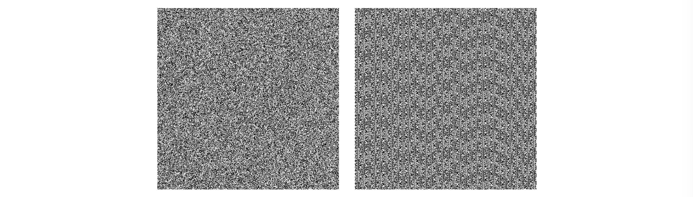
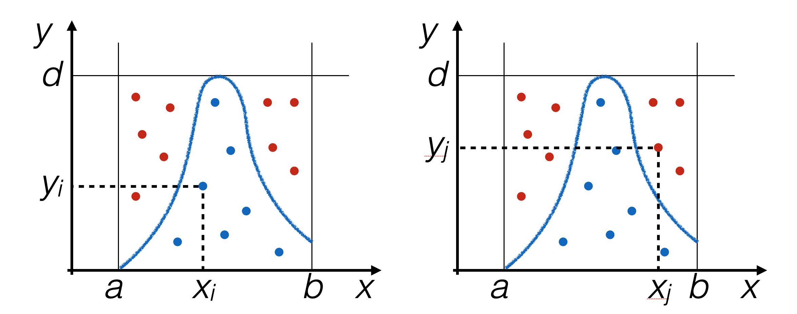
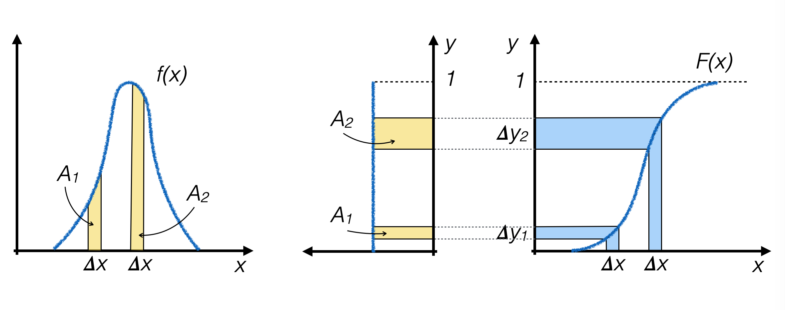
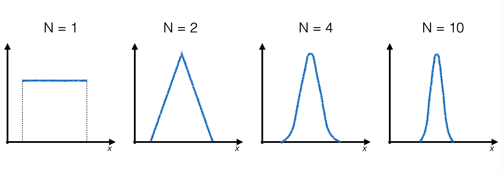

# Lezione 4: la generazione di numeri casuali

## Indice

  * [4.1 I numeri pseudo-casuali](#41-i-numeri-pseudo-casuali)
    * [4.1.1 sequenze casuali](#411-sequenze-casuali)
    * [4.1.2 sequenze pseudo-casuali](#412-sequenze-pseudo-casuali)
    * [4.1.3 il generatore lineare congruenziale](#413-il-generatore-lineare-congruenziale)
    * [4.1.4 le problematiche dei generatori di numeri pseudo-casuali](#414-le-problematiche-dei-generatori-di-numeri-pseudo-casuali)
    * [4.1.5 un generatore di numeri casuali in ```C++```](#415-un-generatore-di-numeri-casuali-in-c)
    * [4.1.6 le caratteristiche di ```rand ()```](#416-le-caratteristiche-di-rand-)
    * [4.1.7 come cambiare il seed di generazione](#417-come-cambiare-il-seed-di-generazione)
  * [4.2 generare numeri pseudo-casuali con distribuzione uniforme](#42-generare-numeri-pseudo-casuali-con-distribuzione-uniforme)
    * [4.2.1 una distribuzione uniforme di numeri razionali pseudo-casuali](#421-una-distribuzione-uniforme-di-numeri-razionali-pseudo-casuali)
  * [4.3 altre distribuzioni di probabilità: try-and-catch](#43-altre-distribuzioni-di-probabilità-try-and-catch)
    * [4.3.1 l'algoritmo try-and-catch (TAC)](#431-lalgoritmo-try-and-catch-tac)
    * [4.3.2 l'implementazione dell'algoritmo try-and-catch](#432-limplementazione-dellalgoritmo-try-and-catch)
    * [4.3.3 vantaggi e svantaggi dell'algoritmo try-and-catch](#433-vantaggi-e-svantaggi-dellalgoritmo-try-and-catch)
  * [4.4 altre distribuzioni di probabilità: la funzione inversa](#44-altre-distribuzioni-di-probabilità-la-funzione-inversa)
    * [4.4.1 l'algoritmo della funzione inversa](#441-lalgoritmo-della-funzione-inversa)
    * [4.4.2 vantaggi e svantaggi dell'algoritmo della funzione inversa](#442-vantaggi-e-svantaggi-dellalgoritmo-della-funzione-inversa)
  * [4.5 distribuzioni di probabilità Gaussiane: il teorema centrale del limite](#45-distribuzioni-di-probabilità-gaussiane-il-teorema-centrale-del-limite)
    * [4.5.1 l'implementazione dell'algoritmo](#451-limplementazione-dellalgoritmo)
    * [4.5.2 vantaggi e svantaggi dell'algoritmo della funzione inversa](#452-vantaggi-e-svantaggi-dellalgoritmo-della-funzione-inversa)
  * [4.6 ESERCIZI](#46-esercizi)


## 4.1 I numeri pseudo-casuali

  * quando si effettua una qualunque misura,
    si porta a termine il **confronto fra i dati raccolti e un modello della natura**
    * per **falsificare il modello**, oppure
    * per **determinare il valore (e l'incertezza** associata) di uno dei suoi parametri
  * è cruciale saper **calcolare le previsioni** di un modello
    * spesso **non si conosce** il modello in forma analitica
      e si ricorre a **metodi computazionali alternativi** per ottenere le previsioni
      da confrontare con le misure
  * molte tecniche di calcolo si basano sulla **generazione di numeri casuali**
    * per riprodurre la **natura aleatoria** delle misure
    * o per popolare uniformemente spazi fasi definiti entro **confini sofisticati**


### 4.1.1 sequenze casuali

  * un **processo casuale, o stocastico**,
    produce una successione di numeri distribuiti casualmente
    secondo una distribuzione di probabilità fissata
  * la probabilità che un determinato numero compaia in qualunque punto della successione
    **non dipende dai numeri che lo precedono o che lo seguono**
  * ad esempio:
    * il **tempo di arrivo di raggi cosmici** su un rivelatore di muoni
    * il risultato del **lancio di una moneta** o di un dado
  * siccome dipendono dalle tempistiche di processi naturali,
    si tratta tipicamente di sequenze che **richiedono molto tempo** per essere costruite,
    che diventa un fattore limitante nei calcoli


### 4.1.2 sequenze pseudo-casuali

  * esistono programmi e librerie,
    detti in generale **generatori di numeri pseudo-casuali**,
    che producono successioni di numeri tali da **sembrare** numeri casuali
  * la sequenza dei numeri nelle successioni è deterministica,
    e le funzioni utilizzate per la generazione sono costruite per
    **mimare il comportamento di successioni casuali**
  * il primo numero di una successione (o sequenza) di numeri pseudo-casuali
    si chiama *seed*,
    perché noto quel numero e l'algoritmo di generazione
    si può riprodurre l'intera sequenza
    * chiaramente, da diversi seed iniziano sequenze di numeri pseudo-casuali diverse


### 4.1.3 il generatore lineare congruenziale

  * un esempio di formula per **calcolare l'elemento successivo**
    di una sequenza pseudo-casuale dato un qualunque numero è il seguente:

  * con:

  * il **primo elemento della sequenza**, con indice zero, è il seed
  * questo algoritmo genera per costruzione **numeri compresi fra 0 ed M**


### 4.1.4 le problematiche dei generatori di numeri pseudo-casuali

  * la dipendenza funzionale fra due numeri pseudo-casuali consecutivi **non deve essere visibile**
  * se in una sequenza di numeri pseudo-casuali ricompare un numero già visto,
    la sequenza inizia a ripetersi da quel punto:
    si tratta della **periodicità del generatore**.
  * il periodo deve essere **molto maggiore** della quantità di numeri pseudo-casuali generati
    e non dipendere dalla scelta del seed
  * tipicamente i generatori di numeri casuali seguono una distribuzione uniforme:
    la **non-uniformità** della distribuzione è un altro difetto tipico
    che si vuole evitare
  * un **esempio** del risultato di un generaore di numeri pseudo-casuali poco performante
    si trova [qui](https://boallen.com/random-numbers.html)



### 4.1.5 un generatore di numeri casuali in ```C++```

  * nella libreria ```cstdlib``` è presente un generatore di numeri pseudo-casuali ```rand()```:
    ```cpp
    #include <cstdlib>
    #include <iostream>

    int main (int argc, char ** argv)
      {
        for (int i = 0 ; i < 5 ; ++i)
          std::cout << "indice " << i << " --> " << rand () << "\n" ;
        std::cout << "\nRAND_MAX: " << RAND_MAX << std::endl ;
        return 0 ;
      }
    ```
    il codice precedente produce come output:
    ```
    indice 0 --> 16807
    indice 1 --> 282475249
    indice 2 --> 1622650073
    indice 3 --> 984943658
    indice 4 --> 1144108930

    RAND_MAX: 2147483647
    ```


### 4.1.6 le caratteristiche di ```rand ()```

  * è un generatore di numeri interi pseudo-casuali distribuiti uniformemente fra ```0``` e ```RAND_MAX```,
    che è una variabile definita all'interno della libreria ```cstdlib```
  * il generatore **inizia sempre dallo stesso seed** per generare gli eventi,
    quindi se si rigira il programma si ottiene sempre la medesima sequenza numerica


### 4.1.7 come cambiare il seed di generazione

  * esiste la funzione ```srand (int seed)``` che imposta il seed di generazione
    dei numeri casuali:
    ```cpp
    srand (3) ;
    for (int i = 0 ; i < 5 ; ++i)
      std::cout << "indice " << i << " --> " << rand () << "\n" ;
    ```
  * è importante poter riprodurre la stessa sequenza di numeri pseudo-casuali
    **a scopo di test**
  * se invece si vuole produrre **ad ogni esecuzione una sequenza differente**,
    si può utilizzare il tempo di esecuzione come seed di generazione,
    utilizzando la funzione ```time ()``` della libreria ```ctime```:  
    ```cpp
    #include <ctime>
    // resto del codice
    srand (time (NULL)) ;
    for (int i = 0 ; i < 5 ; ++i)
      std::cout << "indice " << i << " --> " << rand () << "\n" ;
    ```
  * a meno di avere importanti ragioni per fare diversamente,
    il seed **si inizializza una volta sola**
    durante l'esecuzione di un programma


## 4.2 generare numeri pseudo-casuali con distribuzione uniforme

  * ```rand()```  genera numeri interi compresi fra ```0``` e ```RAND_MAX```
  * può però essere usata per produrre sequenze di numeri pseudo-casuali
    che seguano distribuzioni differenti, mediante opportuni algoritmi
  * in generale le densità di probabilità dei numeri pseudo-casuali prodotti con un calcolatore
    avranno sempre **dominio limitato**, per via delle limitazioni intrinseche dei calcolatori  
  * la distribuzione uniforme di numeri casuali è un caso particolare infatti è **definita su un insieme limitato**
    per costruzione (altrimenti il suo integrale sarebbe divergente)


### 4.2.1 una distribuzione uniforme di numeri razionali pseudo-casuali


  * l'obiettivo è produrre numeri casuali compresi nell'intervallo ```min, max```,
    **partendo dalle risorse che abbiamo**, cioè ```rand ()```
    1. **distribuzione uniforme fra ``0`` ed ``1``** :
       ```cpp
       rand () / static_cast<float> (RAND_MAX) ;
       ```  
    2. **dilatazione** fra ``0`` e ``max-min``:
       ```cpp
       (max - min) * rand () / static_cast<float> (RAND_MAX) ;  
       ```  
    4. **traslazione** di ```min```:
       ```cpp
       float rand_range (float min, float max)
         {
           min + (max - min) * rand () / static_cast<float> (RAND_MAX) ;
         }  
       ```  


## 4.3 altre distribuzioni di probabilità: try-and-catch

  * nel caso della distribuzione di densità di probabilità (pdf) uniforme,
    la probabilità che eventi pseudo-casuali vengano generati in un dato intervallo
    **non dipende dalla posizione** dell'intervallo
  * per pdf non uniformi questo **non è vero**


### 4.3.1 l'algoritmo try-and-catch (TAC)

  * generare eventi pseudo-casuali in modo **proporzionale all'area sottesa dalla pdf**


  * popolare il piano con coppie di numeri pseudo-casuali ```x,y```,
    ciascuno generato uniformemente con ```rand_range ()```
    e utilizzare ```x``` solo se ```y < f(x)```




### 4.3.2 l'implementazione dell'algoritmo try-and-catch

  * per ripetere la generazione fino a che la condizione ```y < f(x)``` non è soddisfatta,
    si utilizza un ciclo:
    ```cpp
    float rand_TAC (float f (float), float xMin, float xMax, float yMax)
      {
        double x = 0. ;
        double y = 0. ;
        do {
          x = rand_range (xMin, xMax) ;
          y = rand_range (0, yMax) ;
        } while (y > f (x)) ;
        return x ;
      }
    ```
  * la funzione ```rand_TAC``` ha bisogno di più argomenti rispetto a ```rand_range```:
    * un **limite superiore per l'asse verticale**: ```yMax```
    * la **forma funzionale** da usare come pdf:
      come vedete anche una funzione può essere passata come argomento
      ad un'altra funzione, descrivendone il prototipo


### 4.3.3 vantaggi e svantaggi dell'algoritmo try-and-catch

  | vantaggi |
  | -------- |

  * **nota la forma funzionale** della pdf, l'algoritmo funziona
  * **non è necessario che la pdf sia nota analiticamente**,
      è sufficiente che si possa scrivere come funzione di ```C++```
  * facilmente **generalizzabile a N dimensioni**

  | svantaggi |
  | --------- |

  * bisogna essere certi di **conoscere il massimo** (```yMax```) della funzione
  * ha **bassa efficienza**:
    * per ottenere un numero casuale, bisogna generarne di sicuro **almeno due**
    * spesso **molti di più**, perché molti punti sul piano vengono scartati


## 4.4 altre distribuzioni di probabilità: la funzione inversa

  * sia x una variabile casuale con pdf *f(x)* continua
  * sia *F(x)* la distribuzione di probabilità cumulativa (cdf)
  * **se *F(x)* è strettamente crescente allora la variabile *y = F(x)* ha distribuzione uniforme**
    (si dimostra usando la regola per il cambio di variabile in una pdf)
  * generare eventi pseudo-casuali **con distribuzione uniforme in *y***
    equivale a generare eventi pseudo-casuali lungo *x* con distribuzione *f(x)*


### 4.4.1 l'algoritmo della funzione inversa

  * si **calcolano analiticamente** *F(x)* e la sua funzione inversa *F <sup>-1</sup>(y)*



  * si **generano numeri pseudo-casuali y<sub>i</sub> con distribuzione uniforme** fra *0* ed *1* lungo l'asse *y*
  * per ogni evento generato, si calcola *x<sub>i</sub> = F <sup>-1</sup>(y<sub>i</sub>)*
    e si utilizza quel valore come numero casuale generato
  * dove *f(x)* è più alta *F(x)* è più ripida,
    quindi il numero di numeri pseudo-casuali generati nei due intervalli
    *&Delta;y<sub>1<sub>* e *&Delta;y<sub>2<sub>*
    risulta proporzionale all'area sottesa dalla curva *f(x)*
    sopra i due intervalli con dimensione *&Delta;x*, rispettivamente,
    che è l'obiettivo che si vuole ottenere.


### 4.4.2 vantaggi e svantaggi dell'algoritmo della funzione inversa

  | vantaggi |
  | -------- |

  * è **efficiente** nella generazione dei numeri pseudo-casuali,
    perché ogni numero viene utilizzato

  | svantaggi |
  | --------- |

  * bisogna **conoscere la forma analitica** di *f(x)* ed *F(x)* e **sapere invertire**
    la funzione comulativa per ottenere *F <sup>-1</sup>(y)*
  * il calcolo di una funzione **aggiunge tempo** nella generazione degli eventi


## 4.5 distribuzioni di probabilità Gaussiane: il teorema centrale del limite

  * Il **teorema centrale del limite** può essere utilizzato
    per generare distribuzioni di probabilità con forma Gaussiana

  | Siano date *N* variabili casuali *x<sub>i</sub>* indipendenti ed identicamente distribuite secondo una distribuzione di probabilità *f(x)* con media &mu; e varianza &sigma;<sup>2</sup> finite. Allora la variabile *y = &lang;x<sub>i</sub>&rang;* è distribuita, per *N* grande, come una Gaussiana con media &mu; e varianza &sigma;<sup>2</sup>. |
  | --------- |


### 4.5.1 l'implementazione dell'algoritmo

  * anche in questo caso,
    si parte da **generatori di numeri pseudo-casuali noti**:
    la distribuzione uniforme
  * per produrre un singolo numero pseudo-casuale distribuito secondo una Gaussiana,
    è necessario **generare *N* numeri pseudo-casuali** secondo la distribuzione uniforme
    e calcolarne la media
  * al **crescere di *N*** la distribuzione finale si avvicina sempre più al limite Gaussiano:




### 4.5.2 vantaggi e svantaggi dell'algoritmo per generazione di pdf con forma gaussiana

  | vantaggi |
  | -------- |

  * è basato su un **ben noto teorema** e permette di verificare (entro le approssimazioni numeriche di un calcolatore) che il teorema stesso funzioni
  * non è necessario descrivere analiticamente la forma funzionale della Gaussiana

  | svantaggi |
  | --------- |

  * per raggiungere una buona precisione,
    bisogna generare molti numeri pseudo-casuali uniformi
    per ottenerne uno distribuito Gaussianamente


## 4.6 ESERCIZI

  * Gli esercizi relativi alla lezione si trovano [qui](ESERCIZI.md)
