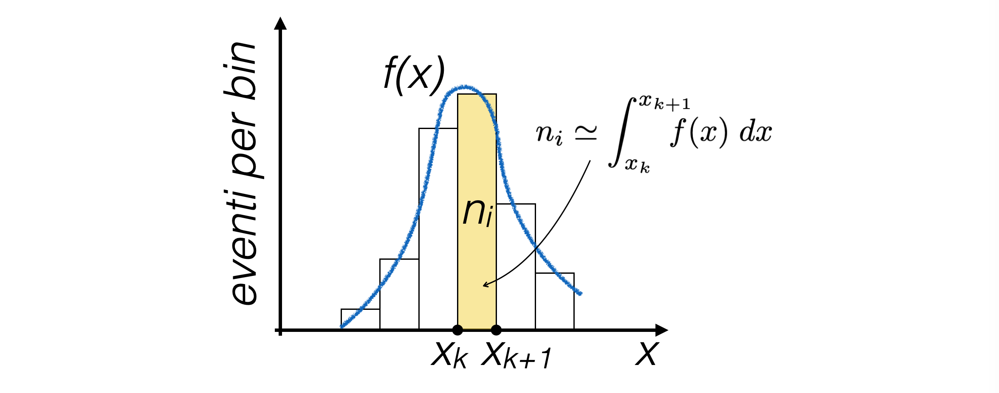
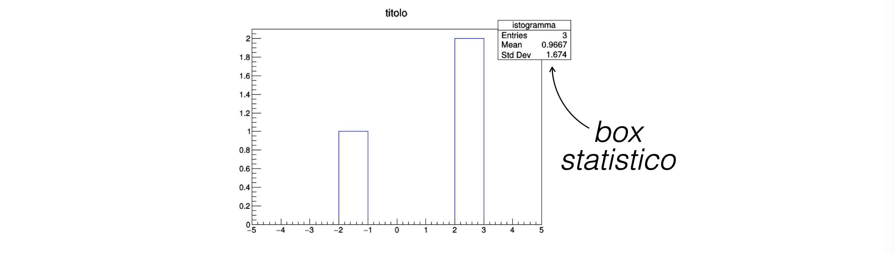
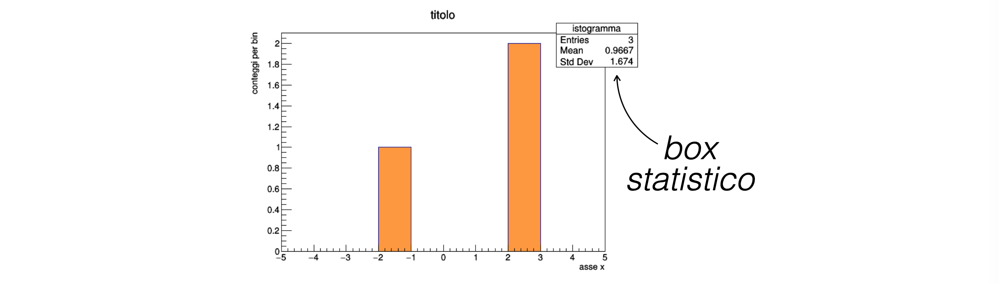
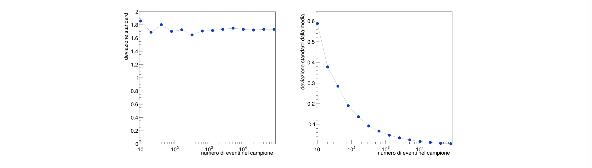

# Lezione 5: visualizzazione di dati con ROOT

## Indice

  * [5.1 Introduzione](#51-introduzione)
    * [5.1.1 l'organizzazione delle librerie di ```ROOT```](#511-lorganizzazione-delle-librerie-di-root)
    * [5.1.2 prerquisiti per utilizzare ```ROOT```](#512-prerquisiti-per-utilizzare-root)
    * [5.1.3 come compilare un programma che include classi di ```ROOT```](#513-come-compilare-un-programma-che-include-classi-di-root)
  * [5.2 ```TH1F```: istogrammi monodimensionali](#52-th1f-istogrammi-monodimensionali)
    * [5.2.1 i bin di un istogramma](#521-i-bin-di-un-istogramma)
    * [5.2.2 istogrammi monodimensionali e distribuzioni di densità di probabilità](#522-istogrammi-monodimensionali-e-distribuzioni-di-densità-di-probabilità)
    * [5.2.3 istogrammi monodimensionali in ```ROOT```](#523-istogrammi-monodimensionali-in-root)
    * [5.2.4 riempimento di un ```TH1F```](#524-riempimento-di-un-th1f)
    * [5.2.5 visualizzazione di un ```TH1F```](#525-visualizzazione-di-un-th1f)
    * [5.2.6 opzioni grafiche](#526-opzioni-grafiche)
    * [5.2.7 un esempio: la forma funzionale Gaussiana](#527-un-esempio-la-forma-funzionale-gaussiana)
    * [5.2.8 scale logaritmiche](#528-scale-logaritmiche)
    * [5.2.9 le statistiche di un istogramma](#529-le-statistiche-di-un-istogramma)
  * [5.3 una piccola digressione: la varianza di una distribuzione](#53-una-piccola-digressione-la-varianza-di-una-distribuzione)
    * [5.3.1 la varianza e la dimensione del campione](#531-la-varianza-e-la-dimensione-del-campione)
    * [5.3.2 varianza e misure (o numeri pseudo-casuali)](#532-varianza-e-misure-o-numeri-pseudo-casuali)
    * [5.3.3 incertezza sulla media](#533-incertezza-sulla-media)
  * [5.4 rappresentazione di andamenti *y* vs *x*: i ```TGraph```](#54-rappresentazione-di-andamenti-y-vs-x-i-tgraph)
    * [5.4.1 definizione di un ```TGraph```](#541-definizione-di-un-tgraph)
    * [5.4.2 riempimento di un ```TGraph```](#542-riempimento-di-un-tgraph)
    * [5.4.3 disegno di un ```TGraph```](#543-disegno-di-un-tgraph)
    * [5.4.4 qualche opzione grafica](#544-qualche-opzione-grafica)
    * [5.4.5 il risultato del disegno](#545-il-risultato-del-disegno)
  * [5.5 TH2F: istogrammi bidimnesionali](#55-th2f-istogrammi-bidimnesionali)
  * [5.6 L'interfaccia interattiva di ```ROOT```: la classe ```TApplication```](#56-linterfaccia-interattiva-di-root-la-classe-tapplication)
  * [5.7 Una gestione furba del testo: ```TString```](#57-una-gestione-furba-del-testo-tstring)
  * [5.8 ESERCIZI](#58-esercizi)


## 5.1 Introduzione

  * [```ROOT```](https://root.cern.ch) offre un insieme di strumenti
    di **visualizzazione, analisi e salvataggio dati**
    sviluppati nell'ambito della fisica delle particelle elementari
  * gli strumenti sono **scritti in ```C++```** ed esiste l'interfaccia ```Python``` per utilizzarli,
    con adattamenti al formato dei dati alla sintassi tipica di quell'ambiente
  * ```ROOT``` offre anche un **ambiente interattivo**
    che si presenta nella forma di una linea di comando,
    dove istruzioni scritte in ```C++``` vengono interpretate
    da un parser dedicato
  * In questo corso vi mostriamo alcune funzionalità di ```ROOT```,
    la descrizione completa di quello che può fare
    si trova nella documentazione on-line


### 5.1.1 l'organizzazione delle librerie di ```ROOT```

  * in un programma scritto in ```C++```,
    ogni oggetto di ```ROOT``` viene reso disponibile nel codice sorgente
    con il corrispondente comando ```#include```
  * la maggior parte degli strumenti disponibili sono implementati
    **sotto forma di classi**  
    ```cpp
    #include "TH1F.h"

    int main (int argc, char ** argv)
      {
        TH1F istogramma ("istogramma", "istogramma", 10, -5., 5.) ;
        return 0 ;
      }
    ```
  * la **visualizzazione** degli strumenti statistici è un aspetto fondamentale del programma,
    quindi molte opzioni grafiche sono integrate negli oggetti statistici


### 5.1.2 prerquisiti per utilizzare ```ROOT```

  * dopo l'installazione, le librerie di ```ROOT``` sono salvate nel disco fisso
    solitamente in una cartella dedicata
  * per avviare l'interfaccia interattiva e per conoscere dove stiano le librerie,
    **è necessario che:**
      * la cartella che contiene l'eseguibile ```root```
        faccia parte della lista di indirizzi salvati nella variabile d'ambiente della SHELL
        ```$PATH```
      * la cartella che contiene le librerie precompilate
        faccia parte della lista di indirizzi salvati nella variabile d'ambiente della SHELL
        ```$LD_LIBRARY_PATH```
  * esiste lo script ```thisroot.sh``` nelle cartelle di installazione che va richiamato
    per effettuare tali impostazioni:
    ```
    > source thisroot.sh
    ```      


### 5.1.3 come compilare un programma che include classi di ```ROOT```

  * è necessario **fornire al compilatore opzioni aggiuntive** perché sia in grado di trovare
    tutti i file da includere e tutte le librerie da compilare
  * la lista di opzioni aggiuntive si **visualizza** con il seguente comando di SHELL:
    ```
    > root-config --cflags --glibs  
    ```
  * per evitare di copiare ed incollare il suo output nel comando di compilazione,
    si può **includere la sua chiamata direttamente nel programma di compilazione**,
    utilizzando gli apici inversi:
    ```
    > c++ -o main_00 `root-config --glibs --cflags` main_00.cpp
    ```


## 5.2 ```TH1F```: istogrammi monodimensionali

  * gli **istogrammi** sono una rappresentazione di distribuzioni differenziali,
    costruita a partire da un campione di numeri,
    che chiamiamo **eventi**
  * si parte quindi da **un campione di eventi *{x<sub>i</sub>}<sub>i=1,..,N</sub>***
    * un esempio di un campione di eventi
      è **l'insieme delle misure raccolte durante un esperimento**,
      oppure una **sequenza di numeri pseudo-casuali**


### 5.2.1 i bin di un istogramma

  * per una variabile casuale di interesse *x*, si suddivide il suo intervallo di definizione
    in **sotto-intervalli adiacenti e disgiunti** delimitati da *{x<sub>k</sub>}*
    * l'intervallo *k*-esimo è limitato fra x<sub>k</sub> ed x<sub>k+1</sub>
    * solitamente gli intervalli sono chiamati **bin**
  * un istogramma è l'**insieme dei conteggi degli eventi che cascano in ogni intervallo**

  * la visualizzazione di un istogramma mono-dimensionale mostra tipicamente:
    * sull'**asse orizzontale** l'intervallo di definizione della variabile *x*
    * sull'**asse verticale** i conteggi corrispondenti a ciascun bin
    * sopra ad ogni bin, **una barra verticale** alta quanto i conteggi


### 5.2.2 istogrammi monodimensionali e distribuzioni di densità di probabilità

  * al **limite per la dimensione dei bin che diventa infinitesima**,
    un istogramma diventa una funzione continua

  * se si dividesse il contenuto di ogni bin per il numero totale di eventi *N*,
    questa funzione è normalizzata,
    quindi un istogramma diventa l'approssimazione di una
    distribuzione di densità di probabilità


### 5.2.3 istogrammi monodimensionali in ```ROOT```

  * istogrammi mono-dimensionali in ```ROOT``` sono realizzati con la classe ```TH1F```
    ```cpp
    TH1F istogramma ("istogramma", "titolo", 10, -5., 5.) ;
    ```
  * il costruttore di ```TH1F``` prende come input:
    * un **nome**: è saggio usare il medesimo della variabile (ogni oggetto deve avere un nome unico!)
    * un **titolo**, che viene scritto sopra l'istogramma
    * il **numero di bin** (```10``` in questo caso) in cui dividere l'intervallo di definizione della variabile
    * l'**intervallo di definizione** della variabile (```-5., 5.``` in questo caso)


### 5.2.4 riempimento di un ```TH1F```

  * un oggetto della classe ```TH1F``` quando viene creato **è vuoto**,
    cioè  i conteggi di ogni singolo bin sono nulli
  * per riempire l'istogramma
    si utilizza il suo metodo ```Fill```,
    che viene chiamato per ogni evento:  
    ```cpp
    istogramma.Fill (2.2) ;
    istogramma.Fill (2.1) ;
    istogramma.Fill (-1.4) ;
    ```
    * aggiorna i **conteggi** del bin in cui casca il valore passato (in questo caso ```2.2```, ```2.1```, ```-1.4```)
    * aggiorna i **contatori** per il calcolo delle statistiche
      (numero di eventi, somma degli eventi, somma del quadrato degli eventi)


### 5.2.5 visualizzazione di un ```TH1F```

  * per visualizzare un istogramma, serve istanziare un oggetto grafico
    della classe ```TCanvas```,
    che è la tela dove l'istogramma viene disegnato
      * è necessario includere ```TCanvas.h``` perché il programma compili
    ```cpp
    TCanvas c1 ;
    istogramma.Draw () ;
    c1.Print ("esempio.png", "png") ;
    ```
    * l'oggetto ```c1``` si occupa di produrre l'immagine che contiene l'istogramma
  * il box in alto a sinistra nell'immagine dell'istogramma
    riporta **statistiche associate alla collezione di eventi**



### 5.2.6 opzioni grafiche

  * perché l'informazione sull'istogramma sia completa,
    è necessario aggiungere informazioni riguardo il **significato degli assi**,
    prima di invocare il metodo ```Draw```:
    ```cpp
    istogramma.GetXaxis ()->SetTitle ("asse x") ;
    istogramma.GetYaxis ()->SetTitle ("conteggi per bin") ;
    ```
  * inoltre, è possibile cambiare il colore di riempimento di un istogramma:
    ```cpp
    istogramma.SetFillColor (kOrange + 1) ;
    ```

  * la descrizione dettagliata di tutte le funzionalità
    ed opzioni di disegno degli istogrammi
    è **documentata nella relativa [guida per l'utente](https://root.cern.ch/root/htmldoc/guides/users-guide/Histograms.html)**


### 5.2.7 un esempio: la forma funzionale Gaussiana

  * si può utilizzare un oggetto di tipo ```TH1F```
    per **visualizzare la distribuzione di eventi pseudo-casuali** generati
    con gli algoritmi scritti nella lezione precedente
  * assumendo che la **funzione che genera numeri casuali**
    con il metodo del teorema centrale del limite
    abbia il seguente prototipo:
    ```cpp
    float rand_TCL (float xMin, float xMax, int N = 10)
    ```
  * si può rimepire un istograma di test dell'algoritmo in questo modo:
    ```cpp
    TH1F h ("h", "eventi pseudo-casuali Gaussiani", 200, -1.5, 1.5) ;
    for (int j = 0 ; j < 1000000 ; ++j)
      h.Fill (rand_TCL (-1., 1., 10)) ;
    ```
    con ```1000000``` eventi, ottenendo poi:


### 5.2.8 scale logaritmiche

  * quando i valori in diversi bin cambiano considerevolmente,
    può essere comodo **visuallizzare gli istogrammi in scala logaritmica**
    (lungo l'asse orizzontale o verticale),
    per migliorare la leggibilità del risultato
  * essendo una diversa visualizzazione dello stesso contenuto,
    è un'operazione che si fa con un metodo della classe ```TCanvas```
    ```cpp
    c1.SetLogy () ;
    c1.Print ("Gaussian.png", "png") ;
    ```
    * chiaramente, lo zero dell'asse in scala logaritmica non può comparire nelle immagini


### 5.2.9 le statistiche di un istogramma

  * è possibile estrarre i valori della **media e della deviazione standard**
    degli eventi salvati in un istogramma:
    ```cpp
    std::cout << "numero di eventi:    " << h.GetEntries () << std::endl ;
    std::cout << "media:               " << h.GetMean ()    << std::endl ;
    std::cout << "deviazione standard: " << h.GetRMS ()     << std::endl ;
    ```


## 5.3 una piccola digressione: la varianza di una distribuzione

  * dato un campione di variabili casuali *{x<sub>i</sub>}<sub>i=1,..,N</sub>*
    indipendenti identicamente distribuite,
    **la varianza della distribuzione è la media degli scarti quadratici dalla media**
  * si dimostra che la varianza di un campione è uguale alla **media dei quadrati meno il quadrato della media**:
    *V = E[x<sup>2</sup>]-E[x]<sup>2</sup>*
    (*E[f]* è il valore di aspettazione di f sul campione in esame)
  * la radice della varianza è detta **sigma, o deviazione standard**
    ed è una stima della dispersione del campione attorno alla sua media


### 5.3.1 la varianza e la dimensione del campione

  * all'aumentare del numero di eventi nel campione,
    la dispersone degli eventi non cambia, quindi **la varianza rimane costante**
    per variabili identicamente distribuite
  * chiaramente, siccome ogni campione è finito,
    i valori della varianza ottenuti con campioni diversi non sono identici,
    ma ci si aspetta che siano **compatibili fra loro**
  * di conseguenza,
    anche la **deviazione standard non dipende dal numero di eventi nel campione**


### 5.3.2 varianza e misure (o numeri pseudo-casuali)

  * se si conosce media e varianza di un campione,
    si ha un'idea di **dove ci si aspetta di trovare l'evento successivo** di quel campione
  * se il campione è un insieme di misure,
    la deviazione standard dice quanto distante ci si aspetta di trovare la **prossima misura**
    dalla media delle misure raccolte
  * dunque, la deviazione standard è associata all'**incertezza sulla singola misura**  


### 5.3.3 incertezza sulla media

  * all'aumentare del numero di misure, invece, aumenta la **precisione
    con la quale si conosce la media** del campione
  * la **deviazione standard della media**,
    definita come la deviazione standard divisa per la radice del numero di eventi nel campione,
    è una stima dell'**incertezza sulla media**


## 5.4 rappresentazione di andamenti *y* vs *x*: i ```TGraph```

  * gli istogrammi mostrano una **singola variabile fisica**
  * talvolta è utile visualizzare **coppie di misure** *(x,y)*
  * in ```ROOT``` la classe che si utilizza per farlo è il ```TGraph```


### 5.4.1 definizione di un ```TGraph```  

  * come sempre, bisogna includere la **libreria** corrispondente:
    ```cpp
    #include "TGraph.h"
    ```
  * ricordando di aggiungere le opzioni di ```ROOT``` al comando di compilazione:
    ```
    > c++ -o programma `root-config --cflags --glibs` programma.cpp
    ```
  * un oggetto di tipo ```TGraph``` si definisce semplicemente:
    ```cpp
    TGraph g_sigma ;
    ```
    * l'oggetto è **vuoto**: non contiene alcuna variabile
    * esistono **altri costruttori** oltre a quello di default,
      che permettono di inizializzare un ```TGraph``` con un insieme di coppie di punti nulli
      oppure a partire da array già riempiti


### 5.4.2 riempimento di un ```TGraph```

  * un ```TGraph``` viene **riempito** con il metodo ```TGraph::SetPoint (Int_t i, Double_t x, Double_t y)```,
    che prende in input:
    * l'**indice del punto da riempire**, che per il primo punto è *0*
    * il **valore della variabile *x***
    * il **valore della variabile *y***
    ```cpp
    g_sigma.SetPoint (g_sigma.GetN (), 11.5, 7.4) ;
    ```
    * in questo caso, come primo argomento si utilizza il metodo stesso ```TGraph::GetN ()```,
      perché per un ```TGraph``` che contiene ```N``` elementi
      l'indice dell'ultimo elemento salvato è ```N-1```
  * si noti che ```ROOT``` ridefinisce le variabili numeriche del ```C++```
    (sostituendo ```int``` con ```Int_t``` e ```double``` con ```Double_t``` in questo caso),
    perché le variaibli definite internamente da ```ROOT``` hanno una dimensione in byte convenzionale


### 5.4.3 disegno di un ```TGraph```

  * come nel caso di ```TH1F```, un ```TGraph``` si **disegna su un ```TCanvas```**:
    ```cpp
    TCanvas c1 ("c1", "c1", 100, 100, 1000, 1000) ;
    c1.SetLogx () ;
    g_sigma.Draw ("ALP") ;
    c1.Print ("sigmaTrend.png", "png") ;
    ```
    * le opzioni passate al metodo ```Draw``` richiedono di
      * tracciare gli **assi** (```A```)
      * congiungere i punti con una **linea** (```L```)
      * disegnare i **marker** ad ogni punto (```P```).


### 5.4.4 qualche opzione grafica

  * anche per un ```TGraph```,
    si possono impostare diversi parametri grafici:
    ```cpp
    g_sigma.SetMarkerStyle (20) ;
    g_sigma.SetMarkerColor (kAzure - 1) ;
    g_sigma.SetLineColor (kGray + 1) ;
    g_sigma.SetMarkerSize (2) ;
    g_sigma.GetHistogram ()->GetXaxis ()->SetTitle ("numero di eventi nel campione") ;
    g_sigma.GetHistogram ()->GetYaxis ()->SetTitle ("deviazione standard") ;
    ```
      * il metodo ```TGraph::GetHistogram ()``` restituisce il puntatore
        all'istogramma di servizio creato da ```ROOT```
        per comporre graficamente il disegno


### 5.4.5 il risultato del disegno

  * nel caso dell'andamento della **deviazione standard**
    e della **deviazione standard della media**,
    dal disegno dei ```TGraph``` nel caso di una distribuzione uniforme
    si nota chiaramente che una delle due rimane costante,
    mentre l'altra diminuisce all'aumentare del numero di eventi
    presenti nel campione

  * il campionamento di punti sull'asse *x* è fatto
    **con ragione logaritmica**,
    perché l'andamento atteso è lento
    (proporzionale a radice di *N*)
  * la **scala logaritmica sull'asse *x***
    aiuta a visualizzare in modo più efficace queste variazioni


## 5.5 TH2F: istogrammi bidimnesionali

  * il concetto di istogramma monodimensionale si applica facilmente anche al **caso bidimensionale**
  * l'oggetto di ```ROOT``` associato a questo concetto si chiama ```TH2F```
  * nel costruttore, è necessario inserire numero di bin ed estremi per due direzioni
    ```cpp
    TH2F h2 ("h2", "eventi pseudo-casuali Gaussiani", 200, -1.5, 1.5, 200, -1.5, 1.5) ;
    ```
  * nel riempimento, il metodo ```TH2F::Fill (Double_t x, Double_t y)``` prende in ingresso due valori
    ```cpp
    h2.Fill (rand_TCL (-1., 1., 10), rand_TCL (-1., 1., 10)) ;
    ```


## 5.6 L'interfaccia interattiva di ```ROOT```: la classe ```TApplication```

  * i ```TCanvas``` di ```ROOT``` sono dotati di diverse **funzionalità interattive**
    alle quali si accede con menu a tendina o contestuali
    (accessibili con il pulsante destro del mouse)
  * per **abilitare queste funzionalità** in un programma compilato,
    è necessario utilizzare un oggetto della classe **TApplication**
    ```cpp
    TApplication theApp ("theApp", &argc, argv) ;
    TCanvas c1 ;
    istogramma.Draw ("hist") ;
    theApp.Run () ;
    ```
    * fra la linea
      ```cpp
      TApplication theApp ("theApp", &argc, argv) ;
      ```
      e la linea
      ```cpp
      theApp.Run () ;
      ```
      va incluso tutto il codice che si vuole interattivo
    * può esistere un solo oggetto di tipo ```TApplication``` in ogni programma
    * per terminare l'esecuzione del programma,
      da un qualunque ```TCanvas``` bisogna utilizzare il menu ```File->Quit ROOT```


## 5.7 Una gestione furba del testo: ```TString```

  * ```ROOT``` fornisce un oggetto che serve per **maneggiare stringhe**
    che può essere utilizzato come argomento nei metodi delle sue classi
  * le ```TString``` hanno definite una serie di operazioni
    che permettono di **combinare velocemente testo con altre variabili**
    ```cpp
    int num = atoi (argv[1]) ;
    TString titolo = "ci sono " ;
    titolo += num ;
    titolo += " eventi" ;
    TH1F istogramma ("istogramma", titolo, 10, -5., 5.) ;
    ```


## 5.8 ESERCIZI

  * Gli esercizi relativi alla lezione si trovano [qui](ESERCIZI.md)
