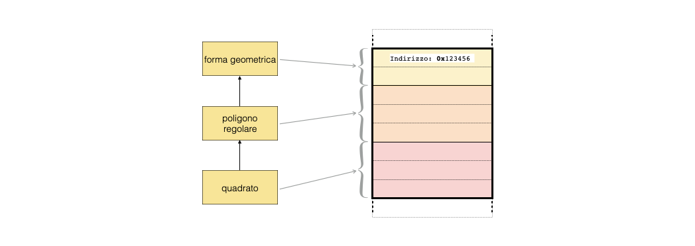

# Lezione 8: programmazione ad oggetti: l'ereditarieta' ```public```


## 8.1 Introduzione

  * nella programmazione ad oggetti,
    la **traslazione dalle funzioni ai metodi delle funzionalita'** dei programmi
    produce necessariamente una proliferazione di classi
    per svolgere i compiti dei programmi
  * spesso succede che classi simili **implentino comportamenti comuni**
    insieme a comportamenti specifici per ciascuna di esse  
  * il meccanismo dell'ereditarieta' permette di **evitare di reimplementare comportamenti comuni**,
    definendoli soltanto una volta per una **classe base**,
    facendo in modo che vengano ereditati da diverse **classi derivate**
  * le classi derivate, dunque, **adattano ed estendono comportamenti generali** 
    definiti nella classe base


### 8.1.1 Rappresentazione grafica

  * il meccanismo di ereditarieta' ```public``` introduce una **gerarchia fra classi**:
    ogni classe derivata e' un caso particolare della classe base.
    Questo concetto e' noto come la **regola is-a**.
    


### 8.1.2 Problemi di privacy

  * nelle classi, 
    i membri ed i metodi sono divisi in parte ```public``` e parte ```private```:
    **come funziona l'accesso** nel caso dell'ereditarieta'?  
  * i membri e metodi ```public``` delle classi base **sono accessibili** alle classi derivate
  * i membri e metodi ```private``` delle classi base **non sono accessibili** alle classi derivate
  * esiste una terza catergoria: 
    i membri e metodi ```protected``` delle classi base **non sono accessibili al di fuori** della classe base,
    **restando accessibili alle classi derivate**.


## 8.2 Implementazione dell'esempio delle forme geometriche 


### 8.2.1 La classe base: ```forma```

  * la **classe base** per le forme geometriche ha un contenuto molto semplice:
    ```cpp
    class forma
    { 
      public:
        
        forma (double area = -1.) : m_area (area) {} ;
        ~forma () {} ;
        double area () const { return m_area ; } ;
    
      protected:  
    
        double m_area ;
    
    } ;

    ```
    * il membro ```m_area``` e' ```protected``` perche' sia accessibile
      anche alle classi derivate
    * in questo caso non ci sono ```private```, ma si potrebbero mettere  
  * un oggetto di tipo ```forma``` puo' essere istanziato in un programma ```C++``` 
    ```cpp
    forma forma_base ;
    cout << forma_base.area () << endl ;
    ```


### 8.2.2 Una classe derivata: ```quadrato```

  * La sintassi per definire una **classe derivata pubblicamente** e' la seguente:
    ```cpp
    class quadrato : public forma 
    {
      public:
    
        quadrato (double lato = 1.) :
          m_lato (lato),
          forma (lato * lato) {}
    
        double lato () const { return m_lato ; }
        void cambia_lato (double lato) 
          {
            m_lato = lato ;
            m_area = m_lato * m_lato ;
            return ;
          } ;
    
        ~quadrato () {} ;
    
      private:  
    
        double m_lato ;
    
    } ;

    ```
    * il membro ```m_lato``` e' **dichiarato ```private```** 
      perche' nella progettazione della struttura di ereditarieta' 
      non ci sono classi derivate che debbano accedervi
    * i metodi specifici della classe quadrato   
      **si aggiungono** a quelli della classe base
    * il membro **```m_area``` e' accessibile** anche dalla classe ```quadrato```  


### 8.2.3 La classe derivata nel programma principale

  * nella funzione ```main```, 
    o in qualunque altra funzione dove venga utilizzato,
    per un oggetto di tipo ```quadrato``` si possono chiamare i metodi pubblici
    **sia della classe base che di quella derivata**:
    ```cpp
    quadrato forma_quadrata (3.) ;
    cout << "area: " << forma_quadrata.area () << endl ;
    cout << "lato: " << forma_quadrata.lato () << endl ;
    forma_quadrata.cambia_lato (4.) ;
    cout << "area: " << forma_quadrata.area () << endl ;
    ```
  * la consistenza delle informazioni (ad esempio, che l'area sia calcolata correttamente)
    dipende dalla **bonta' dell'implementazione**


### 8.2.4 Un'altra classe derivata: il ```rettangolo```

  * da una medesima classe base possono ereditare **diverse classi derivate**:
    ```cpp
    class rettangolo : public forma 
    {
      public:
    
        rettangolo (double lato_o = 1., double lato_v = 1.) :
          m_lato_o (lato_o),
          m_lato_v (lato_v),
          forma (lato_o * lato_v) {}
    
        double lato_o () const { return m_lato_o ; }
        double lato_v () const { return m_lato_v ; }
    
        void cambia_lato_o (double lato) 
          {
            m_lato_o = lato ;
            m_area = m_lato_o * m_lato_v ;
            return ;
          } 
    
        void cambia_lato_v (double lato) 
          {
            m_lato_v = lato ;
            m_area = m_lato_o * m_lato_v ;
            return ;
          }
    
        ~rettangolo () {} ;
    
      private:  
    
        double m_lato_o ;
        double m_lato_v ;
    
    } ;
  
    ```
  * in questo caso, **sono necessari piu' metodi e piu' membri**
    per descrivere le proprieta' del rettangolo


### 8.2.5 La regola is-a: una specializzazione

  * L'ereditarieta' delle funzionalita' delle classi base nelle classi derivate
    e' un aspetto importante della progettazione del codice sorgente
    e **riguarda il comportamento** di una classe
  * ad esempio, per il ```C++``` un quadrato **non** e' una specilizzazione di un rettangolo,
    nonostante dal punto di vista geometrico il quadrato sia un rettangolo con lati uguali
    * ad un rettangolo si puo' modificare la lunghezza di un lato e rimane un rettangolo,
      mentre se si modifica la lunghezza di un lato di un quadrato,
      la forma geometrica **diventa un rettangolo generico**
  * quindi la classe ```quadrato``` **non e' una specializzazione** della classe ```rettangolo```,
    perche' non tutte le funzioni di ```rettangolo``` possono essere applicate a ```quadrato```


## 8.3 ereditarieta' e polimorfismo

  * quando due o piu' classi 
    sono inserite in una gerarchia ereditaria,
    un puntatore alla classe base
    puo' essere utilizzato per **referenziare anche oggetti 
    delle classi derivate**
  * questo e' possibile dal fatto che la memoria dove sono salvati gli oggetti
    viene utilizzata a fette (**memory slicing**), 
    in modo che regioni separate della memoria corrispondano
    a parti differenti dell'oggetto considerato:
    
    * nello spazio occupato in memoria dall'oggetto ```quadrato```,
      la prima sezione (gialla) **contiene la parte ```forma```** dell'oggetto,
    * la seconda (arancione) contiene **cio' che serve in piu' per realizzare il ```poligono regolare```**,
    * la terza (rossa) contiene **cio' che serve in piu' rispetto al ```poligono regolare```
      per realizzare il ```quadrato```**
  * in questo modo, noto l'indirizzo della cella iniziale 
    a seconda del tipo da considerare il ```C++``` e' in grado di ricostruire
    l'oggetto corrispondente    


### 8.3.1 Compatibiita' fra tipi ereditariamente correlati

  * Il *memory slicing* significa che sia lecito assegnare il puntatore di una classe derivata
    a **quello di una classe base**, 
    senza incorrere il problemi di accesso alla memoria:
    ```cpp
    quadrato forma_quadrata (3.) ;
    forma * puntatore = & forma_quadrata ;
    ```
  * Chiaramente l'opposto non e' ammissibile,
    perche' l'oggetto ```quadrato``` occupa piu' posto in memoria dell'oggetto ```forma```


### 8.3.2 Il calcolo dell'area

  * Nell'implementazione delle funzioni ```rettangolo::cambia_lato_o (double)```, 
    ```rettangolo::cambia_lato_o (double)```, ```quadrato::cambia_lato (double)``` 
    l'area della forma geometrica **e' stata ricalcolata**,
    perche' sono state modificate le caratteristiche geometriche della forma
  * E' naturale **aggiungere un metodo ```calcola_area```** per tutte le forme geometriche,
    in modo che per ciascuna di esse il calcolo venga fatto sempre allo stesso modo
  * E' anche naturale immaginare che questo metodo sia parte della classe ```forma```, 
    perche' esiste per ogni classe derivata, 
    e venga poi **reimplementato** da ogni classe derivata


### 8.3.3 *Dynamic binding*

  * A partire da un puntatore ad una classe base,
    il ```C++``` e' in grado di **comprendere dinamicamente 
    di che tipo sia l'oggetto** referenziato dal puntatore
    ed applicare il metodo corretto
  * Per ottenere questo comportamento,
    e' necessario definire i metodi da reimplementare 
    con la parola chiave ```virtual```  


### 8.3.4 Implementazione del metodo ```calcola_area```

  * **Nella classe base**, la funzione ```calcola_area``` non ha informazioni sufficienti 
    per fare alcun conto, quindi e' implementata in modo banale in ```forma```:
    ```cpp
    virtual double calcola_area () { return -1. ; } 
    ```
    * La parola chiave ```virtual``` anticipa al compilatore  
      che le classi derivate **potrebbero reimplementare questo metodo**
      e che bisogna scegliere quella giusta in fase di esecuzione,
      a seconda del tipo effettivo di ciascun puntatore
  * **Nella classe derivata** la funzione viene reimplementata 
    con le informazioni necessarie, ad esempio per ```quadrato```:
    ```cpp
    virtual double calcola_area () 
      { 
        m_area = m_lato * m_lato ; 
        return m_area ; 
      }
    ```


### 8.3.5 l'ulitizzo nel programma

  * Con questo accorgimento, grazie al *dynamic binding* 
    il programma **riconosce durante l'esecuzione**
    il tipo di oggetto da considerare.
  * Le seguenti istruzioni:
    ```cpp
    quadrato forma_quadrata (3.) ;
    forma * puntatore = & forma_quadrata ;   
    cout << puntatore->calcola_area () << endl ;
    ```
    restituiranno a schermo il valore ```9```, invece che ```-1```.


### 8.3.6 Il distruttore di una classe virtuale

  * Il *dynamic binding* si intreccia con il fatto che un puntatore potrebbe venire **allocato dinamicamente**,
    quindi poi distrutto con l'operatore ```delete```
  * Se l'operatore ```delete``` viene chiamato su un puntatore alla classe base,
    per essere certi che venga chiamato anche il distruttore della classe derivata
    e' necessario **dichiarare sempre il distruttore di tipo ```virtual```**
    quando si utilizzi il polimorfismo


## 8.4 Le interfacce e le classi puramente virtuali

  * Una classe base in ```C++``` puo' essere utilizzata
    soltanto **per definire i comportamenti** di un insieme di classi derivate,
    deputanto l'implementazione alle classi derivate.
  * Chiaramente, una classe senza implementazione **non puo' essere utilizzata**
    per definire oggetti, 
    perche' il tipo e' incompleto.
  * Una classe di questo genere e' detta ```puramente virtuale```.


### 8.4.1 Le interfacce

  * La definizione di una classe puramente virtuale
    che detti i comportamenti delle classi derivate
    viene spesso utilizzata per garantire che oggetti definiti all'esterno di un programma
    o di una libreria
    **abbiano comportamenti compatibili** con il programma o la libreria stessi.
  * Le classi puramente virtuali 
    dalle quali si eredita il comportamento desiderato sono dette **interfacce**.


## 8.5 Il polimorfismo ed i contenitori STL


  * il comportamento polimorfico di una catena di ereditarieta'
    permette di **riempire contenitori STL con un insieme eterogeneo** di oggetti
  * infatti, un contenitore di puntatori ad oggetti di una classe base
    puo' essere **riempito con i puntatori ad oggetti di diverse classi derivate**
    ed il ```C++``` capisce *run-time* quale funzione interpellare  
    ```cpp
    map<string, forma *> m_forme ; 
    
    forma forma_base ;
    m_forme["base"] = & forma_base ; 
    quadrato forma_quadrata (3.) ;
    m_forme["quadrato"] = & forma_quadrata ; 
      rettangolo forma_rettangolare (3., 2.) ;
    m_forme["rettangolo"] = & forma_rettangolare ; 

    for (map<string, forma *>::const_iterator it = m_forme.begin () ;
         it != m_forme.end () ;
         ++it)
      cout << it->first << " ha area " << it->second->calcola_area () << endl ;
  
    ```


## 8.6 algoritmi nelle STL

  * insieme a strumenti per contenere informazioni, 
    le STL offrono **algoritmi per maneggiarle**
  * due operazoni importanti per maneggiare contenitori
    sono la **ricerca di un elemento al suo interno** e
    l'**ordinamento del suo contenuto**


### 8.6.1 ```std::find```

  * il prototipo di questo algoritmo e' il seguente:
    ```cpp
    template <class InputIterator, class T>
    InputIterator find (InputIterator first, InputIterator last, const T& val);
    ```
  * trova il **primo elemento** all'interno di un contenitore uguale a ```val```,
    nell'intervallo delimitato da due iteratori ```[first, last)```
    * per cercare su **tutto un contenitore** si passano come argomenti i suoi ```begin ()``` ed ```end ()```
  * utilizza l'**```operator==``` definito per il tipo ```T```** per la ricerca
    * deve essere definito!
  * restituisce l'**iteratore** al primo elemento trovato uguale a ```val```
    * se **non trova nulla**, restituisce l'iteratore alla fine del contenitore


### 8.6.2 ```std::sort```


### 8.6.3 unary operators


### 8.6.4 ordinamento al contrario


## 8.7 Ereditarieta' e ```template```

- polimorfismo run-time e polimorfismo compile-time


## 8.8 ESERCIZI

  * Gli esercizi relativi alla lezione si trovano [qui](ESERCIZI.md)


