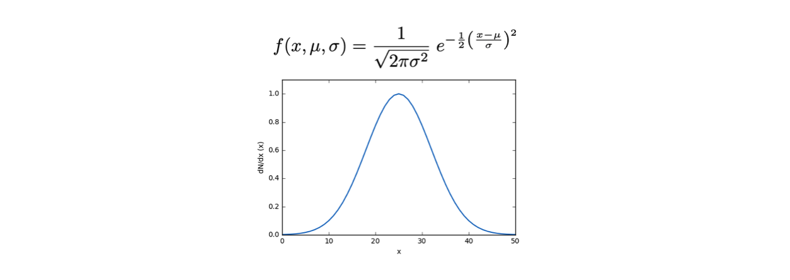
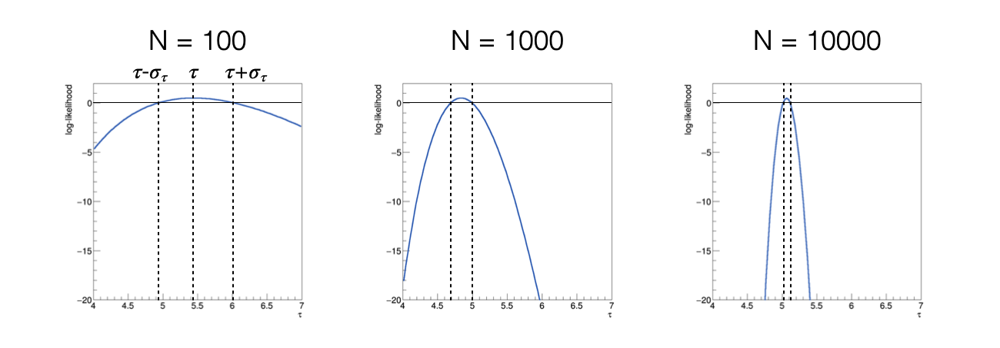

# Lezione 9: stima di parametri con il metodo della massima verosimiglianza


## 9.1 Introduzione

  * Studiamo la statistica nel **paradigma frequentista**,
    secondo il quale la probabilita' e' definita operativamente 
    come la frazione di volte in cui una misura ha un determinato risultato, 
    rispetto ad un totale molto grande
  * Il **risultato di un esperimento** di misura
    e' uno dei possibili risultati date le configurazioni iniziali


### 9.1.1 Un modello che descrive i dati

  * Un **modello** e' una distribuzione di probabilita' *f*
    o una legge *g* alla quale ci si aspetta che le misure obbediscano.
  * I **risultati delle misure** sono ovviamente variabili 
    rispetto alle quali il modello dipende
  * Ulteriori variabili presenti nel modello,
    che non sono misurate,
    sono dette **parametri**.


### 9.1.2 Distribuzioni di probabilita'

  * Dato un insieme di misure reali *x<sub>i</sub>* definite su un insieme &Omega; 
    indipendenti identicamente distribuiite,
    sappiamo che seguono una **data distribuzione di densita' probabilita'**, 
    indicata genericamente come *f(x, &theta;)*
  * Questo significa che *f(x<sub>i</sub>, &theta;)* e' **la densita' di probabilita'**
    che la misura avvenga nel punto x<sub>i</sub> dell'insieme di definizione &Omega;.
  * Il **simbolo &theta;** indica che la funzione di densita' di probabilita' *f*
    dipende da altre variabili oltre che *x*
    * &theta; puo' anche essere un vettore di parametri
    * Ad esempio, una **distribuzione Gaussiana** ha due parametri aggiuntivi, &mu; e &sigma;:



### 9.1.3 La determinazione dei parametri

  * Spesso l'obiettivo di un esperimento e' la **stima dei parametri** di un modello
  * Per ottenere questo risultato, 
    si **raccolgono molti dati** *x<sub>i</sub>* e si utilizzano come input
    ad algoritmi, detti **stimatori**, che stimino i parametri di interesse
  * Le **stime** prodotte da uno stimatore **sono variabili casuali**, 
    perche' tramite gli stimatori sono funzioni di numeri casuali (i dati)
    * Hanno una propria distribuzione di probabilita'

  * Esistono programmi che svolgono il compito per noi. 
    Fra questi, ```ROOT``` contiene diversi algoritmi per farlo.
    In gergo, **l'operazione di determinazione dei parametri e' chiamata *fit***,
    cioe' adatattamento.


## 9.2 La massima verosimiglianza

  * La tecnica della massima verosimiglianza
    si basa sull'assunto che la stima dei parametri ricercati
    corrisponda al **valore 
    che massimizza la *likelihood***,
    definita come
    il prodotto del valore della distribuzione di densita' di probabilita'
    calcolata per ogni misura effettuata:

  * La *likelihood* e' funzione sia delle misure che dei parametri, 
    tuttavia si **evidenzia la dipendenza dai parametri** perche'
    a misure finite i dati sono immutabili.
  * La funzione che stima i parametri dunque si ricava dall'equazione:


### 9.2.1 Il logaritmo della massima verosimiglianza

  * Solitamente si utilizza il **logaritmo della funzione di *likelihood***, 
    indicato con in lettera corsiva minuscola:.

  * Infatti, siccome il logaritmo e' una **funzione monotona crescente**,
    gli estremanti di una funzione e del suo logaritmo si trovano al medesimo posto
  * Il logaritmo di un prodotto di termini
    e' uguale alla somma dei logaritmi dei singoli termini,
    quindi l'operazione di derivata del logaritmo della funzione di *likelihood*
    e' **piu' semplice** rispetto alla 
    derivata della funzione di *likelihood*:

  * Il logaritmo di un numero e' piu' piccolo del numero stesso
    e varia su un intervallo minore rispetto alla variabilita' del numero stesso,
    quindi **operazioni con i logaritmi sono piu' stabili numericamente**


### 9.2.2 La sigma della distribuzione dei parametri stimati

  * Sappiamo che esiste un **metodo grafico** 
    per la determinazione della sigma associata ai parametri stimati con 
    il metodo della massima verosimiglianza
  * consiste nel deteminare i punti di intersezione 
    fra la funzione di log-*likelihood* 
    e la retta orizziontale con coordinata pari al **massimo di log-*likelihood* - 0.5**
    e calcolarne la mezza distanza


### 9.2.3 Le proprieta' degli stimatori di massima verosimiglianza

  * Sono **consistenti**
  * Sono **asintoticamente non distorti**, 
    cioe' hanno bias nullo per il numero di misure *N* che tende all'infinito
  * Sono **asintoticamente efficienti**,
    cioe' hanno la varianza minima possibile 
    per il numero di misure *N* che tende all'infinito


### 9.3 Un utile intermezzo: la lettura di un *file* di testo

  * Puo' essere comodo **salvare informazioni semplici** su file di testo,
    per poterle rileggere dai programmi di analisi dati
  * La gestione dell'accesso a file di testo in ```C++``` e' **analoga
    alla scrittura a schermo e lettura da tastiera**:
    si utilizzano gli operatori di redirezione ```operator>>``` (per leggere)
    ed ```operator<<``` (per scrivere) fra un oggetto che rappresenta il file
    e le variabili


### 9.3.1 L'implementazione della lettura

  * L'oggetto che rappresenta un file e' di tipo ```fstream```: 
    ```ifstream``` per lettura (**input file stream**) ed
    ```ofstream``` per scrittura (**output file stream**):
    ```cpp
    #include <fstream>
    // ...
    ifstream input_file ; 
    input_file.open ("file.txt", ios::in) ;
    // ...
    vector<double> data ;
    double input_val ;
    while (true) 
      {
        input_file >> input_val ;
        if (input_file.eof () == true) break ;
        data.push_back (input_val) ;
      } 
    input_file.close () ;
    ```
    * In questo modo, una sequenza di numeri scritti nel file ```file.txt```
      vengono letti uno ad uno, **trasferendone il valore nella variabile ```input_val```**
    * Il valore della variabile, ad ogni lettura, viene aggiunto al ```vector``` chiamato ```data```
    * All'interno del file di testo,
      i valori sono seperati da spazi, tab o accapo.  
    * Al termine della lettura, il *file* viene chiuso.


## 9.4 La costruzione di una *likelihood* e la determinazione di un parametro

  * Si utilizzera' l'esempio della distribuzione esponenziale
    per determinarne l'unico parametro &tau; tramite il metodo della massima verosimiglianza:

  * **Si dimostra analiticamente**
    che la media artimetica dei dati e' uno stimatore del parametro &tau;,
  * si vuole in questo caso **costruire lo stimatore numerico**
    del parametro,
    come esempio di un caso generale in cui il calcolo analitico non sia possibile.


### 9.4.1 La distribuzione di probabilita' e la funzione di *likelihood*

  * Sia la distribuzione di densita' di probabilita'
    che il calcolo della *likelihood* vanno scritte in codice sorgente:
    ```cpp
    double esponenziale (double x, double tau)
      {
         if (tau == 0.) return 1. ;
         return exp (-1. * x / tau) / tau ;
      }
    ```
    * il primo ```if``` serve a **proteggere il programma** da risultati infiniti
  * il calcolo della *likelihood* avra' in ingresso
    sia i dati, che il parametro di interesse:
    ```cpp
    double loglikelihood (
      const vector<double> & data, 
      double param
    )
    {
      double result = 0. ; 
      for (int i = 0 ; i < data.size () ; ++i) result += log (esponenziale (data.at (i), param)) ;
      return result ;   
    }
    ```
    * in questo caso, 
      si calcola il logaritmo del valore della densita' di probabilita' in ogni punto


### 9.4.2 La determinazione del massimo del logaritmo della *likelihood*

  * Si puo' utilizzare l'**algoritmo della sezione aurea** sviluppato durante la Lezione 6
    per trovare il massimo della log-likelihood:
    ```cpp
    double sezione_aurea_max (
      double logl (const vector<double> & , double),
      double xMin,
      double xMax,
      const vector<double> & data,
      double precision = 0.0001
    )
    ```
    * Il programma va scritto in modo che si **cerchi il massimo** di una funzione
    * I **parametri in ingresso** sono 
      la funzione di cui trovare l'estremante (```logl```),
      l'intervallo sul quale cercare il valore massimo **per il parametro &tau;**,
      il ```vector``` contenente i dati
      e la precisone alla quale arrestare il calcolo,
      per la quale c'e' un valore di default.


### 9.4.3 L'applicazione al caso in esame

  * Dopo aver letto un file contenente numeri distribuiti secondo una densita' di probabilita' esponenziale,
    che si puo' visualizzare con un ```TH1F``` di ```ROOT```:

  * Le funzioni sviluppate possono essere utilizzate 
    con i numeri salvati in un ```vector```,
    a partire da un **intervallo di ricerca del massimo scelto ragionevolmente**:
    ```cpp
    double massimo = sezione_aurea_max (loglikelihood, 0.5 * media_v, 1.5 * media_v, data) ;
    ```
  * Il risultato di questo algoritmo puo' essere **confrontato con la media aritmetica** 
    dei numeri, che per questa particolare distribuzione di probabilita'
    e' uno stimatore di &tau;:
    ```
    letti 100 eventi
    media = 5.44364
    massimo della likelihood = 5.44362
    ```


### 9.4.4 La sigma associata allo stimatore di &tau;

  * Lo stimatore di &tau; e' una variabile casuale, 
    cioe' ha una **proria distribuzione di probabilita'**
  * Dunque oltre al avere associata una stima puntuale ricavata massimizzando
    il logaritmo della verosimiglianza
    **possiede anche una sigma**
  * Si utilizza spesso un **metodo grafico** per determinare questa sigma,
    che si basa sul fatto che asintoticamente la funzione di *likelihood* rispetto ai parametri e' Gaussiana,
    dunque che la funzione di *log-likelihood* e' parabolica
  * Si dimostra che **si trovano i due punti *&tau; - &sigma;<sub>&tau;</sub>* e *&tau; + &sigma;<sub>&tau;</sub>***
    annullando la seguente funzione:


### 9.4.5 L'equivalente grafico

  * **Disegnando la funzione *h(&tau;)*** si ottiene, 
    al variare del numero di eventi utilizzati per calcolare la funzione *log-likelihood*:

  * al crescere del numero di eventi utilizzati,
    la funzione *h(&tau;)* diventa piu' stretta,
    cioe' **la sigma dello stimatore diminuisce**
  * al crescere del numero di eventi utilizzati,
    la funzione *h(&tau;)* diventa piu' simmetrica,
    cioe' **assume comportamento asintotico**


### 9.4.6 L'implementazione della funzione *h(&tau;)* 

  * Si puo' implementare la funzione *h(&tau;)*
    **a partire dalla funzione ```loglikelihood```**:
    ```cpp
    double h (
      const vector<double> & data, 
      double param,
      double max
    )
    {
      return loglikelihood (data, param) + 0.5 - loglikelihood (data, max) ;   
    }
    ```  


### 9.4.7 Il calcolo numerico dei punti di intersezione

  * Si puo' **utilizzare il metodo della bisezione** per trovare
    *&tau; - &sigma;<sub>&tau;</sub>* e *&tau; + &sigma;<sub>&tau;</sub>*   
    ```cpp
    double bisezione (
      double h (const vector<double> & , double, double),
      double xMin,
      double xMax,
      const vector<double> & data,
      double massimo,
      double precision
    )
    {
      double xAve = xMin ;
      while ((xMax - xMin) > precision)
        {
          xAve = 0.5 * (xMax + xMin) ;
          if (h (data, xAve, massimo) * h (data, xMin, massimo) > 0.) xMin = xAve ;
          else                                                        xMax = xAve ;
        }
      return xAve ;
    }
    ```


### 9.4.8 L'utilizzo nel programma principale

  * Su un intervallo relativamente ristretto intorno al massimo 
    della funzione *log-likelihood* sappiamo che
    **la funzione *h(&tau;)* ha due zeri**,
    uno a destra ed uno a sinistra del suo massimo
  * Richiamando la funzione ```bisezione``` **due volte**,
    dunque, si possono calcolare i due punti desiderati:
    ```cpp
    double zero_sx = bisezione (h, 0.5 * media_v, massimo, data, massimo) ;
    double zero_dx = bisezione (h, massimo, 1.5 * media_v, data, massimo) ;

    cout << "zero_sx = " << zero_sx << endl ;
    cout << "zero_dx = " << zero_dx << endl ;
    cout << "sigma = " << 0.5 * (zero_dx - zero_sx) << endl ;
    ```


### 9.X.Y Tabella riassuntiva 


## 9.8 ESERCIZI

  * Gli esercizi relativi alla lezione si trovano [qui](ESERCIZI.md)


