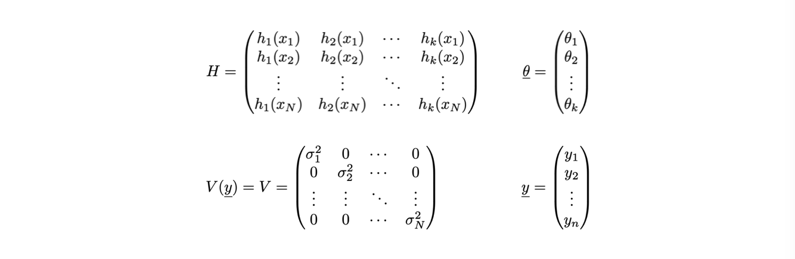
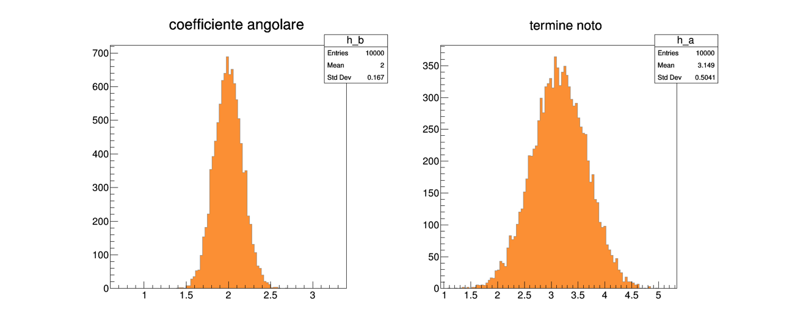
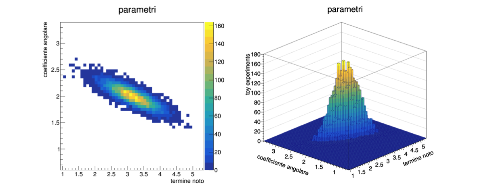

# Lezione 10: stima di parametri con il metodo dei minimi quadrati


## 10.1 Introduzione

  * Il metodo dei **minimi quadrati** si basa su un principio indipendente
    rispetto a quello della massima verosimiglianza
  * Si scelgono i parametri &theta; che rendono **minima la distanza** 
    fra il modello ed i dati, 
    secondo una metrica definita dagli scarti quadratici medi


### 10.1.1 Un esempio immediato

  * Per determinare la media &mu; di un insieme di misure *x<sub>i</sub>*
    si puo' minimizzare la funzione:


### 10.1.2 Il caso *y=g(x)*

  * La stessa metrica viene spesso utilizzata
    per fare **regressioni sui dati**, chiamata anche *fit*
  * Siano date *N* coppie di misure indipendenti del tipo *(x<sub>i</sub>, y<sub>i</sub> )*,
    per le quali:
    * l'incertezza sul valore *x<sub>i</sub>* sia **nulla o trascuarbile**
    * **l'incertezza sul valore *y<sub>i</sub>*** sia &sigma;<sub>i</sub>
  * Sia data l'ipotesi che le due variabili *x<sub>i</sub>* e *y<sub>i</sub>*
    siano in **relazione fra loro secondo una funzione *g*** tale per cui *y=g(x,&theta;)*
  * Si definisce la **funzione *Q<sup>2</sup>(&theta;)*** come:


### 10.1.3 La determinazione dei parametri &theta;

  * In questo caso, i parametri &theta; (che puo' essere un vettore)
    si determinano **trovando il minimo della funzione *Q(&theta;)***:

  * esistono diverse tecniche numeriche per trovare il minimo della funzione


### 10.1.4 Le proprieta' del metodo

  * Se gli scarti *&epsilon;<sub>i</sub>* di *y<sub>i</sub>* rispetto a *g(x<sub>i</sub>,&theta;)*
    hanno **valore di aspettazione nullo e varianza finita e fissa**,
    cioe' non dipendente da *y*, allora 
    * il metodo dei minimi quadrati e' uno **stimatore non distorto** dei parametri &theta;
    * ed ha la **varianza minima** fra tutti gli stimatori non distorti lineari (in *y*), 
      indipendentemente dalla distribuzione di probabilita' degli scarti
  * Se gli scarti *&epsilon;<sub>i</sub>* sono distribuiti secondo una distribuzione di probabilita' Gaussiana,
    il minimo della funzione *Q<sup>2</sup>(&theta;)*
    e' distribuito secondo una **distribuzione di probabilia' &Chi;<sup>2</sup>**
    con *N-k* gradi di liberta',
    * dove *N* e' il **numero di coppie** *(x<sub>i</sub>, y<sub>i</sub> )*
      e *k* il **numero di parametri stimati** con i minimi quadrati


## 10.2 Il caso lineare

  * Nel caso in cui la funzione *g(x)* sia **lineare nei parametri &theta;**,
    le equazioni di minimizzazione possono essere risolte analiticamente

  * Un esempio di funzione lineare e' **la retta 
    *g(x,&theta;) = &theta;<sub>1</sub>+*&theta;<sub>2</sub>x***:
    * *h<sub>1</sub>(x) = 1*
    * *h<sub>2</sub>(x) = x*
  * Un altro esempio di funzione lineare e' **una parabola 
    *g(x,&theta;) = *&theta;<sub>1</sub> + *&theta;<sub>2</sub>x + *&theta;<sub>3</sub>x<sup>2</sup>***:
    * *h<sub>1</sub>(x) = 1*
    * *h<sub>2</sub>(x) = x*
    * *h<sub>3</sub>(x) = x<sup>2</sup>*


### 10.2.1 La formulazione matriciale

  * Nel caso generale, 
    le *N* coppie di misure *(x<sub>i</sub>, y<sub>i</sub> )* 
    e *k* parametri *&theta;<sub>j</sub>*
    si possono **rappresentare in forma vettoriale**
  * Per comodita' di scrittura,
    la determinazione del minimo della funzione *Q<sup>2</sup>(&theta;)*
    viene **svolta in forma matriciale**


### 10.2.2 Le espressioni dei singoli elementi

  * Gli **ingredienti necessari**
    per la deteminazione dei parametri *&theta;<sub>j</sub>* 
    sono i seguenti:

  * Dove *V* e' la matrice di covarianza delle misure *y<sub>i</sub>*,
    che e' diagonale perche' le misure sono indipendenti fra loro


### 10.2.3 Il valore dei parametri e della loro incertezza

  * Il risultato delle operazioni di minimizzazione e' il seguente:

  * *V<sup>-1</sup>* indica l'**inversa** della matrice di covarianza delle misure *y<sub>i</sub>*
  * *<sup>t</sup>H* indica la **trasposta** della matrice *H*
  * La notazione che indica il risultato dell'algoritmo dei minimi quadrati
    con un accento circonflesso sulla lettera &theta;
    sottolinea il fatto che si tratta del **risultato di una stima**


## 10.3 Un esempio: il fit di una retta

  * L'implementazione di una regressione di un modello *g(x,&theta;) = &theta;<sub>1</sub>+*&theta;<sub>2</sub>x*
    in ```C++``` e' un utile esercizio di **programmazione e comprensione della statistica**
  * ... ricordando che esistono **librerie per l'analisi dati** (come ```ROOT```) con gia' implementati questi algoritmi
    * strumenti **piu' generici**: 
      implementano il metodo dei minimi quadrati sia per un modello lineare generico
      che per modelli non lineari
    * strumenti **piu' efficaci**:
      implementano algoritmi di minimizzazione tipicamente piu' potenti di quelli 
      che possiamo scrivere in una lezione  


### 10.3.1 L'algebra delle matrici

  * Assumiamo di avere a disposizione una semplice libreria per lo **svolgimento di calcoli fra matrici**,
    che potete trovare qui: [algebra_2.h](programmi/algebra_2.h) e [algebra_2.cc](programmi/algebra_2.cc)
    (per scaricare o copiare il file sorgente conviene visualizzarlo in versione ```Raw```)
    * Rispetto a quella scritta per esercizio nella Lezione 7, 
      in questo caso non si utilizzano ```template```
      perche' risuta piu' comodo **decidere a *runtime*** la dimensione delle matrici


### 10.3.2 Gli strumenti a disposizione

  * Una classe **```vettore```**:
    ```cpp
    class vettore 
    {
      public:
        vettore (int N) ;
        vettore (const std::vector<double> & v) ;
        vettore (const vettore & orig) ;
        vettore & operator = (const vettore & orig) ;
        ~vettore () ;
    
        void    setCoord (int i, double val) ;
        double  norm () const ;
        int     N () const ;
        double  at (int i) const ;
        void    stampa () const ;
        double  operator[] (int i) const ;
        vettore operator+ (const vettore & v) const ;
        vettore operator- (const vettore & v) const ;
        vettore operator* (double val) const ;
        double  dot (const vettore & v) const ;
    
      private:
        double * m_elementi ;
        int m_N ;
    } ;
    ```      
  * Una classe **```matrice```**:
    ```cpp
    class matrice
    {
      public:
        matrice (int R) ;
        matrice (int R, int C) ;
        matrice (const matrice & orig) ;
        matrice & operator= (const matrice & orig) ;
        ~matrice () ;
    
        void    setCoord (int i, int j, double val) ;
        double  at (int i, int j) const ;
        void    stampa () const ;
        bool    quadrata () const ;
        int     rango () const ;
        int     N_righe () const ;
        int     N_colonne () const ;
        bool    simmetrica () const ;
        void    dimensioni () const ;
        matrice minore (int r, int c) const ; // complemento algebrico
        matrice inversa () const ;
        matrice trasposta () const ;
        double  determinante () const ;
        void    operator*= (double val) ;
    
      private:
        int index (int i, int j) const ;
        int m_R ;
        int m_C ;
        double * m_elementi ;
    } ;
    ```
  * **operazioni** fra i due tipi:
    ```cpp
    vettore operator* (const matrice & M, const vettore & v) ;
    matrice operator* (const matrice & M1, const matrice & M2) ;
    ```


### 10.3.3 La generazione dei punti da interpolare

  * Per svolgere l'esercizio,
    bisogna innanzitutto avere a disposizione una **collezione di dati**
  * Con un generatore di numeri pseudo-casuali,
    si possono **generare valori degli scarti *&epsilon;<sub>i</sub>***
    per ogni punto *x<sub>i</sub>*,
    tali per cui:
    *y<sub>i</sub> = g(x<sub>i</sub>, &theta;) + &epsilon;<sub>i</sub>*
  * Assumendo una **distribuzione Gaussiana** per *&epsilon;<sub>i</sub>*,
    centrata in ```0``` e con &sigma; scelta a piacere:
    ```cpp
    double g (double x)
      {
         return 3.14 + 2 * x ;
      }
    // ....
    vector<double> asse_x ;
    vector<double> asse_y ;
    for (int i_point = 0 ; i_point < N_points ; ++i_point)
      {
        double epsilon = rand_TAC_gaus (sigma) ; 
        asse_x.push_back (i_point) ;
        asse_y.push_back (g (i_point) + epsilon) ;
      }
    ```
    * In questo caso, la funzione ```rand_TAC``` e' stata modificata,
      con una implementazione **dedicata al problema**


### 10.3.4 La preparazione di matrici e vettori

  * a partire dalle coppie di punti, si costruiscono:
  * la **matrice H** dei valori delle funzioni *h<sub>j</sub>(x)*
    per tutti i punti:
    ```cpp
    matrice H (Npoints, 2) ;
    for (int i_point = 0 ; i_point < N_points ; ++i_point)
      {
        H.setCoord (i_point, 0, 1) ;
        H.setCoord (i_point, 1, asse_x.at (i_point)) ;
      }
    ```
  * il **vettore y** (con un costruttore apposito che riceve in input uno ```std::vector```:
    ```cpp
    vettore y (asse_y) ;
    ```
  * la **matrice V** di covarianza delle misure *y<sub>i</sub>*:
    ```cpp
    matrice V (Npoints) ;
    for (int i_point = 0 ; i_point < N_points ; ++i_point) 
      V.setCoord (i_point, i_point, sigma * sigma) ;
    ```
    * assumendo **nota ```sigma```**


### 10.3.5 La stima dei parametri &theta;

  * I calcoli per la determinazione del vettore &theta;
    e della sua varianza
    sono svolte in sequenza,
    **minimizzando il numero di singole operazioni**:
    ```cpp
    matrice V_inv = V.inversa () ;
    matrice theta_v = (H.trasposta () * V_inv * H).inversa () ;
    vettore theta = (theta_v * (H.trasposta () * V_inv)) * y ;
    ```
    * L'**inversione della matrice *V*** e' fatta una sola volta
    * La **matrice di covarianza** di &theta;,
      che entra anche nel calcolo del suo valore centrale,
      viene calcolata una sola volta


### 10.3.6 La stampa del risultato

  * Sapendo che i **termini diagonali della matrice di covarianza**
    corrispondono alle varianze dei vari &theta;<sub>i</sub>,
    il risultato del fit e':
    ```cpp
    cout << "termine noto: " << theta.at (0) << " +- " << sqrt (theta_v.at (0, 0)) << endl ;
    cout << "pendenza:     " << theta.at (1) << " +- " << sqrt (theta_v.at (1, 1)) << endl ;
    ```


## 10.4 Le proprieta' statistiche degli stimatori

  * Per studiare le **proprieta' statistiche delle stime** 
    ottenute con lo stimatore dei minimi quadrati,
    si utilizza la tecnica dei *toy montecarlo*
  * **Riprodurre molte volte** (```N_toys```) lo stesso fit 
    fatto su un determinato numero di punti (```N_point```), 
    ciascuno generato in modo pseudo-casuale
  * La procedura di fit viene quindi inserita in un ciclo aggiuntivo:
    ```cpp
    //loop over toys
    for (int i_toy = 0 ; i_toy < N_toys ; ++i_toy)
      {
        // generare il sample
        // trovare i parametri
        // riempire istogrammi e contatori
      } //loop over toys
    ```


### 10.4.1 Gli elementi del ciclo

  * Il ciclo e' composto di tre fasi:
    * La **generazione degli eventi**, come e' stato fatto in precedenza
    * Il **calcolo del valore dei parametri**, con lo stesso programma utilizzato in precedenza
    * Il **riempimento di istogrammi e contatori**
      per la determinazione delle proprieta' delle stime ottenute


### 10.4.2 La distribuzione delle stime

  * Le proprieta' dello stimatore dei minimi quadrati 
    si verificano osservando la **distribuzione di probabilita' delle stime** ottenute
  * Queste distribuzioni si determinano attraverso **istogrammi**,
    che vanno creati prima del ciclo sui toy:
    ```cpp
    // istogrammi per il disegno dei risultati del fit
    TH1F h_a ("h_a", "termine noto", 
              100, 3.14 * (1. - 1. * sigma), 3.14 * (1. + 1. * sigma) ) ;
    TH1F h_b ("h_b", "coefficiente angolare", 
              100, 2. * (1. - 1. * sigma), 2. * (1. + 1. * sigma) ) ;
    ```  
  * Gli istogrammi vanno poi **riempiti** nel ciclo:
    ```cpp
    //loop over toys
    for (int i_toy = 0 ; i_toy < N_toys ; ++i_toy)
      {
        // ...
        h_a.Fill (theta.at (0)) ;
        h_b.Fill (theta.at (1)) ;
      } //loop over toys
    ```


### 10.4.3 Il risultato ottenuto

  * Infine, gli istogrammi vanno **visualizzati** dopo il termine del ciclo:
    ```cpp
    TCanvas c1 ("c1", "", 800, 800) ;
    c1.SetRightMargin (0.15) ;
    h_a.SetFillColor (kOrange + 1) ;
    h_a.SetLineColor (kGray + 1) ;
    h_a.Draw ("hist") ;
    c1.Print ("parametro_a.png", "png") ;
 
    h_b.Draw ("hist") ;
    h_b.SetFillColor (kOrange + 1) ;
    h_b.SetLineColor (kGray + 1) ;
    c1.Print ("parametro_b.png", "png") ;
    ```
  * Ottenendo le seguenti distribuzioni:



### 10.4.4 La copertura dell'intervallo di confidenza

  * Oltre al valore centrale, 
    per ogni parametro lo stimatore dei minimi quadrati
    produce anche una **stima della sua varianza**
  * Per verificare che l'intervallo &theta;<sub>j</sub> &plusmn; &sigma;<sub>j</sub>
    abbia la **copertura attesa del 68%**,
    si contano i *toy experiment* per cui il valor vero e' contenuto nell'intervallo:
    ```cpp
    int cont_a  = 0 ;
    int cont_b  = 0 ;

    //loop over toys
    for (int i_toy = 0 ; i_toy < N_toys ; ++i_toy)
      {
        //...
        if (fabs (theta.at (0) - 3.14) < sqrt (theta_v.at (0,0))) ++cont_a ;
        if (fabs (theta.at (1) - 2.  ) < sqrt (theta_v.at (1,1))) ++cont_b ;
      } //loop over toys
    ```


### 10.4.5 Il risultato del test

  * Dividendo il numero di volte in cui il valor vero e' contenuto nell'intervallo
    per il numero totale di *toy experiment*:
    ```cpp
    cout << "copertura parametro a: " << static_cast<double> (cont_a) / N_toys << endl ;
    cout << "copertura parametro b: " << static_cast<double> (cont_b) / N_toys << endl ;
    ```
  * Si ottiene il valore ricercato:
    ```
    copertura parametro a: 0.6829
    copertura parametro b: 0.68
    ```  


### 10.4.6 La correlazione fra i parametri

  * Il metodo dei minimi quadrati produce la **matrice di covarianza**
    dei parametri stimati, che non e' necessariamente diagonale
  * Questo significa che i **parametri stimati possono essere correlati fra loro**:
    se &theta;<sub>j</sub> e' maggiore del suo valor vero, 
    puo' succedere che in media anche &theta;<sub>k</sub> sia maggiore del proprio valor vero,
    o viceversa
  * I **termini fuori diagonale** della matrice di covarianza dei parametri 
    indicano la correlazione fra i parametri


### 10.4.7 La visualizzazione della correlazione

  * Anche in questo caso, 
    si sfruttano i *toy experiment* per visualizzare la correlazione,
    utilizzando un istogramma bi-dimensionale, 
    che mostri cioe' il numero di *toy experiment* **in funzione di due variabili**
  * La classe di ```ROOT``` che si utilizza si chiama ```TH2F```:
    ```cpp
    TH2F h_ab ("h_ab", "parametri", 
              50, 3.14 * (1. - 1. * sigma), 3.14 * (1. + 1. * sigma),
              50, 2. * (1. - 1. * sigma), 2. * (1. + 1. * sigma) ) ;
    h_ab.GetXaxis ()->SetTitle ("termine noto") ;
    h_ab.GetYaxis ()->SetTitle ("coefficiente angolare") ;
    h_ab.SetStats (0) ;
    ```  
    * come nel caso di un ```TH1F```, 
      il costruttore prende in ingresso un **nome ed un titolo**
    * essendoci due variabili fisiche,
      il **numero di bin, minimo e massimo** vanno indicati per ciascuna variabile  


### 10.4.8 Il riempimento dell'istogramma

  * All'interno del ciclo sui *toy experiment*,
    l'istogramma bi-dimensionale va **riempito con le due variabili**:
    ```cpp
    //loop over toys
    for (int i_toy = 0 ; i_toy < N_toys ; ++i_toy)
      {
        //...
        h_ab.Fill (theta.at (0), theta.at (1)) ;
      } //loop over toys
    ```
  * Quindi, al termine del ciclo,
    **disegnato** su un oggetto di tipo ```TCanvas```    
    ```cpp
    TCanvas c1 ("c1", "", 800, 800) ;
    c1.SetRightMargin (0.15) ;
    h_ab.Draw ("colz") ;
    c1.Print ("parametri_2D.png", "png") ;
    ```
    * Diverse **opzioni grafiche** producono varie visualizzazioni,
      come descritto nella [documentazione](https://root.cern/root/htmldoc/guides/users-guide/ROOTUsersGuide.html#drawing-histograms)
      di ```ROOT```



## 10.5 Una parentesi utile: il salvataggio degli oggetti di ROOT

  * Un oggetto utilizzato per fare analisi dati in ```ROOT```
    tipicamente puo' essere **salvato in un file binario** di tipo ```.root```
  * Analogamente al salvataggio su file di testo, 
    si utilizza una **classe dedicata alla gestione del file**:
    in questo caso, ```TFile```:
    ```cpp
    #include "TFile.h"
    //...
    TFile f_out ("main_03.root", "recreate") ;
    ```
    * il **primo argomento** e' il nome del file da salvare su disco
    * il **secondo argomento** e' la modalita' di apertura del file:
      ```recreate``` apre il file in scrittura e ne cancella il contenuto,
      se il file e' gia' esistente


### 10.5.1 La scrittura di un oggetto su un file

  * Dopo aver creto un oggetto di tipo ```TFile```, 
    si possono **scrivere al suo interno** altri oggetti,
    utilizzando il metodo ```Write``` degli oggetti stessi:
    ```cpp
    #include "TFile.h"
    //...
    TH1F h_test ("h_test", "istogramma di test", 10, 0., 10) ;
    h_test.Fill (5.3) ;

    TFile f_out ("main_03.root", "recreate") ;
    h_test.Write () ;
    f_out.Close () ;
    ```
  * Al termine della scrittura, il file va **chiuso**


### 10.5.2 Come aprire un terminale di ```ROOT```

  * Un file di tipo ```.root``` puo' essere **letto dalla linea di comando di ```ROOT```**
  * Per aprire la linea di comando,
    si esegue da ```SHELL``` il comando **```root```**:
    ```
    > root
     ------------------------------------------------------------------
    | Welcome to ROOT 6.20/04                        https://root.cern |
    | (c) 1995-2020, The ROOT Team; conception: R. Brun, F. Rademakers |
    | Built for macosx64 on Apr 01 2020, 08:28:48                      |
    | From tags/v6-20-04@v6-20-04                                      |
    | Try '.help', '.demo', '.license', '.credits', '.quit'/'.q'       |
     ------------------------------------------------------------------
 
    root [0] 
    ```
  * In questa linea di comando,
    ```ROOT``` fornisce un **interprete di istruzioni ```C++```** 
    che possono essere inserite a mano
    * Essendo interpretate, sono tipicamente molto **piu' lente** di un programma compilato


### 10.5.3 Come guardare dentro ad un file

  * Se il comando ```root``` viene **seguito dal nome del file da aprire**,
    ```ROOT``` crea automaticamente il puntatore ad un oggetto ti dipo ```TFile``` con nome ```_file0```
    che punta al TFile stesso:
    ```
    root [0] 
    Attaching file main_03.root as _file0...
    (TFile *) 0x7ffb3f44eb80
    root [1] 
    ```
  * A questo punto, 
    e' possibile **operare sugli oggetti** contenuti nel ```TFile```, 
    come se fossero puntatori:
    ```
    root [1] _file0->ls ()
    TFile**   main_03.root  
    TFile*   main_03.root  
    KEY: TH1F h_test;1  istogramma di test
    root [2] h_test->Draw ()
    Info in <TCanvas::MakeDefCanvas>:  created default TCanvas with name c1
    ```


## 10.6 La stima di una incertezza ignota

- dopo i tanti toy
- nel singolo fit (varianza unbiased, sigma no)


## 10.5 ESERCIZI

  * Gli esercizi relativi alla lezione si trovano [qui](ESERCIZI.md)

                                                                                                               
 +--------------------------------+
 |                                | 
 | OPEN POINTS                    | 
 |                                | 
 | - estrapolazioni               | 
 | - goodness of fit              | 
 |                                | 
 +--------------------------------+

