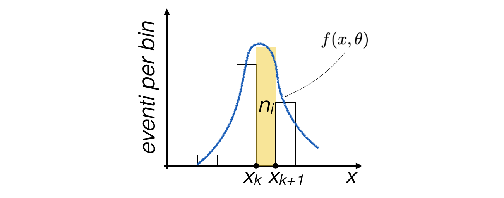
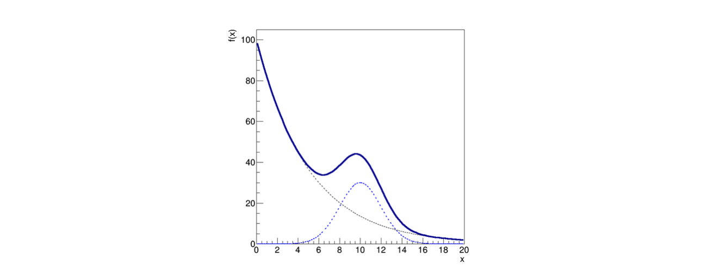
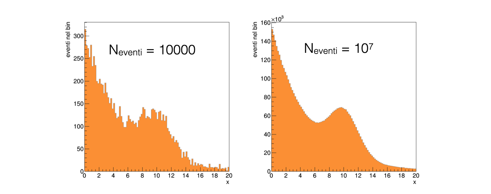
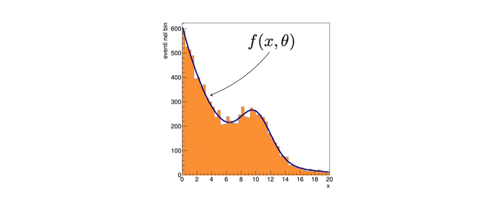
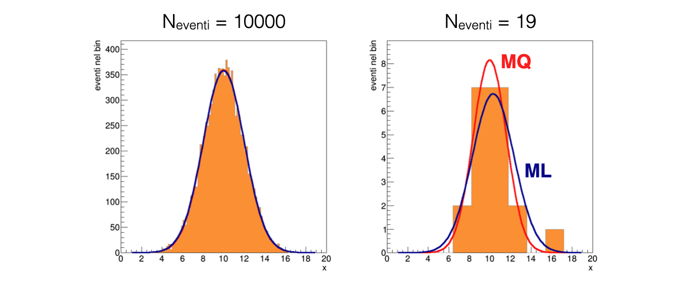

# Lezione 11: fit di distribuzioni binnate con ```ROOT```

## Indice

  * [11.1 Introduzione](#111-introduzione)
    * [11.1.1 L'applicazione del metodo dei minimi quadrati](#1111-lapplicazione-del-metodo-dei-minimi-quadrati)
    * [11.1.2 L'applicazione del metodo della massima verosimiglianza](#1112-lapplicazione-del-metodo-della-massima-verosimiglianza)
    * [11.1.3 La scelta fra le due tecniche](#1113-la-scelta-fra-le-due-tecniche)
  * [11.2 Un esercizio di regressione](#112-un-esercizio-di-regressione)
    * [11.2.1 La lettura dei dati](#1121-la-lettura-dei-dati)
    * [11.2.2 La determinazione dei parametri](#1122-la-determinazione-dei-parametri)
    * [11.2.3 Il fit di un istogramma in ```ROOT```](#1123-il-fit-di-un-istogramma-in-root)
    * [11.2.4 Il fondo ed il modello completo](#1124-il-fondo-ed-il-modello-completo)
    * [11.2.5 Il fit del modello ai dati](#1125-il-fit-del-modello-ai-dati)
    * [11.2.6 Come aiutare ```ROOT``` a trovare il minimo giusto](#1126-come-aiutare-root-a-trovare-il-minimo-giusto)
    * [11.2.7 Come maneggiare meno parametri alla volta](#1127-come-maneggiare-meno-parametri-alla-volta)
    * [11.2.8 I parametri dell'esponenziale dalla regione esponenziale](#1128-i-parametri-dellesponenziale-dalla-regione-esponenziale)
    * [11.2.9 Il fit finale](#1129-il-fit-finale)
  * [11.3 L'analisi del risultato della regressione](#113-lanalisi-del-risultato-della-regressione)
    * [11.3.1 La stampa a schermo del risultato](#1131-la-stampa-a-schermo-del-risultato)
    * [11.3.2 La convergenza del fit](#1132-la-convergenza-del-fit)
    * [11.3.3 Il valore dei parametri e la loro incertezza](#1133-il-valore-dei-parametri-e-la-loro-incertezza)
    * [11.3.4 La bontà del fit](#1134-la-bontà-del-fit)
    * [11.3.5 La matrice di covarianza dei parametri risultanti](#1135-la-matrice-di-covarianza-dei-parametri-risultanti)
  * [11.4 Minimi quadrati (MQ) e massima verosimiglianza (ML)](#114-minimi-quadrati-mq-e-massima-verosimiglianza-ml)
    * [11.4.1 Il fit di massima verosimiglianza in ```ROOT```](#1141-il-fit-di-massima-verosimiglianza-in-root)
    * [11.4.2 Il confronto fra due risultati](#1142-il-confronto-fra-due-risultati)
    * [11.4.3 Il disegno del risultato](#1143-il-disegno-del-risultato)
  * [11.5 Sulla scelta del binning](#115-sulla-scelta-del-binning)
  * [11.6 ESERCIZI](#116-esercizi)


## 11.1 Introduzione

  * I metodi dei minimi quadrati e della massima verosimiglianza
    possono essere **applicati anche al caso di istrogrammi**,
    cioè di distribuzioni binnate, 
    dove si voglia fittare una funzione alla distribuzione dei conteggi nei bin:

  * In questo caso, il contenuto di ogni bin è un numero di eventi *n<sub>i</sub>*
  * Se il numero di bin e il numero medio di eventi in ciascuno di essi non è piccolo,
    si può assumere che la variabile casuale *n<sub>i</sub>* segua
    una **statistica di Poisson**


### 11.1.1 L'applicazione del metodo dei minimi quadrati

  * Nel caso dei minimi quadrati, 
    la funzione ***Q<sup>2</sup>(&theta;)*** è solitamente la seguente (formulazione di Neyman):

  * Il valore di *y<sub>i</sub>* della lezione scorsa è **costituito da *n<sub>i</sub>*** 
  * L'**incertezza su *n<sub>i</sub>*** è data dalla sua radice quadrata,
    secondo la statistica di Poisson
  * Il valore di *x<sub>i</sub>* è il **centro del bin corrispondente**
  * Il numero di bin dell'istogramma è *N*


### 11.1.2 L'applicazione del metodo della massima verosimiglianza

  * Nel caso della massima verosimiglianza, 
    si assume che in ogni bin i conteggi seguano una **distribuzione di probabilità Poissoniana**
    con valore atteso *&mu; = f(x<sub>i</sub>, &theta;)*:


### 11.1.3 La scelta fra le due tecniche

  * Nel caso di **pochi conteggi** presenti nei bin,
    * bin senza conteggi non contribuiscono al fit nel caso dei minimi quadrati, 
      nonostante l'assenza di eventi sia un'informazione importante
    * consigliato utilizzare il metodo della **massima verosimiglianza**
  * Nel caso di **molti conteggi** presenti nei bin,
    i due metodi sono equivalenti
    e spesso il metodo dei **minimi quadrati** è computazionalmente più semplice


## 11.2 Un esercizio di regressione

  * Supponiamo di **raccogliere eventi** lungo una variabile *x* 
    e di voler determinare i parametri della distribuzione di probabilità della variabile
  * Assumiamo che questo modello abbia una forma data 
    da una **distribuzione di fondo esponenziale sommata ad una di segnale gaussiana**:

  * **Graficamente**, 
    il modello ha un andamento descrescente che risale quando il termine Gaussiano diventa imporante,
    come mostrato in figura:

    * la **linea continua** mostra il modello totale
    * mentre le **due linee tratteggiate** mostrano i
      due termini della somma,
      che si possono pensare come un **picco di segnale
      sovrapposto ad un fondo lentamente decrescente**


### 11.2.1 La lettura dei dati

  * Supponiamo di aver **raccolto 10,000 eventi**,
    che si trovano salvati nel file [dati.txt](programmi/dati.txt)
  * Quando si visualizzano gli eventi in un istogramma,
    siccome si tratta di un esperimento di conteggio
    il **contenuto di ogni bin fluttua** in maniera stocastica:

    * Nel caso di 10,000 eventi le fluttuazioni relative
      sono molto più accentuate del caso con 10,000,000 di eventi,
      come ci si aspetta
    


### 11.2.2 La determinazione dei parametri

  * Per **determinare i parametri &theta;** si utilizza tipicamente 
    il metodo dei minimi quadrati o della massima verosimiglianza
  * In entrambi i casi, bisogna trovare l'estremante di una funzione 
    * con **molti parametri**
    * in presenza di **fluttuazioni statistiche**
  * In questa lezione si ricorrerà agli **[algoritmi disponibili in ```ROOT```](https://root.cern.ch/root/htmldoc/guides/users-guide/FittingHistograms.html)**
    per poter trattare un problema sofisticato


### 11.2.3 Il fit di un istogramma in ```ROOT```

  * Per poter effettuare il fit, 
    è necessario definire il modello funzionale nel linguaggio di ```ROOT```
  * Una funzione si rappresenta con un oggetto di tipo ```TF1```:  
    ```cpp
    TF1 segnale ("segnale", "gaus(0)", 0., 20.) ;
    segnale.SetParameter (0, p2) ;
    segnale.SetParameter (1, p3) ;
    segnale.SetParameter (2, p4) ;
    ```
    * In questo caso, la funzione sfrutta l'implementazione interna di ```ROOT``` della **Gaussiana**
    * La funzione è definita **sull'intervallo ```0., 20.```**
    * La ```gaus``` ha **tre parametri**, perché per fittare un istogramma non normalizzato
      anche l'integrale della funzione è un parametro libero
    * L'indice del primo parametro è ```0```, come indicato fra parentesi in ```gaus(0)```
    * Il metodo ```TF1::SetParameter``` permette di **assegnare valori** ai parametri


### 11.2.4 Il fondo ed il modello completo

   * Analogamente, 
     la distribuzione di probabilità del rumore di fondo è:
     ```cpp
     TF1 fondo ("fondo", "expo(0)", 0., 20.) ;
     ```
   * Il modello totale, 
     indipendente dai primi due, è:  
     ```cpp
     TF1 model ("model", "expo(0) + gaus(2)", 0., 20.) ;
     ```
     * In questo caso, l'indice dei parametri della Gaussiana inizia da ```2```


### 11.2.5 Il fit del modello ai dati

  * L'**operazione di fit** viene effettuata con il seguente comando, 
    che invoca il metodo dei **minimi quadrati**:
    ```cpp
    TFitResultPtr fit_result = h_eventi.Fit ("model", "S") ;
    ```
  * Dopo il fit, 
    la funzione con nome ```"model"``` ha i propri **parametri adattati all'istogramma**
  * L'oggetto ```TFitResultPtr``` contiene i **risultati del fit**
  * **Difficilmente il fit ha successo autonomamente**,
    perché a causa del gran numero di parametri &theta; e delle fluttuazioni 
    stocastiche del contenuto dei bin 
    il programma non riesce a trovare il minimo giusto della funzione *Q<sup>2</sup>*


### 11.2.6 Come aiutare ```ROOT``` a trovare il minimo giusto

  * Per facilitare il fit,
    è molto efficace dare a ```ROOT``` un **punto di partenza non distante dal risultato finale**,
    basandosi sulla conoscenza del problema:
    * I parametri &theta;<sub>0</sub> e &theta;<sub>2</sub> 
      sono l'integrale delle due funzioni di segale e fondo, 
      quindi sono **legati all'integrale dell'istogramma**:
      ```cpp
      double N_bkg = v_eventi.size () / 2. ;
      double p0 = log (N_bkg) ;             // eventi di fondo
      double p2 = v_eventi.size () / 2. ;   // eventi di segnale
      model.SetParameter (0, p0) ;
      model.SetParameter (1, p1) ;
      ```
    * L'esponenziale è sicuramente **decrescente**:  
      ```cpp
      double p1 = -0.5 ;                    // pendenza del fondo
      ```
    * Il **massimo della Gaussiana** si trova circa a metà dell'intervallo:
      ```cpp
      double p3 = 0.5 * (max - min) ;       // media del segnale
      ```
    * La **larghezza della Gaussiana** è per un certo livello correlata alla sigma dell'istogramma:
      ```cpp
      double p4 = h_eventi.GetRMS () ;      // sigma del segnale
      ```


### 11.2.7 Come maneggiare meno parametri alla volta

  * Talvolta anche partendo da valori ragionevoli dei parametri 
    **il fit non converge** all'estremante cercato
  * In questo caso, 
    può essere d'aiuto identificare una regione dello spettro di *x* 
    dove soltanto **un sottoinsieme dei parametri è rilevante**


### 11.2.8 I parametri dell'esponenziale dalla regione esponenziale

  * Un **fit parziale** soltanto sull'intervallo ```0., 4.```
    con la dsitribuzione di probabilità del solo fondo
    permette di calcolare una stima preliminare di &theta;<sub>0</sub> e &theta;<sub>1</sub>
    ```cpp
    TF1 fondo ("fondo", "expo(0)", 0., 20.) ;
    fondo.SetParameter (0, p0) ;
    fondo.SetParameter (1, p1) ;
    h_eventi.Fit ("fondo", "Q", "", 0., 4.) ;
    ```
    * L'**opzione ```"Q"```** fa in modo che nulla venga scritto a schermo
  * Un **fit parziale** soltanto sull'intervallo ```7., 14.```
    con la dsitribuzione di probabilità del solo segnale
    permette di calcolare una stima preliminare di &theta;<sub>0</sub> e &theta;<sub>1</sub>
    ```cpp
    TF1 segnale ("segnale", "gaus(0)", 0., 20.) ;
    segnale.SetParameter (0, p2) ;
    segnale.SetParameter (1, p3) ;
    segnale.SetParameter (2, p4) ;
    h_eventi.Fit ("segnale", "Q", "", 7., 14.) ;
    ```


### 11.2.9 Il fit finale

  * Dopo aver **impostato i parametri** iniziali della funzione ```"model"```
    con i valori ricavati in precedenza,
    si effettua il fit finale:
    ```cpp
    model.SetParameter (0, fondo.GetParameter (0)) ;
    model.SetParameter (1, fondo.GetParameter (1)) ;
    model.SetParameter (2, segnale.GetParameter (0)) ;
    model.SetParameter (3, segnale.GetParameter (1)) ;
    model.SetParameter (4, segnale.GetParameter (2)) ;    

    TFitResultPtr fit_result = h_eventi.Fit ("model", "S") ;
    ```
    * L'opzione ```"S"``` garantisce che il **risultato del fit venga salvato** 
      e sia accessibile tramite l'oggetto ```fit_result```


## 11.3 L'analisi del risultato della regressione

  * La funzione di fit viene automaticamente aggiunta alla proprietà del ```TH1F```
    e visualizzata quando viene invocato il metodo ```TH1F::Draw```:



### 11.3.1 La stampa a schermo del risultato

  * L'**output a schermo** del fit ha la forma seguente:
    ```
     FCN=43.2314 FROM MIGRAD    STATUS=CONVERGED     136 CALLS         137 TOTAL
                         EDM=1.23203e-07    STRATEGY= 1  ERROR MATRIX UNCERTAINTY   5.6 per cent
      EXT PARAMETER                                   STEP         FIRST   
      NO.   NAME      VALUE            ERROR          SIZE      DERIVATIVE 
       1  p0           6.42014e+00   1.80871e-02   1.13175e-05   2.97351e-03
       2  p1          -1.96538e-01   4.53819e-03   5.31592e-06   1.27147e-01
       3  p2           1.76316e+02   6.42286e+00   1.74578e-02  -3.17192e-05
       4  p3           9.97488e+00   7.97750e-02  -1.12275e-04   1.19307e-03
       5  p4           2.08229e+00   8.35661e-02  -1.64878e-04   1.22967e-04
    ```
    * In questo caso, l'algoritmo di minimizzazione utilizzato è ```MIGRAD```
    * L'algoritmo ha avuto successo: ```STATUS=CONVERGED```
    * I **valori dei singoli parametri** e della loro incertezza sono riportati a schermo
  * Le **singole informazioni** si possono recuperare anche dentro il codice sorgente  


### 11.3.2 La convergenza del fit

  * Per conoscere il **successo dell'algoritmo numerico**,
    si utilizza il metodo ```TFitResult::IsValid ()```, che deve essere ```true``` in caso di successo,
    oppure il metodo ```TFitResult::Status ()```, che deve essere ```0``` in caso di successo
    ```cpp
    cout << "primo feedback sul risultato del fit: " << fit_result->IsValid () << endl ;
    cout << "primo feedback sul risultato del fit: " << fit_result->Status () << endl ;
    ```
    * La classe ```TFitResultPtr``` si comporta come un puntatore ad oggetti di tipo ```TFitResult```


### 11.3.3 Il valore dei parametri e la loro incertezza

  * Il valore dei parametri e della loro incertezza possono essere **ottenuti dalla funzione di fit**:
    ```cpp
    cout.precision (3) ; // stampa soltanto tre cifre significative
    cout << "eventi di fondo:    " << exp (model.GetParameter (0)) << "\t+- " 
                                   << model.GetParError (0) * exp (model.GetParameter (0)) << endl ;
    cout << "pendenza del fondo: " << model.GetParameter (1) << "\t+- " << model.GetParError (1) << endl ;
    cout << "eventi di segnale:  " << model.GetParameter (2) << "\t+- " << model.GetParError (2) << endl ;
    cout << "media del segnale:  " << model.GetParameter (3) << "\t+- " << model.GetParError (3) << endl ;
    cout << "sigma del segnale:  " << model.GetParameter (4) << "\t+- " << model.GetParError (4) << endl ;

    ```


### 11.3.4 La bontà del fit

  * Nel caso in cui la distribuzione di densità di probabilità dei singoli *n<sub>i</sub>* sia Gaussiana,
    ***Q<sup>2</sup><sub>min</sub>* segue la distribuzione del *&Chi;<sup>2</sup>*** con *N-k* gradi di libertà,
    con *N* il numero di bin fittati e *k* il numero di parametri determinati
  * E' necessario che **per ogni bin ci siano abbastanza eventi**, 
    per cui la distribuzione di Poisson sia simile ad una Gaussiana
  * In queste condizioni si può utilizzare il **test del *&Chi;<sup>2</sup>*** per determinare la bontà del fit
    calcolando la probabilità che il risultato possa essere peggiore di quello ottenuto,
    integrando la distribuzione di *&Chi;<sup>2</sup>(N-k)* da *Q<sup>2</sup><sub>min</sub>* all'infinito.
    L'integrale si può ottenere in due modi:
    ```cpp
    cout << "probabilità associata a Q2: " << model.GetProb () << endl ;
    cout << "probabilità associata a Q2: " << fit_result->Prob () << endl ;
    ```
    * Più alto è l'integrale, più si è fiduciosi del fit
  * Si possono anche ottenere il valore di *Q<sup>2</sup><sub>min</sub>* e del numero di gradi di libertà
    **dalla variabile ```fit_result```**
    ```cpp
    cout << "Valore di Q2: " << fit_result->Chi2 () << endl ;
    cout << "Numero di gradi di libertà: " << fit_result->Ndf () << endl ;
    ```


### 11.3.5 La matrice di covarianza dei parametri risultanti

  * La matrice di covarianza e di correlazione dei parametri risultati **può essere stampata a schermo**:
    ```cpp
    fit_result->PrintCovMatrix (cout) ;
    ```
  * I **singoli valori** sono accessibili tramite un oggetto di tipo ```TMatrixDSym``` (una matrice simmetrica),
    che si ottiene sempre dall'oggetto ```fit_result```:
    ```cpp
    TMatrixDSym cov = fit_result->GetCovarianceMatrix () ;
    // or TMatrixDSym cov = r->GetCorrelationMatrix();
    for (int i = 0; i < cov.GetNrows () ; ++i) 
      {
        for (int j = 0; j < cov.GetNcols () ; ++j) 
          { 
            cout << cov(i,j) << "\t" ;
          }
        cout << "\n";
      }
    ```


## 11.4 Minimi quadrati (MQ) e massima verosimiglianza (ML)

  * Il metodo dei minimi quadrati (MQ) e quello della massima verosimiglianza
    (ML, da maximum likelihood) sono **stimatori dei parametri di un modello**, 
    a partire dai dati
  * I due stimatori godono di proprietà diverse ed hanno comportamenti differenti: 
    pur utilizzando gli stessi dati, possono **produrre risultati differenti** 


### 11.4.1 Il fit di massima verosimiglianza in ```ROOT```

  * Per svolgere un fit con il metodo della massima verosimiglianza,
    è sufficiente aggiungere l'opzione ```"L"``` all'istruzione di fit:
    ```cpp
    // fit con i minimi quadrati
    TFitResultPtr fit_result_MQ = h_eventi.Fit ("model", "SQ+") ;
    // fit con la massima verosimiglianza
    TFitResultPtr fit_result_ML = h_eventi.Fit ("model", "SLQ+") ;
    ```
  * L'oggetto di tipo ```TFitResultPtr``` prodotto nei due casi
    contiene **le stesse variabili**
    * Anche nel caso della massima verosimiglianza viene calcolato 
      il **valore di *Q<sup>2</sup><sub>min</sub>***,
      per poter effettuare il test del *&Chi;<sup>2</sup>*


### 11.4.2 Il confronto fra due risultati

  * Per un **grande numero di eventi**, 
    i due stimatori si equivalgono 
  * Per un numero ridotto di eventi, invece,
    lo stimatore di massima verosimiglianza
    **considera propriamente anche i bin vuoti
    e attribuisce più importanza alle code** delle distribuzioni  



### 11.4.3 Il disegno del risultato

  * L'opzione ```"+"``` nell'istruzione di fit 
    impone a ```ROOT``` di salvare nell'oggetto ```TH1F``` una copia della funzione 
    utilizzata pr effettuare il fit.
  * La funzione può essere recuperata con il metodo ```TH1F::GetFunction```  
    ```cpp
    // fit con i minimi quadrati
    TFitResultPtr fit_result_MQ = h_eventi.Fit ("model", "SQ+") ;
    h_eventi.GetFunction ("model")->SetLineColor (kRed) ;
    ```
    * Siccome il modello è sempre il medesimo, 
      ```TH1F::GetFunction``` può generare ambiguità;
      la lista delle funzioni associate ad un ```TH1F``` si può ottenere
      anche con il **metodo ```TH1F::GetListOfFunctions()```**


## 11.5 Sulla scelta del binning

  * Siccome la scelta del binning determina il numero ed il valore dei punti *n<sub>i</sub>*,
    essa **ha impatto sul risultato del fit**
  * Scegliere **bin con dimensioni molto piccole** (e quindi un gran numero di bin)
    * rende distorto il metodo dei minimi quadrati,
      per via della possibile **presenza di bin vuoti**  
    * rende **inaffidabile il test del *&Chi;<sup>2</sup>*** per la bontà del fit
  * Scegliere **bin con dimensioni molto grandi**
    riduce la sensibilità degli stimatori,
    perché peggiora la risoluzione con la quale gli stimatori
    hanno accesso ai dati
    * Si può utilizzare il test del *&Chi;<sup>2</sup>* per deteminare la scelta del binning ottimale


## 11.6 ESERCIZI

  * Gli esercizi relativi alla lezione si trovano [qui](ESERCIZI.md)
