# Lezione 12: Test di Ipotesi

## Indice

  * [12.1 Introduzione](#121-introduzione)
    * [12.1.1 Regione Critica, Size e Power](#1211-regione-critica-size-e-power)
    * [12.1.2 Il test del Chi-Quadro](#1212-il-test-del-chi-quadro)
    * [12.1.3 Il Metodo del discriminante di Fischer](#1213-il-metodo-del-discriminante-di-fischer)
    * [12.1.4 Il Metodo del rapporto di Likelihood](#1214-il-metodo-del-rapporto-di-likelihood)
  * [12.2 Decorrelazione lineare di variabili](#122-decorrelazione-lineare-di-variabili)
    * [12.2.1 Un cambio di coordinate](#1221-un-cambio-di-coordinate)
    * [12.2.2 Una rotazione della matrice di covarianza](#1222-una-rotazione-della-matrice-di-covarianza)
    * [12.2.3 La rotazione delle variabili](#1223-la-rotazione-delle-variabili)
  * [12.3 Un esempio di implementazione di decorrelazione](#123-un-esempio-di-implementazione-di-decorrelazione)
    * [12.3.1 La lettura del file di testo](#1231-la-lettura-del-file-di-testo)
    * [12.3.2 La costruzione della matrice delle covarianze](#1232-la-costruzione-della-matrice-delle-covarianze)
    * [12.3.3 Il calcolo delle covarianze](#1233-il-calcolo-delle-covarianze)
    * [12.3.4 L'angolo di rotazione ed il cambio di variabili](#1234-langolo-di-rotazione-ed-il-cambio-di-variabili)
  * [12.4 Il discriminante di Fisher](#124-il-discriminante-di-fisher)
    * [12.4.1 La determinazione della direzione del discriminante](#1241-la-determinazione-della-direzione-del-discriminante)
    * [12.4.2 Due modelli da confrontare](#1242-due-modelli-da-confrontare)
    * [12.4.3 Il calcolo delle matrici di covarianza](#1243-il-calcolo-delle-matrici-di-covarianza)
    * [12.4.4 Il calcolo delle medie](#1244-il-calcolo-delle-medie)
    * [12.4.5 Il calcolo della direzione del discriminante di Fisher](#1245-il-calcolo-della-direzione-del-discriminante-di-fisher)
  * [12.5 L'utilizzo della statistica di test](#125-lutilizzo-della-statistica-di-test)
    * [12.5.1 Il calcolo della statistica di test per i due campioni](#1251-il-calcolo-della-statistica-di-test-per-i-due-campioni)
    * [12.5.2 La visualizzazione dell'informazione disponibile](#1252-la-visualizzazione-dellinformazione-disponibile)
    * [12.5.3 Il comportamento del test di ipotesi](#1253-il-comportamento-del-test-di-ipotesi)
    * [12.5.4 La curva ROC](#1254-la-curva-roc)
    * [12.5.5 L'algoritmo di costruzione](#1255-lalgoritmo-di-costruzione)
    * [12.5.6 Il riempimento della curva](#1256-il-riempimento-della-curva)
    * [12.5.7 Il confronto con le altre variabili](#1257-il-confronto-con-le-altre-variabili)
  * [12.6 Il Teorema di Neyman-Pearson](#126-il-teorema-di-neyman-pearson)
    * [12.6.1 Determinazione della regione critica](#1261-determinazione-della-regione-critica)
  * [12.7 Un esempio di calcolo della BCR](#127-un-esempio-di-calcolo-della-bcr)
    * [12.7.1 Funzione binormale](#1271-funzione-binormale)
    * [12.7.2 Rapporto di Likelihood](#1272-rapporto-di-likelihood)
    * [12.7.3 Disegnamo le due pdf e il rapporto di likelihood](#1273-disegnamo-le-due-pdf-e-il-rapporto-di-likelihood)
    * [12.7.4 Best Critical Region (BCR)](#1274-best-critical-region-bcr)
    * [12.7.5 Funzione che calcola il size](#1275-funzione-che-calcola-il-size)
    * [12.7.6 Calcolo della size in funzione della soglia](#1276-calcolo-della-size-in-funzione-della-soglia)
    * [12.7.7 Disegno della BCR](#1277-disegno-della-bcr)
    * [12.7.8 Disegno curva ROC](#1278-disegno-curva-roc)
  * [12.8 ESERCIZI](#128-esercizi)


## 12.1 Introduzione
    
  * si hanno N campionamenti IID di una *pdf(x)* con *x* variabile mono o pluri-dimensionale, si vuole:
    * valutare la validità di un'ipotesi *H<sub>0</sub>* relativa alla *pdf(x)* 
    * **confrontare l'ipotesi *H<sub>0</sub>* con l'ipotesi alternativa H<sub>1</sub>**, entrambe relative alla *pdf(x)*
  * le ipotesi si dividono in:
  	* **semplici**, che sono caratterizzate da un modello univoco senza parametri indeterminati
    * **composte**, che sono caratterizzate da un insieme di modelli, 
      come ad esempio un modello con un parametro non determinato
      o vincolato ad assumere un insieme di valori
  * in questa lezione consideriamo il caso di **ipotesi semplici**


### 12.1.1 Regione Critica, Size e Power

  * un test di ipotesi prevede di:
	* costruire una statistica di test *t* usando i campionamenti 
	* scartare l'ipotesi H<sub>0</sub> quando *t* cade nella regione del sample space 
    che chiamiamo **regione critica** 
  * il test è caratterizzato da due parametri: 
    * &alpha; è la probabilità che l'ipotesi H<sub>0</sub> venga scartata quando è vera: è il **size** del test
    * &beta; è la probabilità  che l'ipotesi H<sub>0</sub> viene accettata quando è vera H<sub>1</sub>: 
      (1-&beta;) è il **power** del test   
  * la regione critica non è univocamente determinabile dal size del test 
  * **la regione critica che massimizza il power del test, una volta fissato il suo size, è la Best Critical Region (BCR)**


### 12.1.2 Il test del Chi-Quadro

  * il test del chi-quadro analizza una singola ipotesi *H<sub>0</sub>*
    * i parametri sono stimati preventivamente ed il test usa il valore stimato
    * la statistica di test *t* è una variabile mono-dimensionale che segue la distribuzione del chi-quadro
    * la regione critica è data da *t* > *t*<sub>cut</sub>
    * il size è l'integrale della distribuzione chi-quadro per *t* > *t*<sub>cut</sub> 
   


### 12.1.3 Il Metodo del discriminante di Fischer 

  * sono dati N campionamenti IID di una *pdf(x)* e si vuole determinare se provengono dalla 
     *pdf(x| H<sub>0</sub>)* o dalla *pdf(x| H<sub>1</sub>)*
  * il metodo del discriminante di Fischer prevede di:
    * costruire una statistica di test *t* che sia una funzione lineare dei campionamenti
    * accettare l'ipotesi se t < *t*<sub>cut</sub>
    * la selezione basata su *t*<sub>cut</sub> identifica la regione critica
      e si utilizza quindi per calcoare size e power del test
     


### 12.1.4 Il Metodo del rapporto di Likelihood 

  * sono dati N campionamenti IID di una *pdf(x)* e si vuole determinare se provengono dalla 
    * pdf(x| H<sub>0</sub>)* o dalla *pdf(x| H<sub>1</sub>)*   
  * il metodo del rapporto di Likelihood prevede di:
    * usare come statistica del test il rapporto

    * accettare l'ipotesi se il rapporto è minore di *t*<sub>cut</sub> 
    * la selezione basata su *t*<sub>cut</sub> identifica la regione critica
       e si utilizza quindi per calcoare size e power del test
  * nel caso di ipotesi semplici questa procedura produce, a parità di size, 
    il test con il power più alto
  * la regione critica in questo caso si chiama **Best Critical Region** o  BCR
      


## 12.2 Decorrelazione lineare di variabili

  * Dato un campione di *N* misure (*x*<sub>i</sub>, *y*<sub>i</sub>) indipendenti ed identicamente distribuite,
    in generale la variabile *x* può essere **linearmente correlata con la variabile *y***,
    cioè la covarianza &sigma;<sub>xy</sub> calcolata fra le due variabili può essere diversa da zero.
  * In questo caso,
    la matrice di covarianza associata al modello che descrive la misura, cioè alla popolazione,
    non è diagonale:
    


### 12.2.1 Un cambio di coordinate

  * Siccome la covarianza descrive il livello di correlazione lineare che sussiste fra due variabili,
    esiste sempre un cambio di variabili nello spazio delle fasi del campione
    tale per cui **le variabili trasformate siano non correlate fra di loro**
    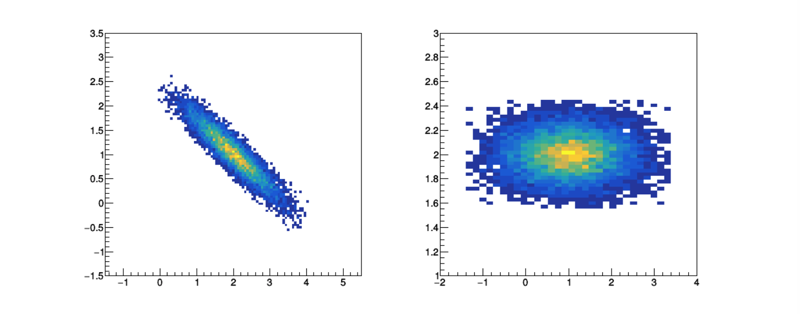


### 12.2.2 Una rotazione della matrice di covarianza

  * Nel nuovo sistema di riferimento,
    la **matrice delle covarianze risulta quindi diagonale**
  * Questo non ci stupisce, 
    perché essendo simmetrica la matrice delle covarianze è sempre diagonalizzabile
  * Una trasformazione unitaria che diagonalizzi la matrice delle covarianze è **una rotazione di un angolo &theta;**
  * Data una matrice simmetrica 2x2:
    
  * l'angolo di rotazione si calcola come:
    
  * che per il caso della matrice delle covarianze diventa:
    


### 12.2.3 La rotazione delle variabili

  * Noto l'angolo di rotazione &theta;, la matrice di rotazione associata è:
    
  * Che corrisponde al cambio di variabili:
    
    


## 12.3 Un esempio di implementazione di decorrelazione

  * Sia dato il campione di *N* misure (*x*<sub>i</sub>, *y*<sub>i</sub>) sotto forma di un *file* di testo.
  * Dopo aver trasferito i valori contenuti nel *file* in due ```vector```, 
    si può **calcolare la matrice delle covarianze sul campione**
    ed utilizzare i valori ottenuti 
    come stimatori della matrice delle covarianze del modello,
    utilizzando la tecnica della sostituzione per il calcolo di stimatori.
  * A partire dalla matrice così ottenuta, 
    si può quindi **calcolare l'angolo di rotazione e trasformare le variabili**


### 12.3.1 La lettura del file di testo

  * Si esegue secondo le istruzioni già studiate durante la [Lezione 9](../Lezione_09/README.md),
    prestando attenzione al fatto che **le coppie di valori (*x*<sub>i</sub>, *y*<sub>i</sub>) 
    sono scritte una per riga**:
    ```cpp
    // apertura del file di testo
    double input_x ;
    double input_y ;
    while (true) 
      {
        input_file >> input_x ;
        input_file >> input_y ;
        if (input_file.eof () == true) break ;
        data_x.push_back (input_x) ;
        data_y.push_back (input_y) ;
      } 
    input_file.close () ;
    ```


### 12.3.2 La costruzione della matrice delle covarianze

  * I **termini sulla diagonale** della matrice delle covarianze 
    sono la varianza di ciascuna variabile:
    ```cpp
    #include "../../Lezione_09/programmi/statistiche_vector.h"
    // ...
    double V_xx = varianza (data_x) ;
    double V_yy = varianza (data_y) ;
    ```
  * Dove la funzione che calcola la varianza utilizza
    una ben nota formula:
    ```cpp
    template <class T>
    T varianza (const std::vector<T> & input_v) 
    {
      T somma = 0 ;
      T sommaSq = 0 ;
      for (int i = 0 ; i < input_v.size () ; ++i) 
        {
          somma += input_v.at (i) ;
          sommaSq += input_v.at (i) * input_v.at (i) ;
        }  
      return sommaSq / static_cast<float> (input_v.size ()) - 
             (somma / static_cast<float> (input_v.size ()) * somma / static_cast<float> (input_v.size ())) ;
    }
    ```


### 12.3.3 Il calcolo delle covarianze

  * La covarianza è definita come:
    
  * e può essere stimata sul campione come:
    
  * Il programma che implementa lo stimatore, dunque,
    esegue i seguenti calcoli:
    ```cpp
    double M_x = media (data_x) ;
    double M_y = media (data_y) ;
  
    double V_xy = 0. ;
    for (int i = 0 ; i < data_x.size () ; ++i)
      {
        V_xy += (data_x.at (i) - M_x) * (data_y.at (i) - M_y) ;
      }
    V_xy /= data_x.size () ;
    ```


### 12.3.4 L'angolo di rotazione ed il cambio di variabili

  * Nota la matrice di covarianza, si può quindi **calcolare l'angolo di rotazione**:
    ```cpp
    double theta = 0.5 * atan (2 * V_xy / (V_xx - V_yy)) ;
    double c_theta = cos (theta) ;
    double s_theta = sin (theta) ;
    ```
  * E quindi l'effettivo cambio di variabili:
    ```cpp
    vector<double> data_x_dec ;
    vector<double> data_y_dec ;
    for (int i = 0 ; i < data_x.size () ; ++i)
      {
        data_x_dec.push_back (data_x.at (i) * c_theta + data_y.at (i) * s_theta) ; 
        data_y_dec.push_back (data_y.at (i) * c_theta - data_x.at (i) * s_theta) ; 
      }
    ```  
    


## 12.4 Il discriminante di Fisher

  * Costruire una **combinazione lineare** delle variabili che caratterizzano gli eventi di interesse
    che serva per separare due ipotesi *H<sub>0</sub>* ed *H<sub>1</sub>*
  * Nel caso bidimensionale, dato un campione di eventi (*x*<sub>i</sub>, *y*<sub>i</sub>)
    1. **determinare la statistica di test** *t(x,y)* da utilizzare per separare le due ipotesi
    2. **usare la statistica di test** per distinguere le due ipotesi:

|  |  |
| --------------- | ------- |
| *H<sub>0</sub>* | *t(x,y) < t<sub>cut</sub>*  |
| *H<sub>1</sub>* | *t(x,y) >= t<sub>cut</sub>* |


### 12.4.1 La determinazione della direzione del discriminante

  * La statistica di test è una *combinazione lineare* delle variabili che caratterizzano ogni evento:

  * che nel caso bidimnesionale diventa:

  * Il discriminante di Fisher è la determinazione dei coefficienti *f<sub>x</sub>* ed *f<sub>y</sub>*,
    cioè del vettore ***f***,
    tramite la seguente equazione:

  * dove: 
    * ***&mu;<sub>0</sub>*** e ***&mu;<sub>1</sub>*** rappresentano la media attesa
      nel caso di ipotesi *H<sub>0</sub>* ed *H<sub>1</sub>* rispettivamente
    * *W* è la somma delle matrici delle covarianze *V<sub>0</sub>* e *V<sub>1</sub>*
      per le ipotesi *H<sub>0</sub>* ed *H<sub>1</sub>* rispettivamente:


### 12.4.2 Due modelli da confrontare

  * Le medie ***&mu;<sub>i</sub>*** e le matrici delle covarianze *V<sub>i</sub>*
    possono essere determinate **a partire da campioni simulati** di eventi
    generati secondo due modelli *H<sub>0</sub>* ed *H<sub>1</sub>*.
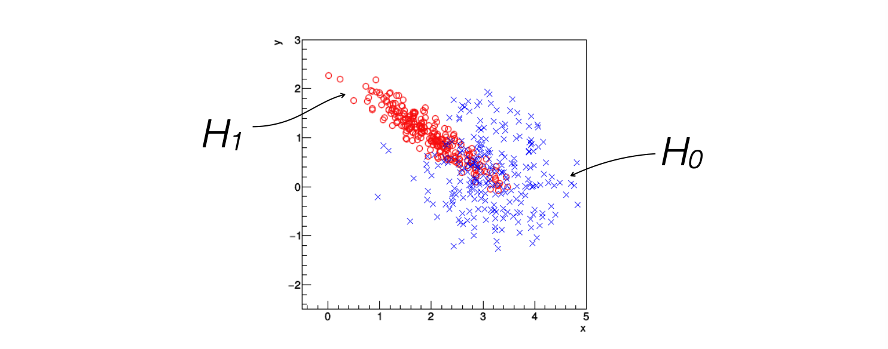


### 12.4.3 Il calcolo delle matrici di covarianza

  * Supponendo che gli eventi simulati siano contenuti in due ```vector<vector<double> >```,
    le **matrici delle covarianze** possono essere calcolate:
    ```cpp
    #include "../../Lezione_10/programmi/algebra_2.h"
    // ...
    vector<vector<double> > data_1 ;
    // riempimento del vector
    matrice cov_1 = determinaCovarianza (data_1) ;
    ```
    * dove la funzione ```determinaCovarianza``` richiama le funzioni
      già definite in precedenza per il calcolo dei singoli elementi
      della matrice delle covarianze


### 12.4.4 Il calcolo delle medie

  * **La media** lungo la direzione *x* e *y* può altrettanto essere calcolata:
    ```cpp
    #include "../../Lezione_09/programmi/statistiche_vector.h"
    #include "../../Lezione_10/programmi/algebra_2.h"
    // ...
    vettore media_1 (2) ;
    media_1.setCoord (0, media (data_1.at (0))) ;
    media_1.setCoord (1, media (data_1.at (1))) ;
  
    vettore media_2 (2) ;
    media_2.setCoord (0, media (data_2.at (0))) ;
    media_2.setCoord (1, media (data_2.at (1))) ;

    ```    


### 12.4.5 Il calcolo della direzione del discriminante di Fisher

  * Con queste informazioni a disposizione,
    si può **determinare il vettore *f***:
    ```cpp

    matrice W = cov_1 + cov_2 ;
    vettore fisher = W.inversa () * (media_2 - media_1) ; 
    ```
  * Il vettore ***f*** corrisponde alla direzione di proiezione ottimale degli eventi
    lungo la quale separare le due ipotesi:
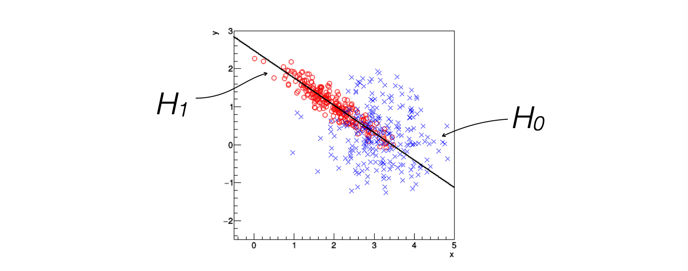


## 12.5 L'utilizzo della statistica di test

### 12.5.1 Il calcolo della statistica di test per i due campioni

  * Per ogni evento che compone i due modelli si può quindi **calcolare
    il valore della statistica di test** *t<sub>i</sub> = t(x<sub>i</sub>,y<sub>i</sub>)*:
    ```cpp
    vector<double> fisher_1 ;
    for (int i = 0 ; i < data_1.at (0).size () ; ++i)
      {
        fisher_1.push_back (
          data_1.at (0).at (i) * fisher.at (0) + 
          data_1.at (1).at (i) * fisher.at (1)
        ) ;
      }
    ```
  * ed analogamente per il secondo campione, generando anche ```vector<double> fisher_2```


### 12.5.2 La visualizzazione dell'informazione disponibile

  * A questo punto,
    i due campioni sono **descritti da tre variabili**: *x*, *y* e *t*,
    dove la terza è una combinazione lineare delle prime due.
  * La **distribuzione delle tre variabili** mostra ad occhio nudo la separazione
    delle distribuzioni di *H<sub>0</sub>* ed *H<sub>1</sub>*
    in ciascuna delle tre direzioni:
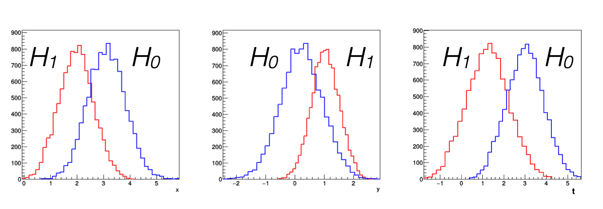
  * dove **gli istogrammi sono stati riempiti** a partire dal ```vector<double>```
    corrispondente a ciascuna variabile:
    ```cpp
    double max_x = *max_element (data.begin (), data.end ()) ;
    double min_x = *min_element (data.begin (), data.end ()) ;
    double sigma_x = sqrt (varianza (data)) ;
    int Nbins = 5 * (max_x - min_x) / sigma_x ;
  
    TH1F * h_vis = new TH1F (
        histo_name.c_str (), "distribuzione 1D",
        Nbins, min_x, max_x
      ) ;
  
    for (int i = 0 ; i < data.size () ; ++i)
      {
        h_vis->Fill (data.at (i)) ;
      }  
    ```


### 12.5.3 Il comportamento del test di ipotesi

  * Per **determinare il comportamento del test di ipotesi** basato sulla statistica di test *t(x,y)*
    si può valutare l'effetto della selezione con soglia *t<sub>cut</sub>*
    con la frazione di falsi positivi &beta; 
    e quella di falsi negativi &alpha;:
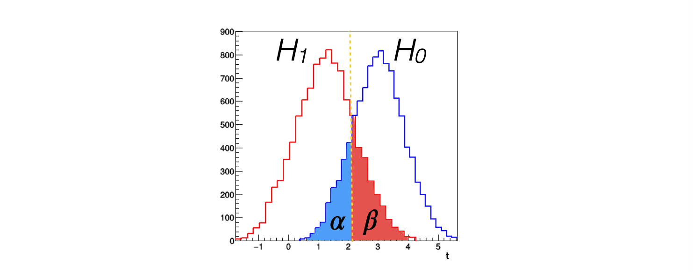


### 12.5.4 La curva ROC

  * L'andamento di &beta; in funzione di &alpha; al variare del valore di *t<sub>cut</sub>*
    è detto **curva ROC**:
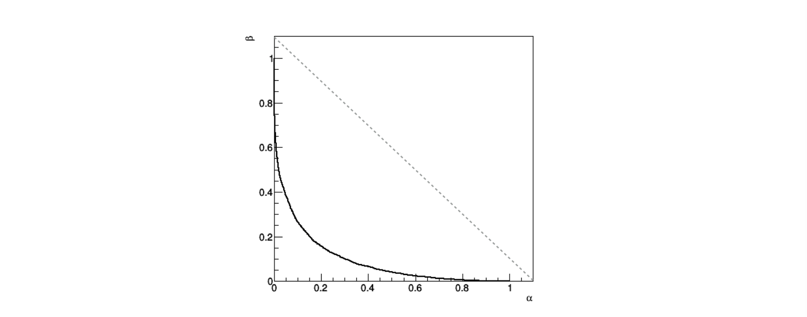


### 12.5.5 L'algoritmo di costruzione

  * Per calcolarlo,
    bisogna **scorrere i possibli valori di *t<sub>cut</sub>***
  * Per semplificare i conteggi,
    come prima cosa si **ordinano** i due ```vector<double>``` da confrontare
    in maniera crescente:  
    ```cpp
    sort (fisher_1.begin (), fisher_1.end ()) ;
    sort (fisher_2.begin (), fisher_2.end ()) ;
    ```
    * questa operazione modifica l'ordinamento nel campione, 
      quindi se l'ordinamento va preservato meglio è **fare una copia
      dei ```vector<double>```** per lavorarci
  * Poi si determinano il **minimo ed il massimo valore per *t<sub>cut</sub>***
    in funzione dei valori assunti dagli eventi:
    ```cpp
    double taglio_min_f = *fisher_1.begin () ;
    if (*fisher_2.begin () < taglio_min_f) taglio_min_f = *fisher_2.begin () ;
  
    double taglio_max_f = *fisher_1.rbegin () ;
    if (*fisher_2.rbegin () > taglio_max_f) taglio_max_f = *fisher_2.rbegin () ;
    ```
    * sfruttando il fatto che i due ```vector<double>``` sono stati ordinati


### 12.5.6 Il riempimento della curva

  * Si decide con che **passo** scorrere la variabile *t<sub>cut</sub>*
    ```cpp
    double risoluzione = 10 * (taglio_max_f - taglio_min_f) / fisher_1.size () ;
    ```
  * Si riempie un ```TGrraph``` di ```ROOT``` con la **successione dei punti
    *(&alpha;<sub>i</sub>, &beta;<sub>i</sub>)*** calcolati a partire da ciascun *t<sub>i</sub>*:
    ```cpp
    TGraph g_ROC_f ;
  
    int contatore_1 = 0 ;
    int contatore_2 = 0 ;
    for (double taglio = taglio_min_f ; taglio < taglio_max_f ; taglio += risoluzione)
      {
        // conta il numero di eventi sotto soglia per ogni campione
        // (ricordando che i due campioni sono stati ordinati)
        for ( ; contatore_1 < fisher_1.size () ; ++contatore_1)
          if (fisher_1.at (contatore_1) > taglio) break ;
        for ( ; contatore_2 < fisher_2.size () ; ++contatore_2)
          if (fisher_2.at (contatore_2) > taglio) break ;
        g_ROC_f.SetPoint (g_ROC_f.GetN (), 
            static_cast<double> (contatore_2) / fisher_2.size (),
            1. - static_cast<double> (contatore_1) / fisher_1.size ()
          ) ;
      }

    ```


### 12.5.7 Il confronto con le altre variabili

  * Così come si è fatto per la variabile *t*, 
    il criterio di selezione per determinare se rigettare o meno l'ipotesi *H<sub>0</sub>*
    si sarebbe potuto **applicare anche alle variabili *x* o *y***
  * Per confrontare l'efficacia delle varie selezioni,
    si possono **sovrapporre le curve ROC** nei tre casi:
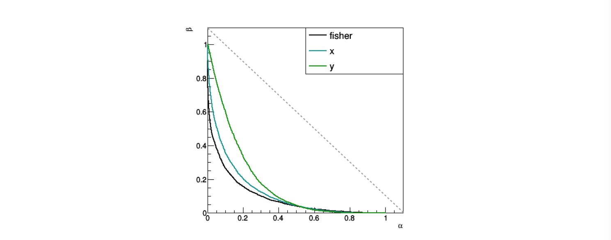
  * Alternativamente, si può **confrontare l'area sottesa** alle singole curve ROC:
    ```cpp
    variabile x:             0.12
    variabile y:             0.17
    discriminante di Fisher: 0.09
    ```
    * In questo frangente, 
      l'area sottesa ad un ```TGraph``` è stata calcolata con il [metodo dei trapezi](https://it.wikipedia.org/wiki/Regola_del_trapezio)


## 12.6 Il Teorema di Neyman-Pearson

  * i dati sono *N* campionamenti IID, *x*<sub>*1*</sub> ... *x*<sub>*N*</sub>
   e si vuole determinare se provengono dalla 
      *pdf(x| H<sub>0</sub>)* o dalla *pdf(x| H<sub>1</sub>)*
  * le due ipotesi sono semplici ed al set di campionamenti si possono quindi associare due Likelihood:
     * *L(x<sub>1</sub> ... x<sub>N</sub> | H<sub>0</sub>)* se vale l'ipotesi *H<sub>0</sub>*
     * *L(x<sub>1</sub> ... x<sub>N</sub> | H<sub>1</sub>)* se vale l'ipotesi *H<sub>1</sub>*
  * la Best Critical Region (BCR) per un test di size &alpha; 
    è quel sottoinsieme del sample space &Omega; definito dalla condizione:
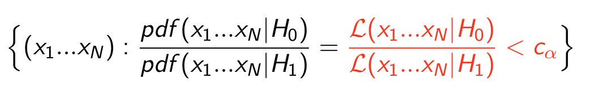
    

  
### 12.6.1 Determinazione della regione critica
  
  * la condizione che determina c<sub>&alpha;</sub> è che campionamenti estratti 
    dalla *pdf(x| H<sub>0</sub>)* abbiano probabilità &alpha; di appartenere alla regione critica:
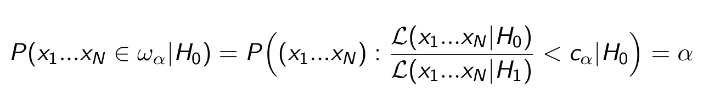  
  * un campionamento appartiene alla regione critica se il suo Likelihood Ratio è inferiore a c<sub>&alpha;</sub>
 
 

## 12.7 Un esempio di calcolo della BCR
  
  * i dati sono un singolo campionamento di una *pdf(x,y)* binormale
  * vogliamo distinguere tra due ipotesi semplici che prevedono valori 
    differenti per media e sigma della binormale
  * per costruire la BCR serve definire:
	* una funzione che descriva la *pdf(x| H<sub>0</sub>)*
	* una funzione che descriva la *pdf(x| H<sub>1</sub>)*
	* una funzione che descriva il rapporto di Likelihood
    * una funzione che calcoli il size relativo a un determinato c<sub>&alpha;</sub> 
      (quindi per una scelta della regione critica)
    * una funzione che costruisca la curva size vs. c<sub>&alpha;</sub> in modo numerico
   * la BCR sarà la regione definita dal c<sub>&alpha;</sub> che ha un size pari a quello desiderato


### 12.7.1 Funzione binormale

  * scriviamo una funzione binormale *pdf(x,y)* con correlazione nulla 
    tra le due variabili *x* ed *y*;
    ```cpp
    double binormal(double *x, double *p){
	  double mux=p[0]; double sigmax=p[1];
	  double muy=p[2]; double sigmay=p[3];
	  double arg;
	  if(sigmax>0 && sigmay>0) {
	     arg= (pow ((x[0]-mux)/sigmax, 2) + pow ((x[1]-muy)/sigmay, 2)) ;
       arg=1. / (2. * acos(-1) * sigmax * sigmay) * exp (- 1./2. * arg) ;
      }
    else arg=1e30 ;
    return arg ;
    }
    ```
  * definiamo due funzioni ```TF2``` di ```ROOT``` che descrivono le due ipotesi:
    ```cpp 
    double par[]={H0_mu_x, H0_sigma_x , H0_mu_y, H0_sigma_y, H1_mu_x, H1_sigma_x , H1_mu_y, H1_sigma_y};
    TF2 *f0 = new TF2("f0",binormal,xmin,xmax,ymin,ymax,npar);
    f0->SetTitle("P(t|H_0)");
    f0->SetParameters(par);
    TF2 *f1 = new TF2("f1",binormal,xmin,xmax,ymin,ymax,npar);
    f1->SetTitle("P(t|H_1)");
    f1->SetParameters(par+4);
    ```
    


### 12.7.2 Rapporto di Likelihood

  * assumiamo di usare un singolo campionamendo della *pdf(x,y)*, 
    il rapporto di Likelihood è il rapporto delle pdf, 
    conviene considerare il suo logaritmo e quindi:
    
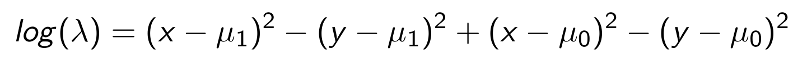
   
  * scriviamo la funzione logaritmo del rapporto di Likelihood:
     ```cpp
     double loglike(double *x, double *p){
       if(p[1]*p[3]*p[5]*p[7]==0) return 1e30; //evito divisione per zero
       double arg = -1 * ( pow( (x[0]-p[0])/p[1],2) + pow( (x[1]-p[2])/p[3],2) );
       arg+= ( pow( (x[0]-p[4])/p[5],2) + pow( (x[1]-p[6])/p[7],2) );
       return arg;
	   }
     ``` 
  * costruiamo una ```TF2``` 
    ```cpp
    TF2 *lratio = new TF2("lratio",loglike,xmin,xmax,ymin,ymax,8); 
    lratio->SetParameters(par);
    ```
   

  
### 12.7.3 Disegnamo le due pdf e il rapporto di likelihood 

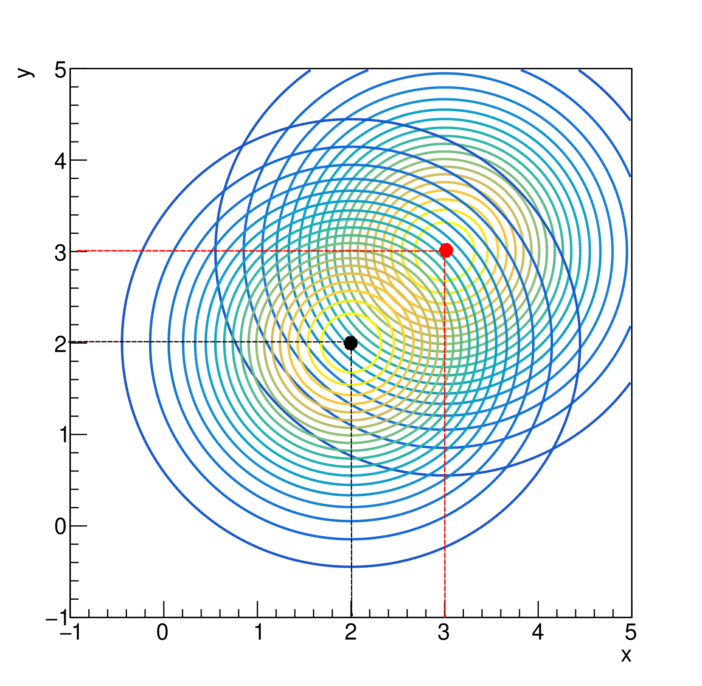
 * ```ROOT``` mette a disposizione molte modalità diverse per disegnare una funzione 
   di due variabili, qui usiamo ```Draw("cont1z")```
 * i metodi ```SetSetNpx(int npoints)``` e ```SetSetNpy(int npoints)``` consentono di cambiare
   il numero di punti su cui la funzione è valutata per essere disegnata 
   (se il disegno appare discontinuo provate a cambiare il numero di punti)
 


### 12.7.4 Best Critical Region (BCR) 
 
  * lo spazio delle fasi coincide con il piano *(x,y)*, quindi la BCR sarà una regione di questo piano 
  definita dalla condizione:
 
  * per determinare il c<sub>&alpha;</sub> che corrisponde al size &alpha; 
    scelto dobbiamo:
    * costruire la funzione che calcola il size al variare di c<sub>&alpha;</sub>
    * scorrere i valori di c<sub>&alpha;</sub> calcolando il corrispondente size
    * individuare il valore di c<sub>&alpha;</sub> che corrisponde al size desiderato


### 12.7.5 Funzione che calcola il size

 * scriviamo una funzione che dato un numero c<sub>&alpha;</sub> calcola il corrispondente size del test
 * va campionata la *pdf(x,y | H<sub>0</sub>)*
   * si può usare la funzione ```rand_TAC``` chiamandola due volte
   * si può usare il metodo ```GetRandom(double x,double y)``` della ```TF2``` 
     (l'inizializzazione del seed si fa nel main con l'istruzione ```gRandom->SetSeed(0); ```)
     ```cpp
      double sizetest(double c_alpha, TF2 *lratio, TF2 *f0){
	    int nhit=0;
	    int Ntoy=100000;
	    double x,y;
	    for (int i=0;i<Ntoy;i++){
	  	  f0->GetRandom2(x,y);
	  	  if (lratio->Eval(x,y)<c_alpha) nhit++;
	  	  }
	     return (nhit*1.)/Ntoy;
       }
     ```


### 12.7.6 Calcolo della size in funzione della soglia

  ```cpp
  double DeterminaBCR(TF2 *lratio, TF2 *f0, double alpha, TGraph *gsize) {...}
  ``` 
  * prende in input:
    * il logaritmo del Likelihood Ratio
    * la *pdf(x,y|H<sub>0</sub> )*
    * il puntatore a un grafico da riempire (definito nella funzione ```main```)
    * il valore del size desiderato, in corrispondenza del quale restituisce il valore di c<sub>&alpha;</sub>
  * effettua le seguenti operazioni:
    * trova gli estremi tra cui far variare c<sub>&alpha;</sub>, 
     sono i valori minimi e massimi del logaritmo del Likelihood Ratio:
      ```cpp
      double lratio_min=lratio->GetMinimumXY(x,y);
      double lratio_max=lratio->GetMaximumXY(x,y);
      ```
    * incrementa c<sub>&alpha;</sub> con un passo costante, 
       partendo dal minimo e arrivando al massimo,  calcola ogni volta il size 
       chiamando la funzione ```sizetest()``` 
    * riempie il grafico con le coppie (c<sub>&alpha;</sub>, &alpha;)


### 12.7.7 Disegno della BCR

 * nella funzione ```main``` del programma possiamo disegnare la regione BCR 
   corrispondente al size scelto e il grafico (c<sub>&alpha;</sub>, &alpha;)
 * c<sub>&alpha;</sub> è il valore restituito dalla funzione ```DeterminaBCR```
 * l'istruzione ```lratio->SetMaximum(c_alpha);``` consente di disegnare la porzione della funzione 
   ```lratio``` minore di c<sub>&alpha;</sub>
   ```cpp
   lratio->SetMaximum(c_alpha);
	 lratio->Draw("cont3");
	 f1->Draw("cont1z same");
	 f0->Draw("cont1z same ");
   ```
 * il power del test può essere calcolato con la funzione ```sizetest``` 
     a cui viene passata la forma della pdf prevista dall'ipotesi *H<sub>1</sub>*  
   ```cpp
   cout<<"power "<<sizetest(c_alpha, lratio, f1)<<endl;
   ```


### 12.7.8 Disegno curva ROC

  * il grafico che rappresenta la curva &beta; in funzione di &alpha; (detta curva ROC)
    si costruisce con un ciclo che scorre con un determinato passo i possibili valori di c<sub>&alpha;</sub>:
    ```cpp
    TGraph *gba=new TGraph();
    for (int i=0;i<gsize->GetN();i++){
	    beta=1-sizetest(gsize->GetPointX(i),lratio, f1);
	    gba->SetPoint(i,gsize->GetPointY(i),beta);
	  }
    gba->Draw("AP*");
    gba->GetXaxis()->SetTitle("#alpha");
    gba->GetYaxis()->SetTitle("#beta");
    ```
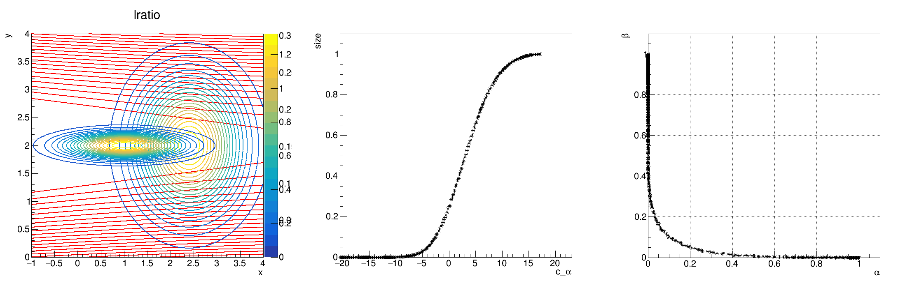
  


## 12.8 ESERCIZI

  * Gli esercizi relativi alla lezione si trovano [qui](ESERCIZI.md)


